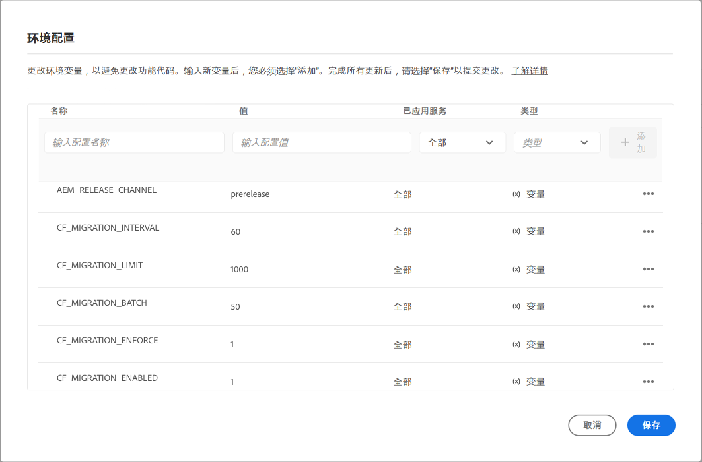

# 在GraphQL筛选中更新内容片段以进行分页和排序 {#updating-content-fragments-for-paging-and-sorting-graphql-filtering}

要优化GraphQL过滤器的性能，您需要运行更新内容片段的过程。

>[!NOTE]
>
>更新内容片段后，您可以按照 [优化GraphQL查询](/help/headless/graphql-api/graphql-optimization.md).


## 前提条件 {#prerequisites}

确保您至少拥有2023.1.0版的AEMas a Cloud Service。

## 更新内容片段 {#updating-content-fragments}

要运行该过程，请执行以下步骤：

1. 通过使用Cloud Manager UI为实例设置以下变量来启用更新：

   

   可用的变量包括：

   <table>
    <tbody>
     <tr>
      <th> </th>
      <th>名称</th>
      <th>值</th>
      <th>默认值</th>
      <th>服务</th>
      <th>已应用</th>
      <th>类型</th>
      <th>注释</th>
     </tr>
     <tr>
      <td>1</td>
      <td>'AEM_RELEASE_CHANNEL' </td>
      <td>'prerelease' </td>
      <td> </td>
      <td>所有 </td>
      <td> </td>
      <td>变量 </td>
      <td>需要才能启用该功能。 </td>
     </tr>
     <tr>
      <td>2</td>
      <td>'CF_MIGRATION_ENABLED' </td>
      <td>`1` </td>
      <td>`0` </td>
      <td>所有 </td>
      <td> </td>
      <td>变量 </td>
      <td>Enables(!=0)或禁用(0)触发内容片段迁移作业。 </td>
     </tr>
     <tr>
      <td>3</td>
      <td>'CF_MIGRATION_ENFORCE' </td>
      <td>`1` </td>
      <td>`0` </td>
      <td>所有 </td>
      <td> </td>
      <td>变量 </td>
      <td>强制执行(!=0)重新迁移内容片段。<br>将此标记设置为0将执行CF的增量迁移。 这意味着，如果作业因任何原因而终止，则下次运行作业将从作业终止的位置开始迁移。 请注意，建议强制执行第一次迁移（值=1）。 </td>
     </tr>
     <tr>
      <td>4</td>
      <td>'CF_MIGRATION_BATCH' </td>
      <td>`50` </td>
      <td>`50` </td>
      <td>所有 </td>
      <td> </td>
      <td>变量 </td>
      <td>迁移后用于保存内容片段数的批处理大小。<br>这与将在一个批次中保存到存储库的CF数量有关，并且可用于优化对存储库的写入次数。 </td>
     </tr>
     <tr>
      <td>5</td>
      <td>'CF_MIGRATION_LIMIT' </td>
      <td>`1000` </td>
      <td>`1000` </td>
      <td>所有 </td>
      <td> </td>
      <td>变量 </td>
      <td>一次要处理的最大内容片段数。<br>另请参阅“CF_MIGRATION_INTERVAL”的注释。 </td>
     </tr>
     <tr>
      <td>6</td>
      <td>'CF_MIGRATION_INTERVAL' </td>
      <td>`60` </td>
      <td>`600` </td>
      <td>所有 </td>
      <td> </td>
      <td>变量 </td>
      <td>处理剩余内容片段直至下一个限制的间隔（秒）<br>此间隔也被视为开始作业之前的等待时间，以及每个后续CF_MIGRATION_LIMIT数量的处理之间的延迟。<br>(*)</td>
     </tr>
    </tbody>
   </table>

   >[!NOTE]
   >
   >(*)
   >
   >的值 `CF_MIGRATION_INTERVAL` 也有助于估算迁移作业的总执行时间。
   >
   >例如：
   >
   >* 内容片段总数= 20,000
   >* CF_MIGRATION_LIMIT = 1000
   >* CF_MIGRATION_INTERNAL = 60（秒）
   >* 完成迁移所需的大约时间= 60 +(20,000/1000 * 60)= 1260秒= 21分钟
      >  开始时添加的“60”秒是由于启动作业时的初始延迟所致。

   >
   >您还应该注意，这只是 *最小* 完成作业所需的时间，不包括I/O时间。 实际花费的时间可能大大超过此估计。

1. 监控更新进度和完成情况。

   为此，请从以下位置监控创作日志和黄金发布：

   * `com.adobe.cq.dam.cfm.impl.upgrade.UpgradeJob`

      * 创作日志；例如：

         ```shell
         23.01.2023 13:13:45.926 *INFO* [sling-threadpool-09cbdb47-4d99-4c4c-b6d5-781b635ee21b-(apache-sling-job-thread-pool)-1-Content Fragment Upgrade Job Queue Config(cfm/upgrader)] com.adobe.cq.dam.cfm.impl.upgrade.UpgradeJob This instance<dd9ffdc1-0c28-4d04-9a96-5d4d223e457e> is the leader, will schedule the upgrade schedule job.
         ...
         23.01.2023 13:13:45.941 *INFO* [sling-threadpool-09cbdb47-4d99-4c4c-b6d5-781b635ee21b-(apache-sling-job-thread-pool)-1-Content Fragment Upgrade Job Queue Config(cfm/upgrader)] com.adobe.cq.dam.cfm.impl.upgrade.UpgradeJob Scheduling content fragments upgrade from version 0 to 1, slingJobId: 2023/1/23/13/13/50e1a575-4cd7-497b-adf0-62cb5768eedb_0, enforce: true, limit: 1000, batch: 50, interval: 60s
         
         23.01.2023 13:20:40.960 *INFO* [sling-threadpool-09cbdb47-4d99-4c4c-b6d5-781b635ee21b-(apache-sling-job-thread-pool)-1-Content Fragment Upgrade Job Queue Config(cfm/upgrader)] com.adobe.cq.dam.cfm.impl.upgrade.UpgradeJob Finished content fragments upgrade in 6m, slingJobId: 2023/1/23/13/13/50e1a575-4cd7-497b-adf0-62cb5768eedb_0, status: MaintenanceJobStatus{jobState=SUCCEEDED, statusMessage='Upgrade to version '1' succeeded.', errors=[], successCount=3781, failedCount=0, skippedCount=0}
         ```
   * 黄金发布日志；例如：

      ```shell
      23.01.2023 12:35:05.150 *INFO* [sling-threadpool-8abcc1bb-cdcb-46d4-8565-942ad8a73209-(apache-sling-job-thread-pool)-1-Content Fragment Upgrade Job Queue Config(cfm/upgrader)] com.adobe.cq.dam.cfm.impl.upgrade.UpgradeJob This instance<ad1b399e-77be-408e-bc3f-57097498fddb> is the leader, will schedule the upgrade schedule job.
      
      23.01.2023 12:35:05.161 *INFO* [sling-threadpool-8abcc1bb-cdcb-46d4-8565-942ad8a73209-(apache-sling-job-thread-pool)-1-Content Fragment Upgrade Job Queue Config(cfm/upgrader)] com.adobe.cq.dam.cfm.impl.upgrade.UpgradeJob Scheduling content fragments upgrade from version 0 to 1, slingJobId: 2023/1/23/12/34/ad1b399e-77be-408e-bc3f-57097498fddb_0, enforce: true, limit: 1000, batch: 50, interval: 60s
      ...
      23.01.2023 12:40:45.180 *INFO* [sling-threadpool-8abcc1bb-cdcb-46d4-8565-942ad8a73209-(apache-sling-job-thread-pool)-1-Content Fragment Upgrade Job Queue Config(cfm/upgrader)] com.adobe.cq.dam.cfm.impl.upgrade.UpgradeJob Finished content fragments upgrade in 5m, slingJobId: 2023/1/23/12/34/ad1b399e-77be-408e-bc3f-57097498fddb_0, status: MaintenanceJobStatus{jobState=SUCCEEDED, statusMessage='Upgrade to version '1' succeeded.', errors=[], successCount=3781, failedCount=0, skippedCount=0}
      ```


1. 禁用更新过程。

   >[!IMPORTANT]
   >
   >完成升级需要此步骤。

   运行更新过程后，重置云环境变量 `CF_MIGRATION_ENABLED` 为“0”，以触发所有吊舱的回收。

   <table>
    <tbody>
     <tr>
      <th> </th>
      <th>名称</th>
      <th>值</th>
      <th>默认值</th>
      <th>服务</th>
      <th>已应用</th>
      <th>类型</th>
      <th>注释</th>
     </tr>
     <tr>
      <td></td>
      <td>'CF_MIGRATION_ENABLED' </td>
      <td>`0` </td>
      <td>`0` </td>
      <td>所有 </td>
      <td> </td>
      <td>变量 </td>
      <td>禁用(0)(或启用(!=0))触发内容片段迁移作业。 </td>
     </tr>
    </tbody>
   </table>

   >[!NOTE]
   >
   >这对发布层尤其重要，因为内容更新仅在黄金发布时完成，而在回收面板时，所有常规的发布面板都基于黄金发布。

1. 验证更新过程的完成情况。

   您可以在Cloud Manager开发人员控制台中使用存储库浏览器验证更新是否成功完成，以检查内容片段数据。

   * 在首次完成迁移之前， `cfGlobalVersion` 属性将不存在。
因此，JCR节点上存在此属性 `/content/dam` 值为 `1`，确认迁移已完成。

   * 您还可以在单个内容片段上检查以下属性：

      * `_strucVersion` 应具有 `1`
      * `indexedData` 结构必须存在

      >[!NOTE]
      >
      >此过程将更新创作实例和发布实例上的内容片段。
      >
      >因此，建议通过存储库浏览器对 *至少* 一个作者 *和* 一个发布实例。


## 限制 {#limitations}

请注意以下限制：

* 只有在完整更新所有内容片段(如 `cfGlobalVersion` JCR节点的属性 `/content/dam`)

* 如果从内容包导入内容片段(使用 `crx/de`)，则在再次执行更新过程之前，这些内容片段将不会在GraphQL查询结果中被考虑。