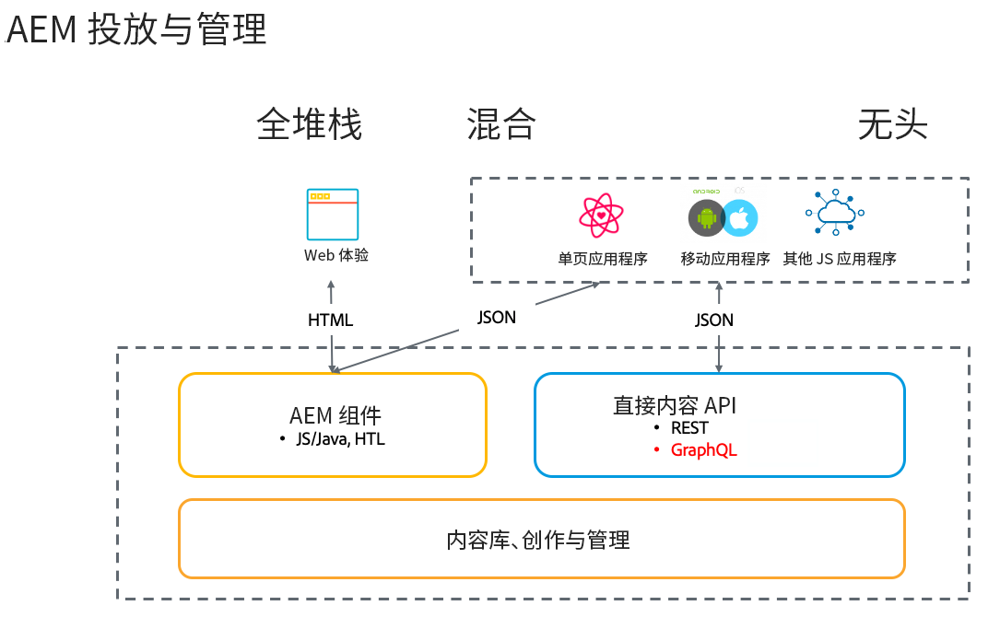

# Adobe Experience Manager Headless 简介  {#introduction-aem-headless}

了解 Adobe Experience Manager (AEM) 的内容模型、内容片段和 GraphQL API 等功能如何用于大规模增强 Headless 体验。

您可以阅读所有功能的详细文档和/或按照 [作为快速入门的无头历程](#first-steps).

## 概述 {#overview}

AEM Headless 是来自 Experience Manager 的 CMS 解决方案，使得任意应用程序可以使用 HTTP，通过 GraphQL 使用 AEM 中的结构化内容（内容片段）。Headless 实施实现了大规模跨平台和渠道的体验交付。

Headless 实施放弃了传统的全栈和混合解决方案中的页面和组件管理，专注于创建渠道中性的、可重用的内容片段，以及它们的跨渠道交付。这是一种现代化的动态开发模式，用于实施 Web 体验。

## AEM Headless 的功能 {#aem-headless-features}

AEM as a Cloud Service 是一款灵活的工具，提供了三种强大的功能用于 Headless 实施模型：

1. **内容模型**
   * 内容模型是内容的结构化表示方式。
   * 内容模型由信息架构师在 AEM 内容片段模型编辑器中定义。
   * 内容模型用作内容片段的基础。
1. **内容片段**
   * 内容片段基于内容模型创建。
   * 由内容作者使用 AEM 内容片段编辑器创建。
   * 内容片段存储在 AEM Assets 并在 Assets 管理 UI 中管理。
1. **用于投放的内容 API**
   * AEM GraphQL API 支持内容片段投放。
   * AEM Assets REST API 支持内容片段 CRUD 操作。
   * 使用[内容片段核心组件的 JSON 导出](https://experienceleague.adobe.com/docs/experience-manager-core-components/using/components/content-fragment-component.html?lang=zh-Hans)也可实现直接内容投放。

## 使用 AEM Headless 的第一步 {#first-steps}

有多个资源可帮助您快速开始使用 AEM 的 Headless 功能。每份指南都针对不同用例和受众量身打造。

| 资源 | 描述 | 类型 | 受众 | 估计用时 |
|---|---|---|---|---|
| [Headless 开发人员历程](/help/journey-headless/developer/overview.md) | **面向刚开始接触 AEM 和 Headless 技术的开发人员**，从这里开始全面了解 AEM 及其 Headless 功能，从 Headless 的理论直到您的第一个 Headless 项目。 | 指南 | **刚开始接触 AEM 和 Headless** 的开发人员 | 1 小时 |
| [Headless 设置](/help/headless/setup/introduction.md) | **面向有经验的 AEM 用户**，在需要关键 AEM Headless 功能的简短摘要时，可以查看此快速入门概览。 | 参考设置 | **具有 AEM 经验**&#x200B;的开发人员、管理员 | 20 分钟 |
| [Headless 实践教程](https://experienceleague.adobe.com/docs/experience-manager-learn/getting-started-with-aem-headless/graphql/multi-step/overview.html?lang=zh-Hans) | **如果您偏好实践方法并且熟悉 AEM**，本教程将直接深入到实施简单的 Headless 应用程序。 | 教程 | 开发人员 | 2 小时 |
| [Headless 架构师历程](/help/journey-headless/architect/overview.md) | **面向刚开始接触 AEM 和 Headless 技术的架构师**，从这里开始了解 Adobe Experience Manager as a Cloud Service 强大而灵活的 Headless 功能，以及如何对项目内容进行建模。 | 指南 | 架构师 | 1 小时 |
| [Headless 创作历程](/help/journey-headless/author/overview.md) | **面向刚开始接触 AEM 和 Headless 技术的商业用户**，从这里开始了解 Adobe Experience Manager as a Cloud Service 强大而灵活的 Headless 功能，以及如何对项目内容进行建模。 | 指南 | 内容创建者 | 1 小时 |
| [Headless 翻译历程](/help/journey-headless/translation/overview.md) | 面向&#x200B;**对 AEM 的 Headless 翻译方法感兴趣的**&#x200B;用户。全面地了解 Headless 技术的信息，以及如何在 AEM 中创建和更新翻译项目。 | 指南 | 翻译专家 | 1 小时 |

## Headful 和 Headless 的比较 {#headful-headless}

本指南侧重于 AEM 的完整 Headless 实施模型。不过，在 AEM 中，Headful 与 Headless 不一定是一个二选一的选择。Headless 功能可用于面向多个接触点管理和交付内容，同时还使内容作者可以编辑单页应用程序。这些都可在 AEM 中实现。

>[!TIP]
>
>有关详细信息，请参阅 [AEM 中的 Headful 和 Headless](/help/implementing/developing/headful-headless.md)。