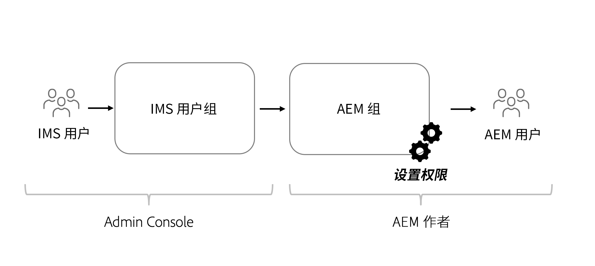

# Headless 内容的权限注意事项

使用 Headless 实施，需要解决多个不同的安全和权限领域。根据 AEM 环境&#x200B;**创作**&#x200B;或&#x200B;**发布**，可以广泛地考虑权限和角色。每个环境包含不同的角色并有不同的需求。

## Author 服务注意事项

Author 服务是内部用户创建、管理和发布内容的地方。权限以管理内容的不同角色为中心。

### 管理组级别权限

作为最佳实践，应在 AEM 中设置组级别权限。这些组也称为本地组，可以在 AEM 创作环境中管理。

管理组成员资格的最简单方式是使用 Adobe Identity Management System (IMS) 组，并将 [IMS 组分配到本地 AEM 组](https://experienceleague.adobe.com/docs/experience-manager-cloud-service/content/security/ims-support.html?lang=zh-Hans#managing-permissions-in-aem)。

在较高级别，流程为：

1. 使用 [Admin Console](https://adminconsole.adobe.com/) 添加 IMS 用户到新的或现有的 IMS 用户组。
1. IMS 组在用户登录时与 AEM 同步。
1. 分配 IMS 组到 AEM 组。
1. 在 AEM 组上设置权限。
1. 用户登录 AEM 并通过 IMS 进行了身份验证后，他们继承 AEM 组的权限。

>[!TIP]
>
> 管理 IMS 和 AEM 用户及组的详细视频演练见[此处](https://experienceleague.adobe.com/docs/experience-manager-learn/cloud-service/accessing/overview.html?lang=zh-Hans)。

要在 AEM 中管理&#x200B;**组**，请导航到&#x200B;**工具** > **安全** > **组**。

要在 AEM 中管理组的权限，请导航到&#x200B;**工具** > **安全** > **组**。

### DAM 用户

在此上下文中，“DAM”表示数字资产管理。**DAM 用户**&#x200B;是 AEM 中现成可用的组，可用于管理数字资产和内容片段的“日常”用户。此组提供权限以&#x200B;**查看**、**添加**、**更新**、**删除**&#x200B;和&#x200B;**发布**&#x200B;内容片段及 AEM Assets 中的所有其他文件。

如果为组成员资格使用 IMS，请添加相应的 IMS 组作为 **DAM 用户**&#x200B;组的成员。登录 AEM 环境时，IMS 组的成员继承了 DAM 用户组的权限。

#### 自定义 DAM 用户组

最好不要直接修改现成可用组的权限。而是应该创建自己的组，按照 **DAM 用户**&#x200B;组权限建模，然后进一步限制对 AEM Assets 中不同&#x200B;**文件夹**&#x200B;的访问权限。

有关更细粒度的权限，请使用 AEM 中的&#x200B;**权限**&#x200B;控制台，并将路径从 `/content/dam` 更新为更具体的路径，即 `/content/dam/mycontentfragments`。

可能最好向此组提供用户创建和编辑内容片段的权限，但不提供删除权限。要查看和分配编辑的权限而不分配删除权限，请参阅[内容片段 - 删除注意事项](/help/assets/content-fragments/content-fragments-delete.md)。

### 模型编辑器

修改&#x200B;**内容片段模型**&#x200B;的能力应该留给管理员或者&#x200B;**一小部分**&#x200B;具有更高权限的用户。修改内容片段模型会对下游产生许多影响。

>[!CAUTION]
>
>对内容片段模型的修改会变更 Headless 应用程序依赖的底层 GraphQL API。

如果您希望创建一个组来管理内容片段模型，但不提供完整的管理员访问权限，您可以创建具有以下访问控制条目的组：

| 路径 | 权限 | 特权 |
|-----| -------------| ---------|
| `/conf` | **允许** | `jcr:read` |
| `/conf/<config-name>/settings/dam/cfm` | **允许** | `rep:write`、`crx:replicate` |

## Publish 服务权限

Publish 服务被视为“实时”环境，通常是 GraphQL API 使用者与之交互的对象。在 Author 服务上编辑和审批之后的内容，发布到 Publish 服务。然后，Headless 应用程序通过 GraphQL API 使用来自 Publish 服务的已批准内容。

默认情况下，通过 AEM Publish 服务的 GraphQL 端点公开的内容可供所有人访问，包括未经身份验证的用户。

### 内容权限

通过 AEM 的 GraphQL API 公开的内容，可以使用资源文件夹上的[封闭用户组 (CUG)](https://experienceleague.adobe.com/docs/experience-manager-learn/assets/advanced/closed-user-groups.html?lang=zh-Hans) 设置进行限制，这指定了哪些 AEM 用户组（及其成员）可以访问资源文件夹的内容。

资源 CUG 的工作方式如下：

* 首先，拒绝对文件夹和子文件夹的所有访问权限
* 然后，对于在 CUG 列表中列出的所有 AEM 用户组，允许对文件夹和子文件夹的只读访问权限

在包含通过 GraphQL API 公开的内容的资源文件夹上，可以设置 CUG。对 AEM Publish 上资源文件夹的访问应通过用户组进行控制，而不是直接通过用户。创建（或重用）AEM 用户组，授予对包含 GraphQL API 所公开内容的资源文件夹的访问权限。

#### 选择身份验证方案{#publish-permissions-users}

[AEM Headless SDK](https://github.com/adobe/aem-headless-client-js#create-aemheadless-client) 支持两种类型的身份验证：

* [基于令牌的身份验证](/help/implementing/developing/introduction/generating-access-tokens-for-server-side-apis.md)使用绑定到单个技术帐户的服务凭据。
* 使用 AEM 用户的基本身份验证。

### 访问 GraphQL API

HTTP 请求向 AEM Publish 服务的 GraphQL API 端点提供[相应的身份验证凭据](https://github.com/adobe/aem-headless-client-js#create-aemheadless-client)，包括凭据授权可以读取的内容，以及可匿名访问内容。GraphQL API 的其他使用者不能读取 CUG 保护的文件夹中的内容。

