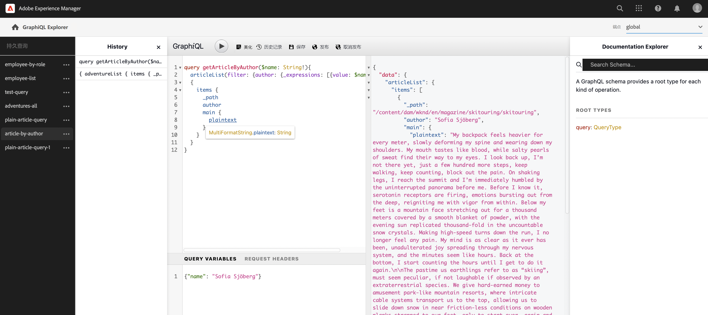
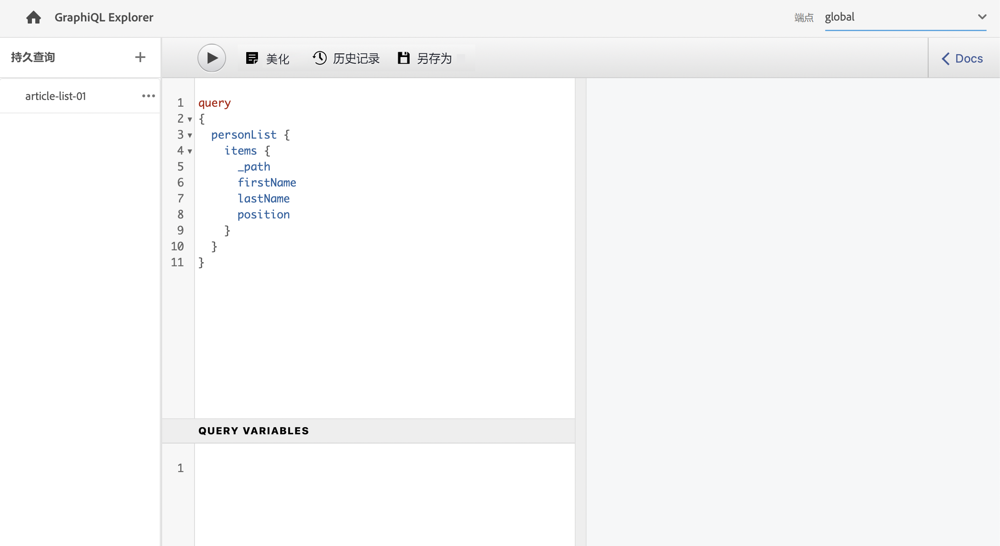
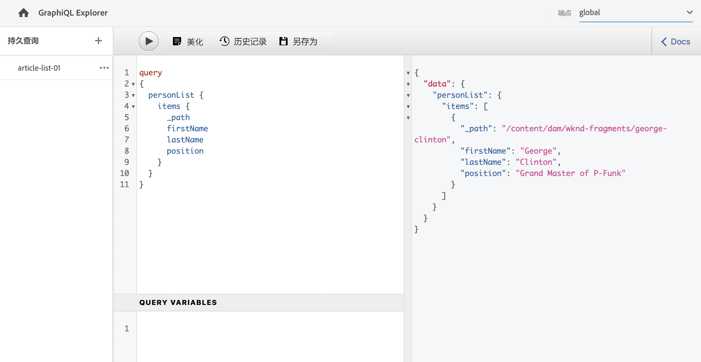
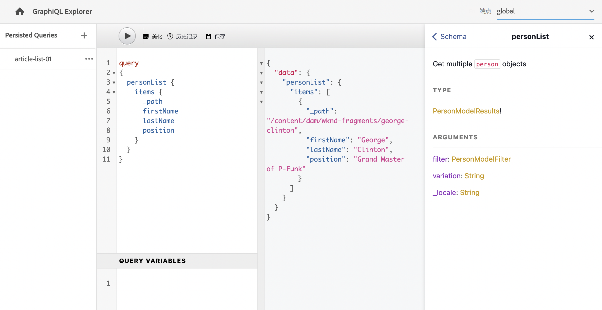

# 创建 API 请求 – Headless 设置 {#accessing-delivering-content-fragments}

了解如何使用 GraphQL API 实现内容片段的 Headless 投放，以及如何使用 AEM 的 Assets REST API 管理内容片段。

## 什么是 GraphQL 和 Assets REST API？ {#what-are-the-apis}

[现在您已经创建了一些内容片段，](create-content-fragment.md)您可以使用 AEM 的 API 以 Headless 的方式投放它们。

* [GraphQL API](/help/headless/graphql-api/content-fragments.md) 允许您创建请求来访问和投放内容片段。此 API 提供了最可靠的一组功能用于查询和使用内容片段内容。
   * 要使用此项，[需要在 AEM 中定义和启用端点](/help/headless/graphql-api/graphql-endpoint.md)，并且在需要时[应安装 GraphiQL 接口](/help/headless/graphql-api/graphiql-ide.md)。
* [Assets REST API](/help/assets/content-fragments/assets-api-content-fragments.md) 允许您创建和修改内容片段（及其他资源）。

本指南的剩余部分侧重于 GraphQL 访问和内容片段投放。

## 启用 GraphQL 端点 {#enable-graphql-endpoint}

必须先创建 GraphQL 端点，然后才能使用 GraphQL API。

1. 导航到&#x200B;**工具**、**通用**，然后选择 **GraphQL**。
1. 选择&#x200B;**创建**。
1. 此时将打开&#x200B;**创建新 GraphQL 端点**&#x200B;对话框。在其中可以指定：
   * **名称**：端点的名称，您可以输入任意文本。
   * **使用的 GraphQL 架构提供自**：使用下拉菜单选择所需的配置。
1. 选择&#x200B;**创建**&#x200B;来确认。
1. 在控制台中，此时将根据之前创建的配置显示一条&#x200B;**路径**。这是用于执行 GraphQL 查询的路径。

   ```
   /content/cq:graphql/<configuration-name>/endpoint
   ```

有关启用 [GraphQL 端点的更多详细信息见此处](/help/headless/graphql-api/graphql-endpoint.md)。

## 使用 GraphQL 及 GraphiQL 查询内容

信息架构师需要为其渠道端点设计查询来投放内容。这些查询通常只需要为每个模型的每个端点考虑一次。对于本指南快速入门，我们只需要创建一个。

GraphiQL 是一个 IDE，包含在您的 AEM 环境中； 在您[配置您的端点](#enable-graphql-endpoint)后，它是可访问/可见的。

1. 登录 AEM as a Cloud Service 并访问 GraphiQL 接口：

   您可以通过以下任一方式访问查询编辑器：

   * **工具** -> **常规** -> **GraphQL 查询编辑器**
   * 直接；例如，`http://localhost:4502/aem/graphiql.html`

1. GraphiQL IDE 是用于 GraphQL 的浏览器中查询编辑器。您可以使用它来生成查询，以检索内容片段，并将通过 JSON 格式 headless 投放。
   * 右上角的下拉列表允许您选择端点。
   * 最左边的面板列出了持久查询（如果可用）
   * 左中面板允许您生成查询。
   * 右中面板显示结果。
   * 查询编辑器具备代码完成和热键功能，可以轻松地执行查询。

   

1. 假定我们创建的模型名为 `person`，带有字段 `firstName`、`lastName` 和 `position`，我们可以构建简单的查询来检索内容片段的内容。

   ```text
   query 
   {
     personList {
       items {
         _path
         firstName
         lastName
         position
       }
     }
   }
   ```

1. 在左侧面板中输入查询。
   

1. 单击&#x200B;**执行查询**&#x200B;按钮或者使用 `Ctrl-Enter` 热键，结果将在右侧面板中以 JSON 格式显示。
   

1. 单击页面右侧的&#x200B;**文档**链接以显示上下文中的文档，帮助您构建适应您自己的模型的查询。
   

GraphQL 启用结构化查询，不仅针对特定数据集或者单独的数据对象，而且还可以提供对象的特定元素，嵌套结果，提供查询变量支持，以及诸多功能。

GraphQL 可以避免迭代 API 以及过度投放，而是允许作为对单个 API 查询的响应，批量精确投放所需呈现的内容。生成的 JSON 可用于向其他站点或应用程序提供数据。

## 后续步骤 {#next-steps}

就是这样！现在，您已对 AEM 中的 Headless 内容管理有了基本了解。当然，其中还有很多资源供您深入研究，以全面了解可用的功能。

* **[内容片段](/help/sites-cloud/administering/content-fragments/content-fragments.md)** – 提供有关创建和管理内容片段的详细信息
* **[AEM Assets HTTP API 中的内容片段支持](/help/assets/content-fragments/assets-api-content-fragments.md)** – 提供直接通过 HTTP API 使用 CRUD 操作（创建、读取、更新、删除）访问 AEM 内容的详细信息
* **[GraphQL API](/help/headless/graphql-api/content-fragments.md)** – 提供有关如何以 Headless 方式投放内容片段的详细信息
