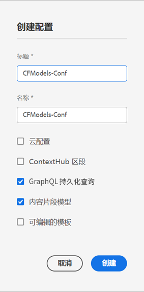

# 创建配置 - Headless 设置 {#creating-configuration}

作为在 AEM as a Cloud Service 中开始使用 Headless 的第一步，您需要创建配置。

## 什么是配置？ {#what-is-a-configuration}

配置浏览器提供了通用配置 API、内容结构、针对 AEM 中配置的解析机制。

在 AEM 的 Headless 内容管理的上下文中，请将配置视为 AEM 中的工作区，您可以在其中创建内容模型，这将定义未来内容和内容片段的结构。您可以使用多个配置来分隔这些模型。

如果您熟悉[全栈 AEM 实施中的页面模板](/help/sites-cloud/authoring/features/templates.md)，使用配置进行内容模型的管理的过程非常相似。

## 如何创建配置 {#how-to-create-a-configuration}

管理员只需要创建配置一次，或者在极少数情况下，需要新工作区用于组织内容模型时进行创建。对于本指南快速入门，我们只需要创建一个配置。

1. 登录 AEM as a Cloud Service，从主菜单选择&#x200B;**工具 -> 常规 -> 配置浏览器**。
1. 提供配置的&#x200B;**标题**&#x200B;和&#x200B;**名称**。
   * **标题**&#x200B;应为描述性的。
   * **名称**&#x200B;将成为存储库中的节点名称。
      * 它会根据标题自动生成，并根据 [AEM 命名约定](/help/implementing/developing/introduction/naming-conventions.md)进行调整。
      * 如有必要可以调整。
1. 查看以下选项：
   * **内容片段模型**
   * **GraphQL 持久查询**

   

1. 点击或单击&#x200B;**创建**

如果需要，您可以创建多个配置。配置也可以嵌套。

>[!NOTE]
>
>根据您的实施要求，除了&#x200B;**内容片段模型**&#x200B;和&#x200B;**GraphQL 持久查询**&#x200B;之外，可能还需要配置选项。

## 后续步骤 {#next-steps}

使用此配置，您现在可以转到快速入门指南的第二部分并[创建内容片段模型](create-content-model.md)。

>[!TIP]
>
>有关配置浏览器的完整详细信息，[请参阅配置浏览器文档](/help/implementing/developing/introduction/configurations.md)。
