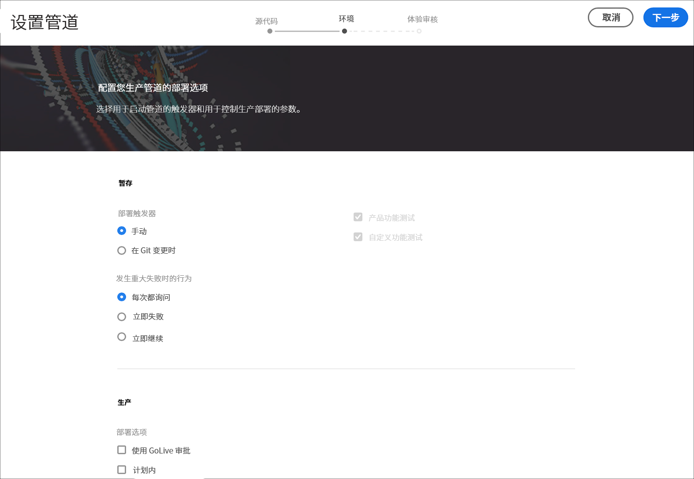

# 配置 CI-CD 管道 {#configure-ci-cd-pipeline}

在Cloud Manager中，有两种类型的管道：

* **生产管道**:

   只有创建生产和阶段环境集后，才能添加生产管道。

   有关更多 [详细信息，请参阅](configure-pipeline.md#setting-up-the-pipeline) “设置生产管道”。

* **非生产渠道**:

   非生产管道可从云管理器的 **用户** 界面的概述页面添加。

   有关详 [细信息，请参阅非生产和代码质量专用管道](configure-pipeline.md#non-production-pipelines) 。

>[!NOTE]
>要配置管道，您必须：
> * 定义将开始管线的触发器。
> * 定义控制生产部署的参数。
> * 配置性能测试参数。

## 设置生产管道 {#setting-up-production-pipeline}

部署管理器负责设置生产管道。

>[!NOTE]
>在项目创建完成、Git存储库至少具有一个分支并且创建了生产和阶段环境集之前，无法设置生产管道。

在开始部署代码之前，您必须从云管理器配置渠 [!UICONTROL 道设置]。

>[!NOTE]
>
>初始设置后，可以更改管线设置。

## 从云管理器配置 [!UICONTROL 管道设置] {#configuring-the-pipeline-settings-from-cloud-manager}

一旦您使用Cloud Manager UI设置了项目并且至少拥 [!UICONTROL 有一个环境] ，您就可以设置部署渠道了。

按照以下步骤配置管道的行为和首选项：

1. 单击“ **设置管道** ”(Setup Pipeline)以设置和配置管道。

   

1. 将显 **示“设置管道** ”屏幕。 Select the branch and click **Next**.

   

1. 配置部署选项。

   

   可以定义触发器以开始管线：

   * **手动** -使用UI手动开始管道。
   * **在Git更改中** -只要向配置的git分支添加提交，就会开始CI/CD管道。 即使选择此选项，也始终可以手动开始管线。

   在管线设置或编辑过程中，当在任何质量门中遇到重要故障时，部署管理器可以定义管线的行为。

   这对于希望获得更自动化流程的客户非常有用。 可用选项有：

   * **每次询问** -这是默认设置，需要手动干预任何重要故障。
   * **立即失败** -如果选中此项，则在出现重要故障时将取消管道。 这实质上是模拟用户手动拒绝每个失败。
   * **立即继续** -如果选中此项，则在出现重要故障时管道将自动继续。 这实际上是模拟用户手动批准每个失败。

1. 生产管道设置包括第三个标签为“体验审 **核”的选项卡**。 此选项提供应始终包含在体验审计中的URL路径的表。 用户必须填写输入字段以定义自己的自定义链接。

   

   单击 **添加新页面** ，以提供要包含在体验审核中的URL路径。

   例如，如果要包含在体验审 `https://wknd.site/us/en/about-us.html` 核中，请在此字段中输 `us/en/about-us.html` 入路径，然后单击 **保存**。

   

   表中显示的URL将为 `https://publish-p14253-e43686.adobeaemcloud.com/us/en/about-us.html`。

   

   最多可包含25行。 如果用户在此部分中未提交任何页面，则默认情况下，网站的主页将包含在体验审核中。

   有关更多 [详细信息，请参阅](/help/implementing/cloud-manager/experience-audit-testing.md) “了解体验审核结果”。

   >[!NOTE]
   > 已配置的页面将提交到服务并根据性能、辅助功能、SEO（搜索引擎优化）、最佳实践和PWA（渐进式Web应用程序）测试进行评估。

1. 从“编 **辑管道** ”屏 **幕中单击“** 保存”。 “概 **述** ”页现在显 **示“部署项目** ”卡。 单击 **“部署** ”按钮以部署项目。

   

## 仅限非生产和代码质量的管道 {#non-production-pipelines}

除了部署到舞台和生产的主要管道外，客户还能够建立额外的管道，称 **为非生产管道**。 这些管线始终执行构建和代码质量步骤。 它们还可以选择部署到Adobe Managed Services环境。

在主屏幕上，新卡中列出了以下管线：

1. 从Cloud **Manager主屏幕访问** “非生产管道”拼贴。

   

1. 单击“添 **加** ”按钮，指定“管道名称”、“管道类型”和“Git分支”。

   此外，您还可以从管道选项设置部署触发器和重要失败行为。

   

1. 单 **击** “保存”，管线将显示在主屏幕上的卡上，并有三个操作，如下所示：

   

   * **编辑** -允许编辑管道设置
   * **构建** -导航到执行页面，可从该页面执行管道
   * **管理Git** —— 允许用户获取访问Cloud Manager Git存储库所需的信息

## 后续步骤 {#the-next-steps}

配置管道后，您需要部署代码。

有关更多 [详细信息](deploy-code.md) ，请参阅部署代码。
