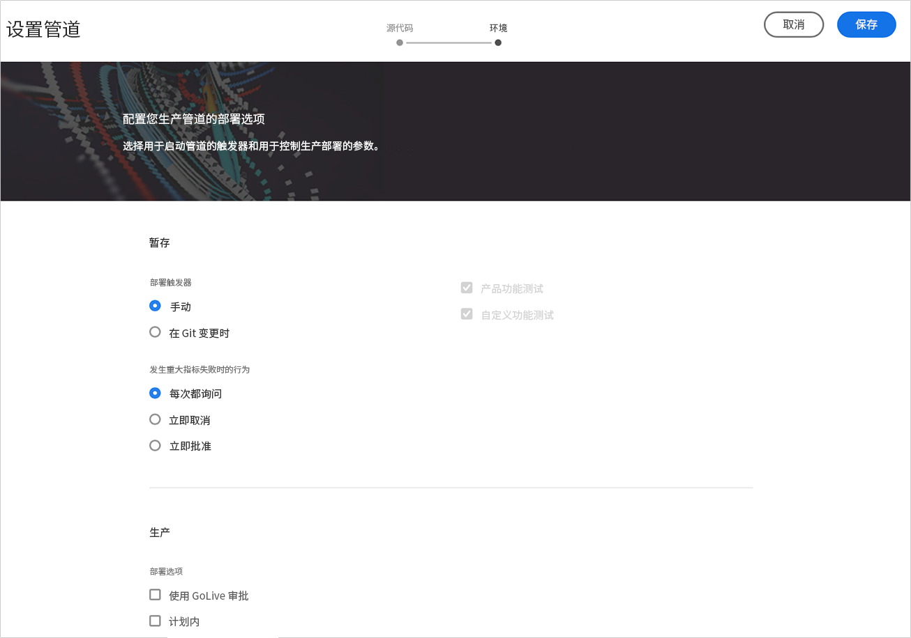
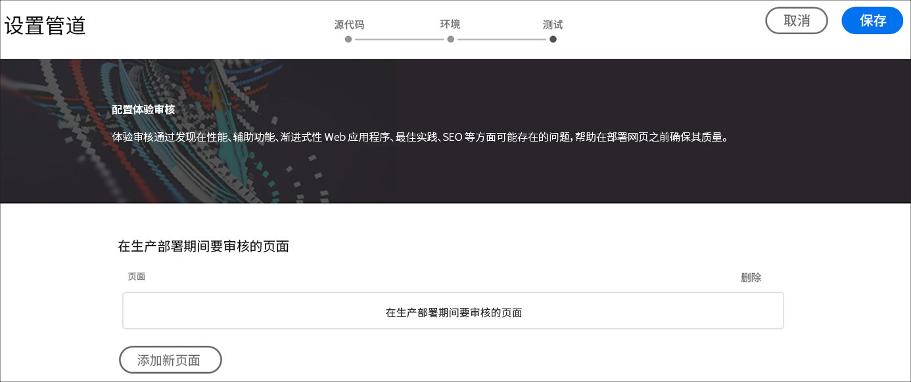
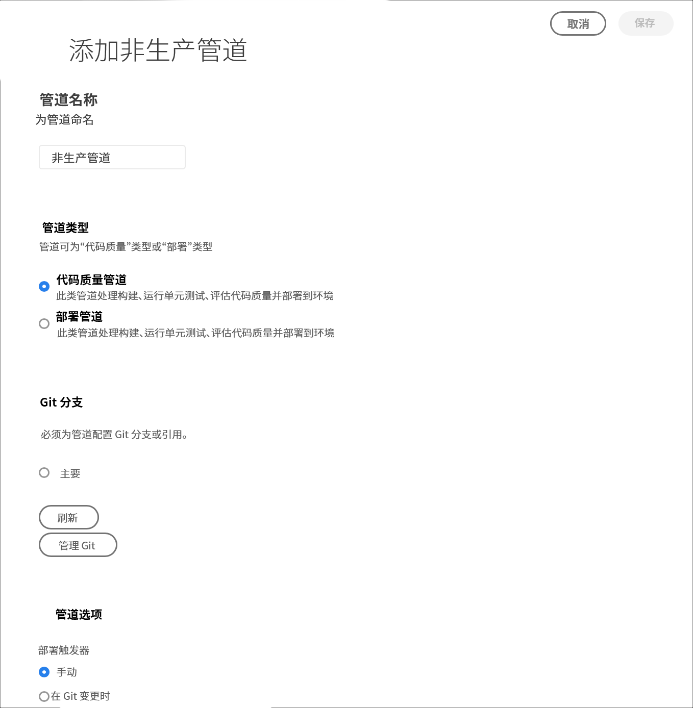
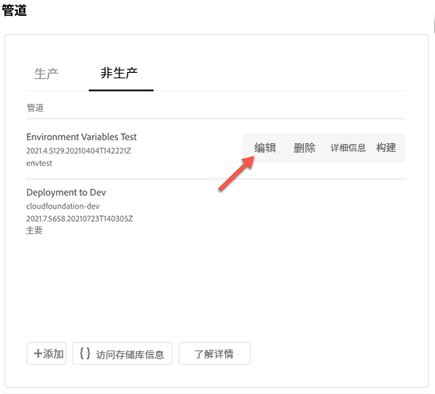
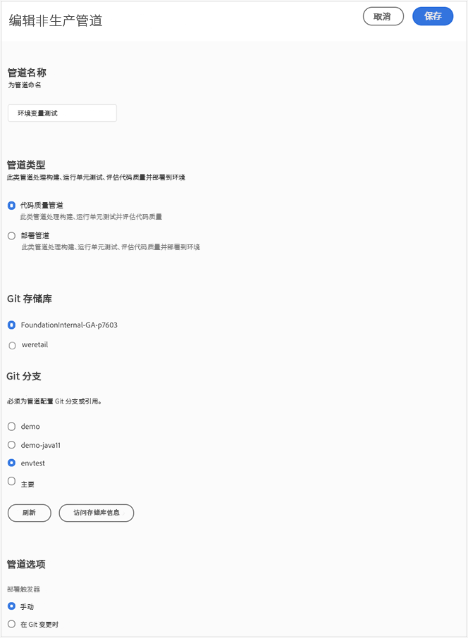

# 配置 CI-CD 管道 {#configure-ci-cd-pipeline}

在Cloud Manager中，管道有两种类型：

* **生产管道**:

   只有在创建生产和暂存环境集后，才能添加生产管道。

   有关更多详细信息，请参阅[设置生产管道](configure-pipeline.md#setting-up-the-pipeline) 。

* **非生产管道**:

   可以从Cloud Manager用户界面的&#x200B;**概述**&#x200B;页面添加非生产管道。

   有关更多详细信息，请参阅[仅限生产和代码质量管道](configure-pipeline.md#non-production-pipelines)。

   >[!NOTE]
   >要配置管道，必须：
   > * 定义将启动管道的触发器。
   > * 定义控制生产部署的参数。
   > * 配置性能测试参数。

## 设置生产管道 {#setting-up-production-pipeline}

部署管理器负责设置生产管道。

>[!NOTE]
>在程序创建完成、Git存储库至少具有一个分支，并且创建了生产和暂存环境集之前，无法设置生产管道。

在开始部署代码之前，必须从[!UICONTROL Cloud Manager]配置管道设置。

>[!NOTE]
>
>在初始设置后，可以更改管道设置。

## 从[!UICONTROL Cloud Manager]配置管道设置 {#configuring-the-pipeline-settings-from-cloud-manager}

在使用[!UICONTROL Cloud Manager] UI设置程序并至少有一个环境后，您就可以设置部署管道了。

请按照以下步骤配置管道的行为和首选项：

1. 单击&#x200B;**设置管道**&#x200B;以设置和配置管道。

   

1. 此时将显示&#x200B;**设置管道**&#x200B;屏幕。 选择分支并单击&#x200B;**Next**。

   

1. 配置部署选项。

   

   您可以定义启动管道的触发器：

   * **手动**  — 使用UI手动启动管道。
   * **在Git更改中**  — 每当向配置的git分支添加提交时，都会启动CI/CD管道。即使选择此选项，也始终可以手动启动管道。

   在管道设置或编辑期间，部署管理器可以选择在任何质量门中遇到重要故障时定义管道的行为。

   这对于希望实现更自动化流程的客户非常有用。 可用选项包括：

   * **每次提问**  — 这是默认设置，需要对任何重要故障进行手动干预。
   * **立即取消**  — 如果选中此选项，则每当发生重要故障时，管道都将被取消。这实质上是在模拟用户手动拒绝每个故障。
   * **立即批准**  — 如果选中此选项，则每当发生重要故障时，管道将自动继续。这实质上是在模拟用户手动批准每次失败。

1. 生产管道设置包含第三个选项卡，标记为&#x200B;**体验审核**。 此选项为应始终包含在体验审核中的URL路径提供了一个表。

   >[!NOTE]
   >必须单击&#x200B;**添加新页面**&#x200B;以定义您自己的自定义链接。

   

   单击&#x200B;**添加新页面**&#x200B;以提供要包含在体验审核中的URL路径。

   例如，如果要在体验审核中包含`https://wknd.site/us/en/about-us.html`，请在此字段中输入路径`us/en/about-us.html`，然后单击&#x200B;**Save**。

   

   表中显示的URL将为：

   `https://publish-p14253-e43686.adobeaemcloud.com/us/en/about-us.html`

   

   最多可包含25行。 如果用户在此部分中未提交页面，则默认情况下网站的主页将包含在体验审核中。

   有关更多详细信息，请参阅[了解体验审核结果](/help/implementing/cloud-manager/experience-audit-testing.md)。

   >[!NOTE]
   > 将配置的页面提交到服务，并根据性能、辅助功能、SEO（搜索引擎优化）、最佳实践和PWA（渐进式Web应用程序）测试进行评估。

1. 单击&#x200B;**编辑管道**&#x200B;屏幕中的&#x200B;**保存**。 现在， **概述**&#x200B;页面会显示&#x200B;**部署程序**&#x200B;卡。 单击&#x200B;**部署**&#x200B;按钮以部署程序。

   

### 编辑生产管道 {#editing-prod-pipeline}

可以从&#x200B;**程序概述**&#x200B;页面编辑管道配置。

请按照以下步骤编辑已配置的管道：

1. 从&#x200B;**程序概述**&#x200B;页面导航到&#x200B;**管道**&#x200B;卡。

1. 单击&#x200B;**...从**&#x200B;管道&#x200B;**卡中单击**&#x200B;编辑&#x200B;**，如下图所示。**

   

1. 此时将显示&#x200B;**编辑生产管道**&#x200B;对话框。

   1. 通过&#x200B;**Configuration**&#x200B;选项卡，可更新&#x200B;**管道名称**、**部署触发器**&#x200B;和&#x200B;**重要量度失败行为**。

      >[!NOTE]
      >请参阅[添加和管理存储库](/help/implementing/cloud-manager/managing-code/cloud-manager-repositories.md) ，以了解如何在Cloud Manager中添加和管理存储库。

      

   1. **Source**&#x200B;选项卡提供了一个选项，用于忽略管道的Web层配置，并选中或取消选中&#x200B;**Pause before deploying to Production**&#x200B;和&#x200B;**Scheduled**&#x200B;选项，这些选项来自&#x200B;**Production Deployment Options**。

      >[!NOTE]
      >如果未选中&#x200B;**忽略Web层配置** ，则管道也将部署Web层配置。

      

   1. 通过&#x200B;**体验审核**&#x200B;选项，您可以更新或添加新页面。

      

1. 编辑完管道后，单击&#x200B;**更新**。

## 仅限非生产和代码质量管道 {#non-production-pipelines}

除了部署到暂存和生产的主管道之外，客户还能够设置其他管道，称为&#x200B;**非生产管道**。 这些管道始终执行生成和代码质量步骤。 它们还可以选择部署到AEMas a Cloud Service环境。

在主屏幕上，这些管道将列在新卡中：

1. 从Cloud Manager主屏幕中访问&#x200B;**非生产管道**&#x200B;拼贴。

   

1. 单击&#x200B;**添加**&#x200B;按钮，以指定管道名称、管道类型和Git分支。

   此外，您还可以从管道选项中设置部署触发器和重要失败行为。

   

1. 单击&#x200B;**Save**，此时主屏幕上的卡片上会显示管道，该管道中会有五个操作，如下所示：

   

   * **编辑**  — 允许编辑管线设置
   * **详细信息**  — 提供管道执行的详细信息
   * **生成**  — 导航到可从中执行管道的执行页面
   * **访问存储库信息**  — 允许用户获取访问Cloud Manager Git存储库所需的信息
   * **了解更多**  — 导航到了解CI/CD管线文档资源。

### 编辑非生产管道 {#editing-nonprod-pipeline}

可以从&#x200B;**程序概述**&#x200B;页面编辑管道配置。

请按照以下步骤编辑配置的非生产管道：

1. 从&#x200B;**程序概述**&#x200B;页面导航到&#x200B;**管道**&#x200B;卡。

1. 选择&#x200B;**非生产**&#x200B;选项卡，然后在选择所需的管道后单击&#x200B;**编辑**。

   

1. 选择所需的存储库和其他必需的更新，然后单击&#x200B;**Save**。

   

## 后续步骤 {#the-next-steps}

配置管道后，您需要部署代码。

有关更多详细信息，请参阅[部署代码](deploy-code.md)。
