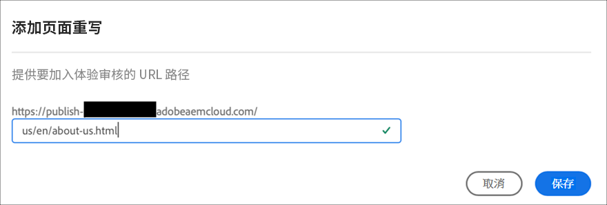
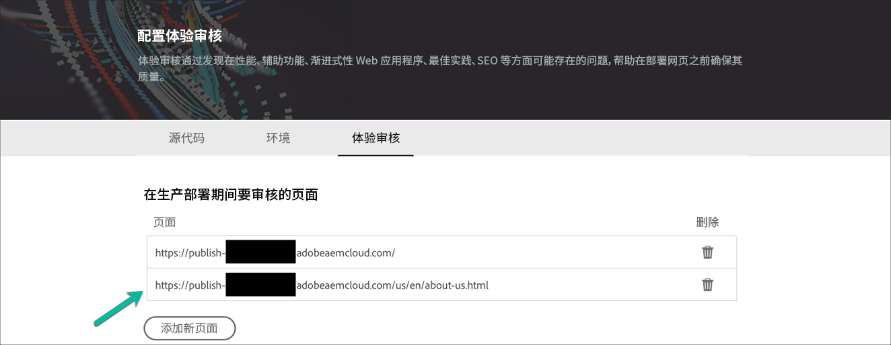

# 配置 CI-CD 管道 {#configure-ci-cd-pipeline}

在Cloud Manager中，管道有两种类型：

* **生产管道**:

   只有在创建生产和暂存环境集后，才能添加生产管道。

   有关更多详细信息，请参阅[设置生产管道](configure-pipeline.md#setting-up-the-pipeline) 。

* **非生产管道**:

   可以从Cloud Manager用户界面的&#x200B;**概述**&#x200B;页面添加非生产管道。

   有关更多详细信息，请参阅[仅限生产和代码质量管道](configure-pipeline.md#non-production-pipelines)。

   >[!NOTE]
   >要配置管道，必须：
   > * 定义将启动管道的触发器。
   > * 定义控制生产部署的参数。
   > * 配置性能测试参数。

## 设置生产管道 {#setting-up-production-pipeline}

部署管理器负责设置生产管道。

>[!NOTE]
>在程序创建完成、Git存储库至少具有一个分支，并且创建了生产和暂存环境集之前，无法设置生产管道。

在开始部署代码之前，必须从[!UICONTROL Cloud Manager]配置管道设置。

>[!NOTE]
>
>在初始设置后，可以更改管道设置。

## 添加新的生产管道 {#adding-production-pipeline}

在使用[!UICONTROL Cloud Manager] UI设置程序并至少有一个环境后，您就可以添加生产管道。

请按照以下步骤配置生产管道的行为和首选项：

1. 从&#x200B;**程序概述**&#x200B;页面导航到&#x200B;**Pipelines**卡。
单击**+Add**&#x200B;并选择&#x200B;**添加生产管道**。

   

1. **此时会显** 示“添加生产管道”对话框。输入管道名称。

   此外，您还可以从&#x200B;**部署选项**&#x200B;中设置&#x200B;**部署触发器**&#x200B;和&#x200B;**重要失败行为**。 单击&#x200B;**继续**。

   

   您可以定义部署触发器以启动管道。

   * **手动**  — 使用UI手动启动管道。
   * **在Git更改中**  — 每当向配置的git分支添加提交时，都会启动CI/CD管道。即使选择此选项，也始终可以手动启动管道。

      在管道设置或编辑期间，部署管理器可以选择在任何质量门中遇到重要故障时定义管道的行为。

      这对于希望实现更自动化流程的客户非常有用。 可用选项包括：
   您可以定义重要的失败量度行为以启动管道。

   * **每次提问**  — 这是默认设置，需要对任何重要故障进行手动干预。
   * **立即失败**  — 如果选中此选项，则每当发生重要故障时，将取消管道。这实质上是在模拟用户手动拒绝每个故障。
   * **立即继续**  — 如果选中此选项，则每当发生重要故障时，管道将自动继续。这实质上是在模拟用户手动批准每次失败。

1. **添加生产管道**&#x200B;对话框包括标有&#x200B;**源代码**&#x200B;的第二个选项卡。 **已选择完** 整堆栈代码。您可以选择&#x200B;**Repository**&#x200B;和&#x200B;**Git分支**。 单击&#x200B;**Save**。

   

1. **添加生产管道**&#x200B;对话框包含第三个标签为&#x200B;**体验审核**&#x200B;的选项卡。 此选项为应始终包含在体验审核中的URL路径提供了一个表。

   >[!NOTE]
   >必须单击&#x200B;**Add Page**&#x200B;以定义您自己的自定义链接。

   

   单击&#x200B;**添加新页面**&#x200B;以提供要包含在体验审核中的URL路径。

   例如，如果要在体验审核中包含`https://wknd.site/us/en/about-us.html`，请在此字段中输入路径`us/en/about-us.html`，然后单击&#x200B;**Save**。

   

   表中显示的URL将为：

   `https://publish-p14253-e43686.adobeaemcloud.com/us/en/about-us.html`

   

   最多可包含25行。 如果用户在此部分中未提交页面，则默认情况下网站的主页将包含在体验审核中。

   有关更多详细信息，请参阅[了解体验审核结果](/help/implementing/cloud-manager/experience-audit-testing.md)。

   >[!NOTE]
   > 将配置的页面提交到服务，并根据性能、辅助功能、SEO（搜索引擎优化）、最佳实践和PWA（渐进式Web应用程序）测试进行评估。

1. 单击&#x200B;**Save**。 现在，新创建的生产管道显示在&#x200B;**Pipelines**&#x200B;卡中。

   管道显示在主屏幕的卡片上，带有三个操作，如下所示：

   * **添加**  — 允许添加新管道。
   * **访问存储库信息**  — 允许用户获取访问Cloud Manager Git存储库所需的信息。
   * **了解更多**  — 导航到了解CI/CD管线文档资源。

### 编辑生产管道 {#editing-prod-pipeline}

可以从&#x200B;**程序概述**&#x200B;页面编辑管道配置。

请按照以下步骤编辑已配置的管道：

1. 从&#x200B;**程序概述**&#x200B;页面导航到&#x200B;**管道**&#x200B;卡。

1. 单击&#x200B;**...从**&#x200B;管道&#x200B;**卡中单击**&#x200B;编辑&#x200B;**，如下图所示。**

   

1. 此时将显示&#x200B;**编辑生产管道**&#x200B;对话框。

   1. 通过&#x200B;**Configuration**&#x200B;选项卡，可更新&#x200B;**管道名称**、**部署触发器**&#x200B;和&#x200B;**重要量度失败行为**。

      >[!NOTE]
      >请参阅[添加和管理存储库](/help/implementing/cloud-manager/managing-code/cloud-manager-repositories.md) ，以了解如何在Cloud Manager中添加和管理存储库。

      

   1. **Source**&#x200B;选项卡提供了选项，用于选中或取消选中&#x200B;**Pause before deploying to Production**&#x200B;和&#x200B;**Scheduled**&#x200B;选项（从&#x200B;**Production Deployment Options**）。

      

   1. 通过&#x200B;**体验审核**&#x200B;选项，您可以更新或添加新页面。

      

1. 编辑完管道后，单击&#x200B;**更新**。

### 其他生产管道操作 {#additional-prod-actions}

#### 运行生产管道 {#run-prod}

可以从管道卡运行生产管道：

1. 从&#x200B;**程序概述**&#x200B;页面导航到&#x200B;**管道**&#x200B;卡。

1. 单击&#x200B;**...从**&#x200B;管道&#x200B;**卡中单击**&#x200B;运行&#x200B;**，如下图所示。**

   

#### 删除生产管道 {#delete-prod}

可以从管道卡中删除生产管道：

1. 从&#x200B;**程序概述**&#x200B;页面导航到&#x200B;**管道**&#x200B;卡。

1. 单击&#x200B;**...从**&#x200B;管道&#x200B;**卡中单击**&#x200B;删除&#x200B;**，如下图所示。**

   

   >[!NOTE]
   >具有部署管理器角色的用户现在可以通过Pipeline卡中的&#x200B;**Delete**&#x200B;选项以自助方式删除生产管道。

## 仅限非生产和代码质量管道 {#non-production-pipelines}

除了部署到暂存和生产的主管道之外，客户还能够设置其他管道，称为&#x200B;**非生产管道**。 这些管道始终执行生成和代码质量步骤。 它们还可以选择部署到AEMas a Cloud Service环境。

### 添加新的非生产管道 {#adding-non-production-pipeline}

在主屏幕上，这些管道将列在新卡中：

1. 从Cloud Manager主屏幕中访问&#x200B;**Pipelines**&#x200B;卡。 单击&#x200B;**+Add**&#x200B;并选择&#x200B;**添加非生产管道**。

   

1. **此时将显示“添加非生**  产管道”对话框。选择要创建的管道类型，包括&#x200B;**代码质量管道**&#x200B;或&#x200B;**部署管道**。

   此外，您还可以从&#x200B;**部署选项**&#x200B;中设置&#x200B;**部署触发器**&#x200B;和&#x200B;**重要量度失败行为**。 单击&#x200B;**继续**。

   

1. **已选择完** 整堆栈代码。您可以选择&#x200B;**Repository**&#x200B;和&#x200B;**Git分支**。 单击&#x200B;**Save**。

   

1. 现在，新创建的非生产管道会显示在&#x200B;**Pipelines**&#x200B;卡中。

   

   管道显示在主屏幕的卡片上，带有三个操作，如下所示：

   * **添加**  — 允许添加新管道。
   * **访问存储库信息**  — 允许用户获取访问Cloud Manager Git存储库所需的信息。
   * **了解更多**  — 导航到了解CI/CD管线文档资源。

### 编辑非生产管道 {#editing-nonprod-pipeline}

可以从&#x200B;**程序概述**&#x200B;页面的&#x200B;**管道卡**&#x200B;编辑管道配置。

请按照以下步骤编辑配置的非生产管道：

1. 从&#x200B;**程序概述**&#x200B;页面导航到&#x200B;**管道**&#x200B;卡。

1. 选择非生产管道并单击&#x200B;**...**。 单击&#x200B;**编辑**，如下图所示。

   

1. 此时将显示&#x200B;**编辑生产管道**&#x200B;对话框。

   1. 通过&#x200B;**Configuration**&#x200B;选项卡，可更新&#x200B;**管道名称**、**部署触发器**&#x200B;和&#x200B;**重要量度失败行为**。

      >[!NOTE]
      >请参阅[添加和管理存储库](/help/implementing/cloud-manager/managing-code/cloud-manager-repositories.md) ，以了解如何在Cloud Manager中添加和管理存储库。

      

   1. **源代码**&#x200B;选项卡提供了更新&#x200B;**存储库**&#x200B;和&#x200B;**Git分支**&#x200B;的选项卡。

      

1. 编辑完非生产管道后，单击&#x200B;**更新**。

## 后续步骤 {#the-next-steps}

配置管道后，您需要部署代码。

有关更多详细信息，请参阅[部署代码](deploy-code.md)。
