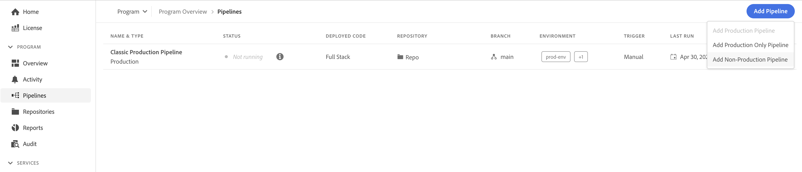

# 仅暂存和仅生产管道 {#stage-prod-only}

了解如何使用专用管道拆分暂存和生产部署。

>[!NOTE]
>
>此功能仅适用于[早期采用者计划。](/help/implementing/cloud-manager/release-notes/current.md#early-adoption)

## 概述 {#overview}

暂存环境和生产环境紧密耦合。默认情况下，对它们的部署链接到单一管道。这是一个部署管道，可部署到该程序中的暂存环境和生产环境。虽然这种耦合通常是合适的，但在某些用例中存在缺点：

* 如果您希望部署到仅暂存环境，则只能通过拒绝管道中的&#x200B;**升级到生产**&#x200B;步骤来执行此操作。但是，执行操作将会被标记为已取消。
* 如果您希望将暂存环境中的最新代码部署到生产环境中，则需要重新部署整个管道，其中包括暂存部署，即使那里没有任何代码更改也是如此。
* 由于在部署期间无法更新环境，如果您想在升级到生产环境之前在暂存环境中暂停并测试数天，则生产环境无法更新。这使得无法更新[环境变量](/help/implementing/cloud-manager/getting-access-to-aem-in-cloud/build-environment-details.md#environment-variables)等非依赖型任务。

仅暂存和仅生产管道通过提供专用的部署选项为这些用例提供解决方案。

* **仅暂存部署管道**&#x200B;仅会部署到暂存环境，部署和测试完成后执行即会结束。
   * 仅暂存管道的行为与标准耦合全栈生产管道相同，但没有生产部署步骤（审批、计划、部署）。
* **仅生产部署管道**&#x200B;仅会部署到生产环境，并且可以选择在暂存环境上成功完成和验证的执行，并在生产环境上部署其工件。
   * 仅生产管道会重用暂存部署中的工件，并会跳过构建阶段。

当全栈生产管道运行时，不会执行仅阶段或仅生产管道，反之亦然。如果仅阶段生产管道和全栈生产管道都配置了 **On Git Changes** 触发器，并且指向同一个分支和存储库，则只有仅阶段生产管道会自动启动。仅限生产的管道不会在 **On Git Changes** 上启动，因为它们未直接链接到存储库。

这些专用管道提供了更大的灵活性，但请注意以下操作细节和建议。

## 限制 {#limitations}

仅生产管道始终会使用仅暂存管道中的工件，无论在此期间通过标准耦合生产管道在暂存环境上部署了什么。

* 这可能会导致不必要的代码回滚。
* Adobe 建议在您开始使用仅生产和仅暂存管道后，就停止使用标准耦合生产管道。
* 如果您仍然决定运行标准耦合管道和仅暂存/仅生产管道，请记住重用工件以避免代码回滚。

## 已知问题 {#known-issues}

在开始测试此功能之前，请注意以下已知问题。

* 一旦您使用仅用于生产的管道，您可能无法从最新的AEM更新中获益
   * 在某些情况下，AEM更新过程可能会将您的代码恢复为上次通过全栈管道部署的代码。
* 如果您使用仅限生产或仅限暂存的管道，则将无法请求[环境还原](/help/operations/restore.md#offsite-backup)。

## 管道创建 {#pipeline-creation}

仅生产和仅暂存管道以与标准耦合的[生产管道](/help/implementing/cloud-manager/configuring-pipelines/configuring-production-pipelines.md)和[非生产管道类似的方式创建。](/help/implementing/cloud-manager/configuring-pipelines/configuring-non-production-pipelines.md) 请参阅这些文件以了解详细信息。

1. 在&#x200B;**管道**&#x200B;窗口中，点击或单击&#x200B;**添加管道**。

   * 选择&#x200B;**添加非生产管道**&#x200B;来创建仅暂存管道。
   * 选择&#x200B;**添加仅生产管道**&#x200B;来创建仅生产管道。

   

>[!NOTE]
>
>如果相应的管道已经存在，则某些选项可能会变灰。
>
>* 如果尚不存在仅暂存管道，则&#x200B;**添加仅生产管道**&#x200B;将不可用。
>* 如果标准耦合管道已经存在，则&#x200B;**添加生产管道**&#x200B;将不可用。
>* 每个程序只允许一个仅生产和一个仅暂存管道。

### 仅暂存管道 {#stage-only}

1. 在您选择&#x200B;**添加非生产管道**&#x200B;选项后，**添加非生产管道**&#x200B;对话框就会打开。
1. 要创建仅暂存管道，请在管道的&#x200B;**符合资格的部署环境**&#x200B;字段中选择暂存环境。填写剩余的字段，然后点击或单击&#x200B;**继续**。

   

1. 在&#x200B;**暂存测试**&#x200B;选项卡上，您可以定义应在暂存环境中执行的测试。点击或单击&#x200B;**保存**&#x200B;以保存您的新管道。

### 仅生产管道 {#prod-only}

1. 在您选择&#x200B;**添加仅生产管道**&#x200B;选项后，**添加仅生产管道**&#x200B;对话框就会打开。
1. 提供&#x200B;**管道名称**。对话框的其余选项和功能与标准耦合管道创建对话框中的其余选项和功能相同。点击或单击&#x200B;**保存**&#x200B;可保存管道。

## 运营仅生产和仅暂存管道 {#running}

仅生产管道和仅暂存管道的运行方式与[所有其他管道的运行方式相同。](/help/implementing/cloud-manager/configuring-pipelines/managing-pipelines.md#running-pipelines)有关详细信息，请参阅文档。

此外，可以直接从仅暂存管道的执行细节中触发仅生产管道运行。

### 仅暂存管道 {#stage-only-run}

仅暂存管道的运行方式几乎与标准耦合管道相同。但是，在运行结束时，在测试步骤之后，**升级构建**&#x200B;按钮允许您启动仅生产管道执行，该执行使用此执行在暂存环境部署的工件并将其部署到生产环境中。

**升级构建**&#x200B;按钮仅当您处于最近成功执行的进暂存管道中时才会出现。点击或单击后，它会要求您确认仅生产管道的运行，或者如果尚不存在仅生产管道，则创建一个这样的管道。

### 仅生产管道 {#prod-only-run}

对于仅生产管道，识别要部署到生产中的源工件非常重要。这些详细信息可以在&#x200B;**工件准备**&#x200B;步骤找到。您可以导航到这些执行来获取更多详细信息和日志。

