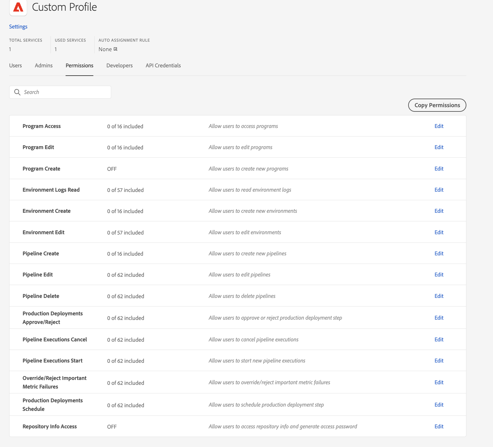

# 自定义权限 {#custom-permissions}

了解如何使用自定义权限创建具有可配置权限的新的自定义权限配置文件，以限制 Cloud Manager 用户对项目、管道和环境的访问。

>[!NOTE]
>
>此功能仅适用于[早期采用者计划。](/help/implementing/cloud-manager/release-notes/current.md#early-adoption)

## 简介 {#introduction}

Cloud Manager 具有一组预定义的角色，从而管理对 Cloud Manager 的各种功能的访问：

* 业务负责人
* 项目管理员
* 部署管理员
* 开发人员

自定义权限可让用户创建具有可配置权限的新的自定义权限配置文件，以限制 Cloud Manager 用户对项目、管道和环境的访问。

>[!TIP]
>
>有关预定义角色的详细信息，请参阅文档 [AEMas a Cloud Service团队和产品配置文件。](/help/onboarding/aem-cs-team-product-profiles.md)

## 使用自定义权限 {#using}

要创建和使用您自己的自定义权限，需要执行以下三个步骤：

1. [创建新的产品配置文件。](#create)
1. [向新产品配置文件分配自定义权限。](#assign-permissions)
1. [将用户分配给新产品配置文件。](#assign-users)

此部分将详细介绍这三个步骤。在创建自己的自定义权限时，您可能会发现参考[术语](#terms)和[可配置权限](#configurable-permissions)会很有用。

>[!NOTE]
>
>您必须具有Adobe Experience Manager as a Cloud ServiceAdmin Console中的产品管理员权限，才能为Cloud Manager创建新配置文件和管理权限。

### 创建新的产品配置文件 {#create}

您首先必须创建产品配置文件，然后才能向它分配自定义权限。

1. 登录 Cloud Manager，网址为 [my.cloudmanager.adobe.com](https://my.cloudmanager.adobe.com/)

1. 在Cloud Manager登陆页面上，选择 **管理访问权限** 按钮

1. 您将重定向到 Admin Console 的&#x200B;**产品**&#x200B;选项卡，可在其中管理 Cloud Manager 的用户和权限。在Admin Console中，选择 **新建配置文件** 按钮。

1. 提供有关配置文件的一般详细信息。

   * **产品配置文件名称** - 配置文件的描述性名称
   * **显示名称** - 将在 UI 中显示的缩写名称（选项）
   * **描述** - 配置文件的信息性描述，用于说明其用途（可选）
   * **通过电子邮件通知用户** - 选择此项后，在此配置文件中添加或删除用户时会通过电子邮件通知用户。

1. 选择 **保存** 完成后。

新产品配置文件将保存并在 Admin Console 中的产品配置文件列表中可见。

### 向配置文件分配自定义权限 {#assign-permissions}

现在，您已拥有新的产品配置文件，可以向其分配自定义权限。

1. 在Admin Console中，选择 [您刚刚创建的新产品配置文件。](#create)

1. 在打开的窗口中，选择&#x200B;**权限**&#x200B;选项卡以查看可编辑权限的列表。

   

1. 选择 **编辑** 用于编辑该文档的权限的链接。

1. 这将打开&#x200B;**编辑权限**&#x200B;窗口。
   * 您在上一步中选择的权限在左列中处于选定状态。
   * 可用于权限分配的权限项位于标记为&#x200B;**可用权限**&#x200B;项的中间列中。
   * 分配的权限项位于标记为&#x200B;**包含的权限项**&#x200B;的右列中。

   

1. 选择加号(`+`)图标以将其添加到列 **包含的权限项**.

   * 选择 `i` 图标来了解权限项的更多信息。

1. 选择 **全部添加** 顶部按钮 **可用权限** 列以添加所有权限。

1. 如果配置文件应始终具有所有权限项，请考虑使用 **自动包含** 选项。

   * **开启**  — 所有当前权限项和未来权限项都将移到“包含的权限项”，保存时将相应地应用。
   * **关闭**  — 所有权限项都将移回可用的权限项，保存时将相应地适用。

1. 选择 **保存** 当您完成新产品配置文件的权限项定义时。

新产品配置文件现已与其自定义权限一起保存。

### 将用户分配给自定义权限 {#assign-users}

您现在可以将用户分配给使用自定义权限创建的新产品配置文件。

1. 在Admin Console中，选择 [您刚刚为其分配了自定义权限的新产品配置文件。](#assign-permissions)

1. 在打开的窗口中，选择&#x200B;**用户**&#x200B;选项卡。

1. 选择 **添加用户** 按钮并将用户分配给您具有自定义权限的新产品配置文件。

请参阅部分 **将用户和用户组添加到产品配置文件** 文档的 [管理企业用户的产品配置文件](https://helpx.adobe.com/cn/enterprise/using/manage-product-profiles.html) 以了解有关如何使用Admin Console的更多详细信息。

## 可配置的权限 {#configurable-permissions}

以下权限可用于创建自定义配置文件。

| 权限 | 描述 |
|---|---|
| 项目创建 | 允许用户创建项目 |
| 项目访问权限 | 允许用户访问项目 |
| 项目编辑权限 | 允许用户编辑项目 |
| 环境创建 | 允许用户创建环境 |
| 环境编辑 | 允许用户更新和编辑环境 |
| 环境日志读取 | 允许用户读取环境日志 |
| 管道创建权限 | 允许用户创建新管道 |
| 管道删除权限 | 允许用户删除管道 |
| 管道编辑权限 | 允许用户编辑管道 |
| 生产部署批准/拒绝权限 | 允许用户批准或拒绝生产部署步骤 |
| 管道执行取消权限 | 允许用户取消管道执行 |
| 管道执行开始权限 | 允许用户开始新的管道执行 |
| 覆盖/拒绝重要量度失败权限 | 允许用户覆盖/拒绝重要量度失败 |
| 生产部署计划权限 | 允许用户计划生产部署步骤 |
| 存储库信息访问权限 | 允许用户访问存储库信息并生成访问密码 |

### 组织级权限 {#organization-level}

组织级别的权限是指始终在组织中跨所有项目授予的权限。

以下权限是组织级权限：

* **项目创建**  — 此权限允许用户在组织中创建项目。
* **存储库信息访问权限**&#x200B;此租户/组织级权限允许用户生成用户名、密码和存储库 URL，以便访问客户项目并为其做出贡献。
   * 对于组织中的所有存储库来说，存储库访问的用户名和密码是通用的，但存储库 URL 对于每个项目来说是唯一的。
   * 请参阅 [访问存储库](/help/implementing/cloud-manager/managing-code/accessing-repos.md) 以了解更多信息。

## 术语 {#terms}

以下术语用于创建并管理自定义权限和预定义的角色。

| 术语 | 描述 |
|---|---|
| 预定义的权限 | 预定义的角色，如 **业务负责人**， **部署管理员**&#x200B;等等，以管理Cloud Manager的各种功能。 有关预定义角色的详细信息，请参阅文档 [AEMas a Cloud Service团队和产品配置文件。](/help/onboarding/aem-cs-team-product-profiles.md) |
| 自定义权限 | Cloud Manager 功能，允许用户创建权限配置文件以定义角色来管理 Cloud Manager 的受支持功能 |
| 产品配置文件 | 在 Admin Console 中创建，用于管理可配置的权限，这些权限将适用于权限配置文件中的用户 |
| 可配置的权限 | Cloud Manager 权限，可在权限配置文件中配置 |
| 权限项 | 可应用权限的项目、环境或管道资源 |

权限项是指权限适用于的范围。通常，它将是下列项之一。

| 权限项类型 | 示例 | 描述 |
|---|---|---|
| 组织 | 组织：A 公司 | 所有对组织适用的资源。资源可以是项目、环境或管道。如果用户为任意权限添加一个组织，则该组织中的所有新资源也将具有此权限。 |
| 项目 | 项目 A | 所有对项目适用的资源 |
| 环境 | 项目 A：环境 | 适用于特定环境 |
| 管道 | 项目 A：管道 | 适用于特定管道 |

## 限制 {#limitations}

使用自定义权限时，请牢记以下限制。

* 自定义权限配置文件在配置权限时还将列出AMS程序、环境和管道。
* 在Cloud Manager中创建的项目、环境、管道等资源可能需要两分钟才能在Admin Console中显示权限配置。
* 在自定义权限服务无法响应的极少数情况下，预定义的配置文件仍可用，并且预定义的配置文件中的用户仍具有相应的访问权限。

## 常见问题解答 {#faq}

### 哪些权限配置文件是预定义的权限配置文件？

* 业务负责人
* 项目管理员
* 部署管理员
* 开发人员

有关预定义角色的详细信息，请参阅 [AEMas a Cloud Service团队和产品配置文件。](/help/onboarding/aem-cs-team-product-profiles.md)

### 引入自定义配置文件后，预定义的权限配置文件会发生什么情况？

默认产品配置文件和 Cloud Manager 角色仍将照常发挥作用。

### 是否能编辑预定义的权限配置文件？

否，默认配置文件是不可编辑的。您无法在默认权限配置文件中添加或删除权限。您只能在预定义的配置文件中添加或删除用户。

### 在自定义配置文件可用后，是否应删除预定义的权限配置文件？

不得从 Admin Console 中删除预定义的权限配置文件。

### 是否能将用户添加到多个权限配置文件？

是，一个用户可以是多个配置文件的一部分，包括预定义的权限配置文件和自定义权限配置文件。在将一个用户分配给多个配置文件时，所有分配的权限配置文件中的组合权限将可供该用户使用。

### 如果用户有权编辑环境/管道，但无权访问包含该环境/管道的项目，会发生什么情况？

在这种情况下，如果用户没有包含环境或管道的&#x200B;**项目访问**&#x200B;权限，则将无法访问环境或管道。
