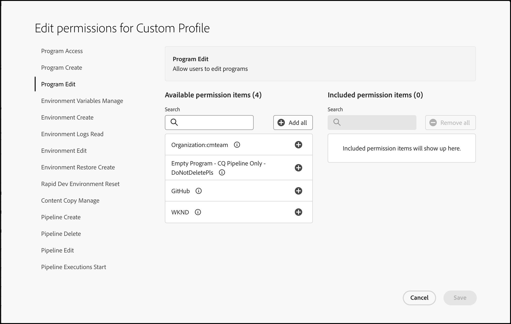

# 自定义权限 {#custom-permissions}

了解如何在Cloud Manager中设置量身定制的权限配置文件。 您可以为程序、管道和环境配置特定的访问控制，从而精细地控制每个用户的操作。

## 简介 {#introduction}

Cloud Manager 有一组预定义的角色，用于管理对 Cloud Manager 各种功能的访问权限：

* 业务负责人
* 项目管理员
* 部署管理员
* 开发人员

自定义权限允许用户使用可配置的权限创建自定义权限配置文件，以限制Cloud Manager用户对程序、管道和环境的访问。

>[!TIP]
>有关预定义角色的详细信息，请参阅[AEM as a Cloud Service团队和产品配置文件](/help/onboarding/aem-cs-team-product-profiles.md)。

## 使用自定义权限 {#using}

创建和使用您自己的自定义权限需要以下三个步骤：

1. [创建产品配置文件](#create)。
1. [为产品配置文件分配自定义权限](#assign-permissions)。
1. [将用户分配给产品配置文件](#assign-users)。

>[!TIP]
>在创建自己的自定义权限时，您可能会发现查看[条款](#terms)和[可配置权限](#configurable-permissions)部分很有帮助。

>[!IMPORTANT]
>您必须在Adobe Experience Manager as a Cloud Service的Admin Console中拥有产品管理员权限，才能创建Cloud Manager的产品配置文件和管理权限。

### 创建产品配置文件 {#create}

1. 在[my.cloudmanager.adobe.com](https://my.cloudmanager.adobe.com/)登录Cloud Manager。

1. 在Cloud Manager登录页面上，单击&#x200B;**管理访问权限**。

   

1. 在Admin Console中，单击&#x200B;**新建配置文件**。

   

1. 提供有关配置文件的一般详细信息。

   * **产品配置文件名称** - 配置文件的描述性名称
   * **显示名称** - UI（选项）中显示的缩写名称
   * **描述** - 有关配置文件的信息性描述，用于说明其用途（可选）
   * **通过电子邮件通知用户** — 用户添加到此配置文件或从中移除时，会收到电子邮件通知。

1. 单击&#x200B;**保存**。

新的产品配置文件已保存，并在 Admin Console 中的产品配置文件列表中可见。

### 为产品配置文件分配自定义权限 {#assign-permissions}

1. 在Admin Console中，单击您创建的[新产品配置文件](#create)的名称。

1. 在&#x200B;**自定义配置文件**&#x200B;页面中，单击&#x200B;**权限**&#x200B;选项卡。

   

1. 在权限名称的行中，单击&#x200B;**编辑**。

1. 在&#x200B;**编辑自定义配置文件的权限**&#x200B;对话框中，执行以下操作之一：

   * 在&#x200B;**可用权限项**&#x200B;列的顶部附近，单击 **全部添加**&#x200B;以添加所有权限。
   * 若要向&#x200B;**包含的权限项**&#x200B;列添加单个权限，请单击其关联的。

     

1. 单击&#x200B;**保存**。

### 将用户分配给产品配置文件 {#assign-users}

1. 在Admin Console中，单击您分配了自定义权限的[新产品配置文件的名称](#assign-permissions)。

1. 在打开的窗口中，单击&#x200B;**用户**&#x200B;选项卡。

1. 单击&#x200B;**添加用户**&#x200B;并将用户分配给具有自定义权限的产品配置文件。

在[管理企业用户的产品配置文件](https://helpx.adobe.com/cn/enterprise/using/manage-product-profiles.html)中，有关如何使用Admin Console的更多详细信息，请参阅&#x200B;**将用户和用户组添加到产品配置文件**。

## 可配置的权限 {#configurable-permissions}

在创建自定义产品配置文件时，可以使用以下权限。

| 权限 | 描述 |
| --- | --- |
| `Program Create` | 允许用户创建项目。 |
| `Program Access` | 允许用户访问程序。 |
| `Program Edit` | 允许用户编辑程序。 |
| `Environment Create` | 允许用户创建环境。 |
| `Environment Edit` | 允许用户更新和编辑环境。 |
| `Environment Logs Read` | 允许用户读取环境日志。 |
| `Environment Variables Manage` | 允许用户创建/编辑/删除环境配置。 |
| `Environment Restore Create` | 允许用户创建环境恢复。 |
| `Rapid Development Environment Reset` | 允许用户重置快速开发环境(RDE)。 |
| `Content Copy Manage` | 允许用户管理内容复制操作。 |
| `Pipeline Create` | 允许用户创建管道。 |
| `Pipeline Delete` | 允许用户删除管道。 |
| `Pipeline Edit` | 允许用户编辑管道。 |
| `Production Deployments Approve/Reject` | 允许用户批准或拒绝生产部署步骤。 |
| `Pipeline Executions Cancel` | 允许用户取消管道执行。 |
| `Pipeline Executions Start` | 允许用户启动新的执行管道。 |
| `Override/Reject Important Metric Failures` | 允许用户覆盖/拒绝重要量度失败。 |
| `Production Deployments Schedule` | 允许用户计划生产部署步骤。 |
| `Repository Info Access` | 允许用户访问存储库信息并生成访问密码。 |
| `Repository Create` | 允许用户创建Git存储库。 |
| `Repository Delete` | 允许用户删除Git存储库。 |
| `Repository Edit` | 允许用户编辑Git存储库。 |
| `Repository Code Generate` | 允许用户从原型生成项目。 |
| `Domain Name Manage` | 允许用户创建/编辑/删除域名。 |
| `IP Allowlist Manage` | 允许用户创建/编辑/删除IP和IP绑定。 |
| `Network Infrastructure Manage` | 允许用户创建/删除/编辑/测试网络基础架构。 |
| `SSL Certificate Manage` | 允许用户创建/编辑/删除SSL证书。 |
| `New Relic Sub Account User Manage` | 允许用户读取/编辑New Relic子帐户用户。 |

### 组织级权限 {#organization-level}

组织级别的权限是指始终在组织中跨所有项目授予的权限。

以下权限是组织级权限：

* **`Program Create`** — 此权限允许用户在组织中创建项目。
* **存储库信息访问** — 此租户/组织级别的权限允许用户生成用于访问和参与客户项目的用户名、密码和存储库URL。
   * 存储库访问的用户名和密码在组织中的所有存储库中都是通用的。 但是，每个项目的存储库URL都是唯一的。
   * 有关详细信息，请参阅[访问存储库](/help/implementing/cloud-manager/managing-code/accessing-repos.md)。

## 术语 {#terms}

以下术语用于创建并管理自定义权限和预定义的角色。

| 术语 | 描述 |
| --- | --- |
| 预定义的权限 | 预定义角色（如&#x200B;**业务负责人**&#x200B;和&#x200B;**部署管理员**）可管理Cloud Manager的各种功能。 有关预定义角色的详细信息，请参阅[AEM as a Cloud Service团队和产品配置文件](/help/onboarding/aem-cs-team-product-profiles.md)。 |
| 自定义权限 | 通过Cloud Manager功能，用户可创建权限配置文件以定义用于管理Cloud Manager所支持功能的角色。 |
| 产品配置文件 | 在Admin Console中创建，用于管理适用于权限配置文件中用户的可配置权限。 |
| 可配置的权限 | 您可以在权限配置文件中配置的Cloud Manager权限。 |
| 权限项 | 可对其应用权限的项目、环境或管道资源。 |

权限项是指权限应用的范围。 通常，它是下列项之一。

| 权限项类型 | 示例 | 描述 |
| --- | --- | --- |
| 组织 | 组织:companyA | 所有对组织适用的资源。 资源可以是项目、环境或管道。 如果用户为任意权限添加一个组织，则该组织中的所有新资源也会具有此权限。 |
| 项目 | 项目 A | 项目的所有适用资源。 |
| 环境 | 项目 A：环境 | 适用于特定环境。 |
| 管道 | 项目 A：管道 | 适用于特定管道。 |

## 使用说明 {#usage-notes}

* 自定义权限配置文件在配置权限时还会列出AMS程序、环境和管道。
* 在Cloud Manager中创建的项目、环境和管道等资源可能需要几分钟才能在Admin Console中显示以进行权限配置。
* 在自定义权限服务无法响应的极少数情况下，预定义的配置文件仍可用，并且预定义的配置文件中的用户仍具有相应的访问权限。

## 常见问题解答 {#faq}

### 哪些权限配置文件是预定义的权限配置文件？

* 业务负责人
* 项目管理员
* 部署管理员
* 开发人员

有关预定义角色的详细信息，请参阅[AEM as a Cloud Service团队和产品配置文件](/help/onboarding/aem-cs-team-product-profiles.md)。

### 随着自定义用户档案的引入，预定义权限用户档案会发生什么情况？

默认产品配置文件和 Cloud Manager 角色仍将照常发挥作用。

### 是否能编辑预定义的权限配置文件？

不会。 默认配置文件不可编辑。 您无法从默认权限配置文件中添加或删除权限。 您只能在预定义的配置文件中添加或删除用户。

### 在自定义配置文件可用后，是否应删除预定义的权限配置文件？

请勿从Admin Console中删除预定义的权限配置文件。

### 是否能将用户添加到多个权限配置文件？

是。 用户可以属于多个配置文件，包括预定义和自定义权限配置文件。 在将一个用户分配给多个配置文件时，所有分配的权限配置文件中的组合权限可供该用户使用。

### 如果用户有权编辑环境/管道，但无权访问包含该环境/管道的项目，会发生什么情况？

如果用户没有包含环境或管道的&#x200B;**项目访问**&#x200B;权限，则无法访问环境或管道。
