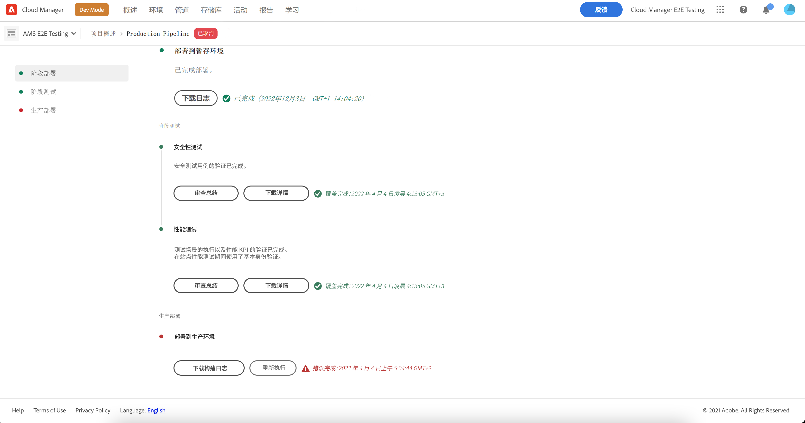

# 部署您的代码 {#deploy-your-code}

了解如何使用 AEM as a Cloud Service 中的 Cloud Manager 管道将代码部署到生产环境中。


通过生产管道将代码无缝部署到暂存环境，然后再部署到生产环境。 生产管道执行分为以下两个逻辑阶段：

1. **部署到暂存环境** — 已生成代码并将其部署到暂存环境，以进行自动功能测试、UI测试、体验审核和用户验收测试(UAT)。
1. **部署到生产环境** — 一旦在暂存环境中验证了生成并批准将其升级到生产环境，相同的生成工件将部署到生产环境。

_只有“完整堆栈代码”管道类型支持代码扫描、功能测试、UI 测试和体验审核。_

## 部署过程 {#deployment-process}

所有 Cloud Service 部署都遵循滚动过程，以确保零停机。请参阅[滚动部署的工作原理](/help/implementing/deploying/overview.md#how-rolling-deployments-work)，以了解更多信息。

>[!NOTE]
>
>每次部署都会清除 Dispatcher 缓存。它随后在新发布节点接受流量之前“预热起来”。

## 在AEM as a Cloud Service中使用Cloud Manager部署代码 {#deploying-code-with-cloud-manager}

[配置生产管道](/help/implementing/cloud-manager/configuring-pipelines/configuring-production-pipelines.md)（包括存储库、环境和测试环境）后，便可以部署代码。

1. 在 [my.cloudmanager.adobe.com](https://my.cloudmanager.adobe.com/) 登录 Cloud Manager 并选择适当的组织。

1. 在&#x200B;**[我的程序](/help/implementing/cloud-manager/navigation.md#my-programs)**&#x200B;控制台上，单击要为其部署代码的程序。

1. 在&#x200B;**概述**&#x200B;页面的行动号召区域中，单击&#x200B;**部署**。

   

1. 在&#x200B;**部署到生产**&#x200B;页面上，单击&#x200B;**生成**。

   

构建过程通过以下三个有序阶段部署代码：

1. [暂存部署阶段](#stage-deployment)
1. [暂存测试阶段](#stage-testing)
1. [生产部署阶段](#production-deployment)

>[!TIP]
>
>您可以通过查看日志或依据测试标准审查结果，来审查各种部署过程的步骤。

### 暂存部署阶段 {#stage-deployment}

**暂存部署**&#x200B;阶段涉及以下步骤：

| 暂存部署步骤 | 描述 |
| --- | --- |
| 验证 | 确保将管道配置为使用当前可用的资源。 例如，测试配置的分支存在其中且环境可用的资源。 |
| 版本和单元测试 | 运行容器化的构建过程。<br>有关生成环境的详细信息，请参阅[生成环境详细信息](/help/implementing/cloud-manager/getting-access-to-aem-in-cloud/build-environment-details.md)。 |
| 代码扫描 | 评估应用程序代码的质量。<br>有关测试过程的详细信息，请参阅[代码质量测试](/help/implementing/cloud-manager/code-quality-testing.md)。 |
| 生成图像 | 此过程会将内容和Dispatcher包从构建步骤转换为Docker图像。 它还根据这些包生成Kubernetes配置。 |
| 部署到暂存环境 | 将映像部署到暂存环境，为[暂存测试阶段](#stage-testing)做准备。 |


### 暂存测试阶段 {#stage-testing}

**暂存测试**&#x200B;阶段涉及以下步骤：

| 暂存测试步骤 | 描述 |
| --- | --- |
| 产品功能测试 | Cloud Manager管道执行针对暂存环境运行的测试。<br>另请参阅[产品功能测试](/help/implementing/cloud-manager/functional-testing.md#product-functional-testing)。 |
| 自定义功能测试 | 管道中的此步骤始终执行，不能跳过。 如果构建未生成测试JAR，则测试会自动通过。<br>另请参阅[自定义功能测试](/help/implementing/cloud-manager/functional-testing.md#custom-functional-testing)。 |
| 自定义 UI 测试 | 一项可选功能，可自动运行为自定义应用程序创建的UI测试。<br>UI测试基于Selenium并打包到Docker图像中，以在语言和框架中提供灵活性。 此方法允许您使用Java和Maven、Node和WebDriver.io，或任何基于Selenium的框架或技术。<br>另请参阅[自定义用户界面测试](/help/implementing/cloud-manager/functional-testing.md#custom-ui-testing)。 |
| 体验审核 | 管道中的此步骤始终执行，不能跳过。 在执行生产管道时，在运行检查的自定义功能测试之后会包含体验审核步骤。<ul><li>配置的页面将提交给服务并进行评估。</li><li>审核结果是信息性的，显示分数以及当前分数和以前分数之间的变化。</li><li>此细节对于确定当前部署中是否会引入回归非常有用。</li></ul>请参阅[了解体验审核结果](/help/implementing/cloud-manager/experience-audit-dashboard.md)。</li></ul> |


### 生产部署阶段 {#production-deployment}

部署到生产拓扑的过程略有不同，旨在尽量减小对AEM网站访客产生的影响。

生产部署通常遵循与前述相同的步骤，但它采用的是滚动方式。 这些步骤包括：

1. 将 AEM 包部署到作者。
1. 从负载平衡器分离`dispatcher1`。
1. 将AEM包部署到`publish1`，并将Dispatcher包部署到`dispatcher1`，刷新Dispatcher缓存。
1. 将`dispatcher1`放回负载平衡器中。
1. 当`dispatcher1`重新投入使用时，从负载平衡器中分离`dispatcher2`。
1. 将AEM包部署到`publish2`，并将Dispatcher包部署到`dispatcher2`，刷新Dispatcher缓存。
1. 将`dispatcher2`放回负载平衡器中。

此过程将持续进行，直到部署到达拓扑中的所有发布者和Dispatcher为止。


## 部署期间超时 {#timeouts}

以下步骤会在部署期间等待用户反馈时超时：

| 步骤 | 超时 |
|--- |--- |
| 代码质量测试 | 14 天 |
| 安全性测试 | 14 天 |
| 性能测试 | 14 天 |
| 申请批准 | 14 天 |
| 计划生产部署 | 14 天 |
| CSE 支持 | 14 天 |

## 重新执行生产部署 {#reexecute-deployment}

在罕见的情况下，生产部署步骤可能会因短暂的原因而失败。在这种情况下，只要生产部署步骤已完成，则支持重新执行生产部署步骤，而不管完成的类型（例如，取消或不成功）。 重新执行将使用包含以下三个步骤的相同管道来创建一个新的执行：

1. **验证** — 与正常管道执行期间发生的验证相同。
1. **生成** — 在重新执行的上下文中，生成步骤将复制工件，而实际上并不执行新的生成过程。
1. **生产部署** — 使用与正常管道执行中的生产部署步骤相同的配置和选项。

在此类能够重新执行的情况下，生产管道状态页面在平常的&#x200B;**下载构建日志**&#x200B;选项旁提供&#x200B;**重新执行**&#x200B;选项。



>[!NOTE]
>
>在重新执行中，在 UI 中为构建步骤加上标签以反映它复制工件而非重新构建。

### 限制 {#limitations}

* 生产部署步骤的重新执行仅适用于上一次执行。
* 重新执行不适用于推送更新执行。 如果最后一次执行是推送更新执行，则不可能重新执行。
* 如果上一次执行在生产部署步骤前的任何时间点失败，则无法重新执行。

### 重新执行 API {#reexecute-API}

除了在 UI 中可用之外，您还可以使用 [Cloud Manager API](https://developer.adobe.com/experience-cloud/cloud-manager/reference/api/#tag/Pipeline-Execution) 触发重新执行以及标识已作为重新执行触发的执行。

#### 触发重新执行 {#reexecute-deployment-api}

要触发重新执行，请在生产部署步骤状态的 HAL 链接 `https://ns.adobe.com/adobecloud/rel/pipeline/reExecute` 发出 PUT 请求。

* 如果存在此链接，则可以从该步骤重新开始执行。
* 如果此链接不存在，则无法从该步骤重新开始执行。

此链接仅适用于生产部署步骤。

```JavaScript
 {
  "_links": {
    "https://ns.adobe.com/adobecloud/rel/pipeline/logs": {
      "href": "/api/program/4/pipeline/1/execution/953671/phase/1575676/step/2983530/logs",
      "templated": false
    },
    "https://ns.adobe.com/adobecloud/rel/pipeline/reExecute": {
      "href": "/api/program/4/pipeline/1/execution?stepId=2983530",
      "templated": false
    },
    "https://ns.adobe.com/adobecloud/rel/pipeline/metrics": {
      "href": "/api/program/4/pipeline/1/execution/953671/phase/1575676/step/2983530/metrics",
      "templated": false
    },
    "self": {
      "href": "/api/program/4/pipeline/1/execution/953671/phase/1575676/step/2983530",
      "templated": false
    }
  },
  "id": "6187842",
  "stepId": "2983530",
  "phaseId": "1575676",
  "action": "deploy",
  "environment": "weretail-global-b75-prod",
  "environmentType": "prod",
  "environmentId": "59254",
  "startedAt": "2022-01-20T14:47:41.247+0000",
  "finishedAt": "2022-01-20T15:06:19.885+0000",
  "updatedAt": "2022-01-20T15:06:20.803+0000",
  "details": {
  },
  "status": "FINISHED"
```

HAL 链接的 href 值的语法只是一个示例。应始终从 HAL 链接读取而不是生成实际值。

通过将PUT请求提交到此端点，将产生201响应（如果成功），并且响应正文是新执行的表示形式。 此工作流类似于通过API开始常规执行。

#### 识别重新执行的执行 {#identify-reexecution}

系统通过将`trigger`字段设置为值`RE_EXECUTE`来识别重新执行。
