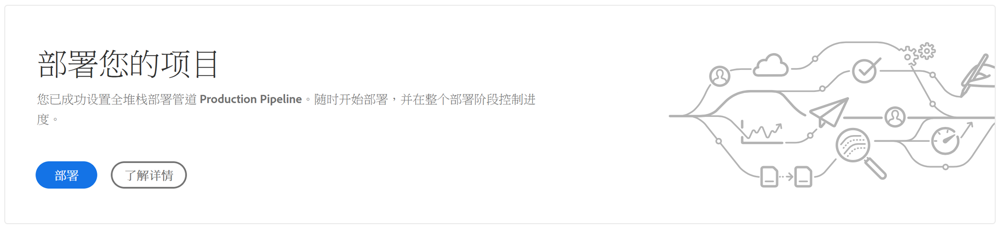
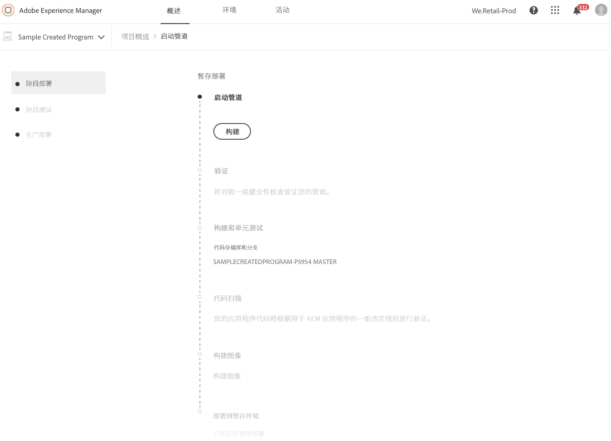
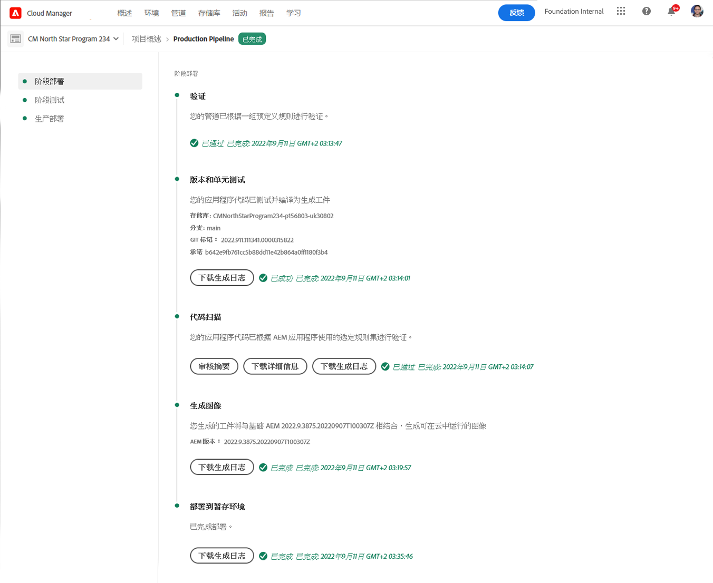
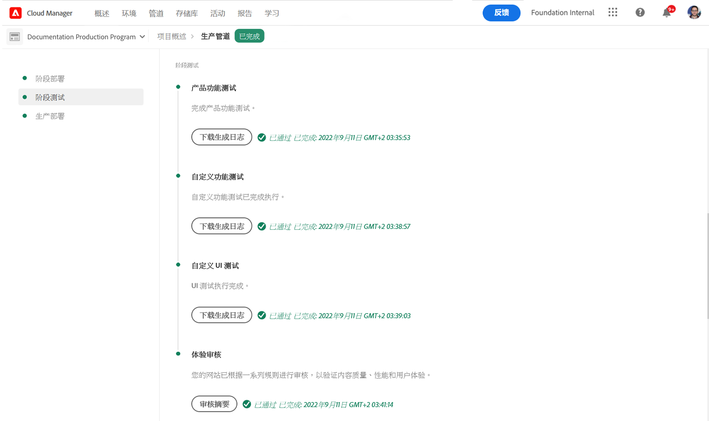
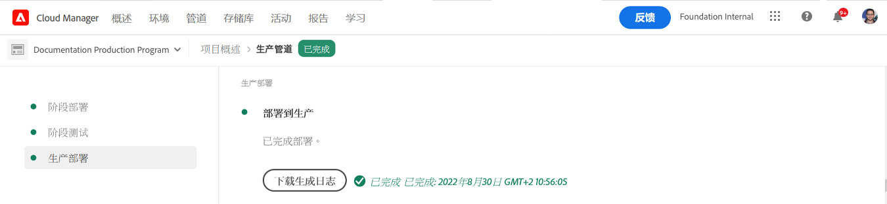

# 部署代码 {#deploy-your-code}

了解如何在AEMas a Cloud Service中使用Cloud Manager管道部署代码。

## 在AEMas a Cloud Service中使用Cloud Manager部署代码 {#deploying-code-with-cloud-manager}

一旦 [配置了生产管道](/help/implementing/cloud-manager/configuring-pipelines/configuring-production-pipelines.md) 包括存储库、环境和测试环境，您都可以部署代码。

1. 登录Cloud Manager(位于 [my.cloudmanager.adobe.com](https://my.cloudmanager.adobe.com/) 并选择相应的组织。

1. 单击要为其部署代码的程序。

1. 单击 **部署** 从 **概述** 屏幕以启动部署过程。

   

1. 的 **管道执行** 屏幕。 单击 **生成** 以启动该过程。

   

构建过程会分三个阶段部署您的代码。

1. [Stage Deployment](#stage-deployment)
1. [阶段测试](#stage-testing)
1. [生产部署](#production-deployment)

>[!TIP]
>
>您可以通过查看日志或查看结果来查看各种部署流程中的步骤，以了解测试标准。

## 阶段部署阶段 {#stage-deployment}

的 **Stage Deployment** 阶段。 涉及这些步骤。

* **验证**   — 此步骤可确保将管道配置为使用当前可用的资源。 例如，测试配置的分支存在且环境可用。
* **构建和单元测试**  — 此步骤运行容器化生成流程。
   * 请查看文档 [构建环境详细信息](/help/implementing/cloud-manager/getting-access-to-aem-in-cloud/build-environment-details.md) 以了解有关生成环境的详细信息。
* **代码扫描**  — 此步骤会评估应用程序代码的质量。
   * 请查看文档 [代码质量测试](/help/implementing/cloud-manager/code-quality-testing.md) ，以了解有关测试过程的详细信息。
* **构建图像**  — 此过程负责将构建步骤生成的内容和调度程序包转换为Docker图像和Kubernetes配置。
* **部署到暂存环境**  — 映像已部署到暂存环境，以便为 [舞台测试阶段。](#stage-testing)

## 阶段测试阶段 {#stage-testing}

的 **阶段测试** 阶段涉及这些步骤。

* **产品功能测试** - Cloud Manager管道执行针对暂存环境运行的测试。
   * 请参阅该文档 [产品功能测试](/help/implementing/cloud-manager/functional-testing.md#product-functional-testing) 以了解更多详细信息。

* **自定义功能测试**  — 管道中的此步骤始终执行，无法跳过。 如果内部版本未生成测试JAR，则测试默认通过。
   * 请参阅该文档 [自定义功能测试](/help/implementing/cloud-manager/functional-testing.md#custom-functional-testing) 以了解更多详细信息。

* **自定义UI测试**  — 此步骤是一项可选功能，可自动运行为自定义应用程序创建的UI测试。
   * UI测试是Docker图像中打包的基于硒的测试，允许在语言和框架（如Java和Maven、Node和WebDriver.io，或基于Selenium构建的任何其他框架和技术）中进行广泛选择。
   * 请参阅该文档 [自定义UI测试](/help/implementing/cloud-manager/functional-testing.md#custom-ui-testing) 以了解更多详细信息。

* **体验审核**  — 管道中的此步骤始终执行，无法跳过。 执行生产管道时，在将运行检查的自定义功能测试之后，将包含体验审核步骤。
   * 配置的页面将提交到服务并进行评估。
   * 结果是信息性的，并显示当前得分和先前得分之间的得分变化。
   * 此洞察对于确定当前部署中是否引入回归参数非常有价值。
   * 请参阅该文档 [了解体验审核结果](/help/implementing/cloud-manager/experience-audit-testing.md) 以了解更多详细信息。

## 生产部署阶段 {#deployment-production}

部署到生产拓扑的流程略有不同，以便最大限度地减少对AEM网站的访客影响。

生产部署通常遵循与之前所述相同的步骤，但采用滚动方式。

1. 部署AEM包以进行创作。
1. 从负载平衡器中分离Dispatcher1。
1. 将AEM包部署到publish1，将调度程序包部署到dispatcher1，刷新调度程序缓存。
1. 将dispatcher1重新放入负载平衡器中。
1. 调度程序1恢复服务后，从负载平衡器中分离dispatcher2。
1. 将AEM包部署到publish2，将调度程序包部署到dispatcher2，刷新调度程序缓存。
1. 将dispatcher2重新放入负载平衡器中。

此过程会一直持续到部署到达拓扑中的所有发布者和调度程序为止。

## 部署过程 {#deployment-process}

所有Cloud Service部署都遵循滚动流程，以确保零停机时间。 请参阅该文档 [滚动部署的工作原理](/help/implementing/deploying/overview.md#how-rolling-deployments-work) 以了解更多。