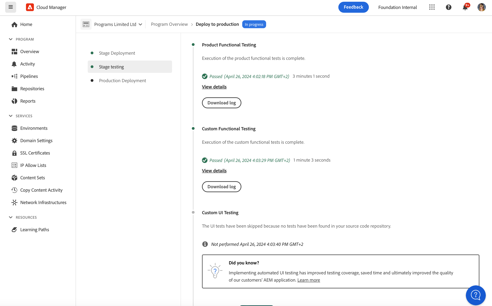

# 部署代码 {#deploy-your-code}

了解如何在AEMas a Cloud Service中使用Cloud Manager管道将代码部署到生产环境。


可通过生产管道将代码无缝部署到暂存环境，然后再部署到生产环境。 生产管道执行分为两个逻辑阶段。

1. 部署到暂存环境
   * 该代码已构建并部署到暂存环境，用于自动进行功能测试、UI测试、体验审核和用户接受测试(UAT)。
1. 部署到生产环境
   * 在暂存环境上验证内部版本并批准将其升级到生产环境后，会将相同的内部版本对象部署到生产环境。

_只有“完整堆栈代码”管道类型支持代码扫描、功能测试、UI测试和体验审核。_

## 在AEMas a Cloud Service中使用Cloud Manager部署代码 {#deploying-code-with-cloud-manager}

一旦 [配置了生产管道](/help/implementing/cloud-manager/configuring-pipelines/configuring-production-pipelines.md) 包括存储库、环境和测试环境，您都可以部署代码。

1. 登录Cloud Manager(位于 [my.cloudmanager.adobe.com](https://my.cloudmanager.adobe.com/) 并选择相应的组织。

1. 单击要为其部署代码的程序。

1. 单击 **部署** 从 **概述** 屏幕以启动部署过程。

   

1. 的 **管道执行** 屏幕。 单击 **生成** 以启动该过程。

   

构建过程会分三个阶段部署您的代码。

1. [Stage Deployment](#stage-deployment)
1. [阶段测试](#stage-testing)
1. [生产部署](#production-deployment)

>[!TIP]
>
>您可以通过查看日志或查看结果来查看各种部署流程中的步骤，以了解测试标准。

## 阶段部署阶段 {#stage-deployment}

的 **Stage Deployment** 阶段。 涉及这些步骤。

* **验证**   — 此步骤可确保将管道配置为使用当前可用的资源。 例如，测试配置的分支存在且环境可用。
* **构建和单元测试**  — 此步骤运行容器化生成流程。
   * 请查看文档 [构建环境详细信息](/help/implementing/cloud-manager/getting-access-to-aem-in-cloud/build-environment-details.md) 以了解有关生成环境的详细信息。
* **代码扫描**  — 此步骤会评估应用程序代码的质量。
   * 请查看文档 [代码质量测试](/help/implementing/cloud-manager/code-quality-testing.md) ，以了解有关测试过程的详细信息。
* **构建图像**  — 此过程负责将构建步骤生成的内容和调度程序包转换为Docker图像和Kubernetes配置。
* **部署到暂存环境**  — 映像已部署到暂存环境，以便为 [舞台测试阶段。](#stage-testing)


## 阶段测试阶段 {#stage-testing}

的 **阶段测试** 阶段涉及这些步骤。

* **产品功能测试** - Cloud Manager管道执行针对暂存环境运行的测试。
   * 请参阅该文档 [产品功能测试](/help/implementing/cloud-manager/functional-testing.md#product-functional-testing) 以了解更多详细信息。

* **自定义功能测试**  — 管道中的此步骤始终执行，无法跳过。 如果内部版本未生成测试JAR，则测试默认通过。
   * 请参阅该文档 [自定义功能测试](/help/implementing/cloud-manager/functional-testing.md#custom-functional-testing) 以了解更多详细信息。

* **自定义UI测试**  — 此步骤是一项可选功能，可自动运行为自定义应用程序创建的UI测试。
   * UI测试是Docker图像中打包的基于硒的测试，允许在语言和框架（如Java和Maven、Node和WebDriver.io，或基于Selenium构建的任何其他框架和技术）中进行广泛选择。
   * 请参阅该文档 [自定义UI测试](/help/implementing/cloud-manager/functional-testing.md#custom-ui-testing) 以了解更多详细信息。

* **体验审核**  — 管道中的此步骤始终执行，无法跳过。 执行生产管道时，在将运行检查的自定义功能测试之后，将包含体验审核步骤。
   * 配置的页面将提交到服务并进行评估。
   * 结果是信息性的，并显示当前得分和先前得分之间的得分变化。
   * 此洞察对于确定当前部署中是否引入回归参数非常有价值。
   * 请参阅该文档 [了解体验审核结果](/help/implementing/cloud-manager/experience-audit-testing.md) 以了解更多详细信息。



## 生产部署阶段 {#deployment-production}

部署到生产拓扑的流程略有不同，以便最大限度地减少对AEM网站的访客影响。

生产部署通常遵循与之前所述相同的步骤，但采用滚动方式。

1. 部署AEM包以进行创作。
1. 从负载平衡器中分离Dispatcher1。
1. 将AEM包部署到publish1，将调度程序包部署到dispatcher1，刷新调度程序缓存。
1. 将dispatcher1重新放入负载平衡器中。
1. 调度程序1恢复服务后，从负载平衡器中分离dispatcher2。
1. 将AEM包部署到publish2，将调度程序包部署到dispatcher2，刷新调度程序缓存。
1. 将dispatcher2重新放入负载平衡器中。

此过程会一直持续到部署到达拓扑中的所有发布者和调度程序为止。


## 超时 {#timeouts}

如果留下等待用户反馈的时间，以下步骤将超时：

| 步骤 | 超时 |
|--- |--- |
| 代码质量测试 | 14天 |
| 安全测试 | 14天 |
| 性能测试 | 14天 |
| 申请批准 | 14天 |
| 计划生产部署 | 14天 |
| CSE支持 | 14天 |

## 部署过程 {#deployment-process}

所有Cloud Service部署都遵循滚动流程，以确保零停机时间。 请参阅该文档 [滚动部署的工作原理](/help/implementing/deploying/overview.md#how-rolling-deployments-work) 以了解更多。

## 重新执行生产部署 {#Reexecute-Deployment}

对于生产部署步骤已完成的执行，支持重新执行生产部署步骤。 完成类型不重要 — 部署可能被取消或失败。 尽管如此，主要用例预计是生产部署步骤因临时原因而失败的情况。 重新执行会使用相同的管道创建新执行。 此新执行包含三个步骤：

1. 验证步骤 — 这基本上与正常管道执行期间发生的验证相同。
1. 生成步骤 — 在重新执行的上下文中，生成步骤是复制工件，而不是实际执行新的生成过程。
1. 生产部署步骤 — 使用与正常管道执行中的生产部署步骤相同的配置和选项。

生成步骤在UI中的标记可能略有不同，以反映它是在复制工件，而不是重新生成。


限制：

* 重新执行生产部署步骤将仅在上次执行时可用。
* 无法重新执行推送更新执行。 如果上次执行是推送更新执行，则无法重新执行。
* 如果上次执行是推送更新执行，则无法重新执行。
* 如果上次执行在生产部署步骤之前的任何时间点失败，则无法重新执行。

### 重新执行API {#Reexecute-API}

### 识别重新执行的执行

要识别执行是否为重新执行，可检查trigger字段。 其价值将是 *RE_EXECUTE*.

### 触发新执行

要触发重新执行，需要向HAL Link &lt;(<http://ns.adobe.com/adobecloud/rel/pipeline/reExecute>)>。 如果此链接存在，则可以从该步骤重新启动执行。 如果不存在，则无法从该步骤重新启动执行。 在初始版本中，此链接将只在生产部署步骤中存在，但将来版本可能支持从其他步骤启动管道。 示例:

```Javascript
 {
  "_links": {
    "http://ns.adobe.com/adobecloud/rel/pipeline/logs": {
      "href": "/api/program/4/pipeline/1/execution/953671/phase/1575676/step/2983530/logs",
      "templated": false
    },
    "http://ns.adobe.com/adobecloud/rel/pipeline/reExecute": {
      "href": "/api/program/4/pipeline/1/execution?stepId=2983530",
      "templated": false
    },
    "http://ns.adobe.com/adobecloud/rel/pipeline/metrics": {
      "href": "/api/program/4/pipeline/1/execution/953671/phase/1575676/step/2983530/metrics",
      "templated": false
    },
    "self": {
      "href": "/api/program/4/pipeline/1/execution/953671/phase/1575676/step/2983530",
      "templated": false
    }
  },
  "id": "6187842",
  "stepId": "2983530",
  "phaseId": "1575676",
  "action": "deploy",
  "environment": "weretail-global-b75-prod",
  "environmentType": "prod",
  "environmentId": "59254",
  "startedAt": "2022-01-20T14:47:41.247+0000",
  "finishedAt": "2022-01-20T15:06:19.885+0000",
  "updatedAt": "2022-01-20T15:06:20.803+0000",
  "details": {
  },
  "status": "FINISHED"
```


HAL链接的语法 _href_  上述值不打算用作参考点。 实际值应始终从HAL链接中读取，而不是生成。

提交 *PUT* 对此端点的请求将导致 *201* 响应（如果成功），且响应主体将表示新执行。 这类似于通过API开始定期执行。
