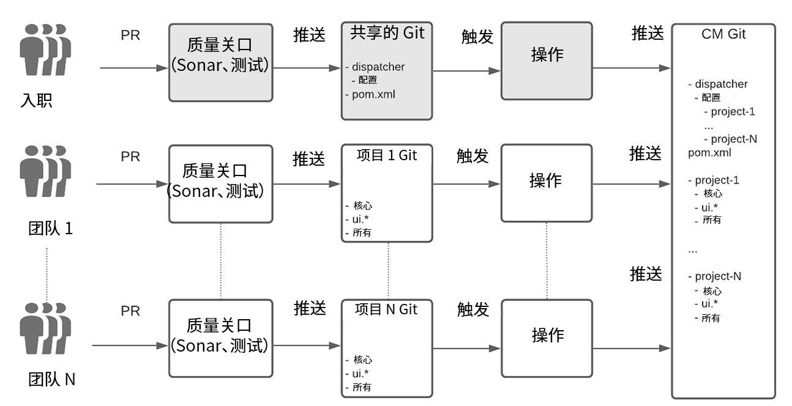
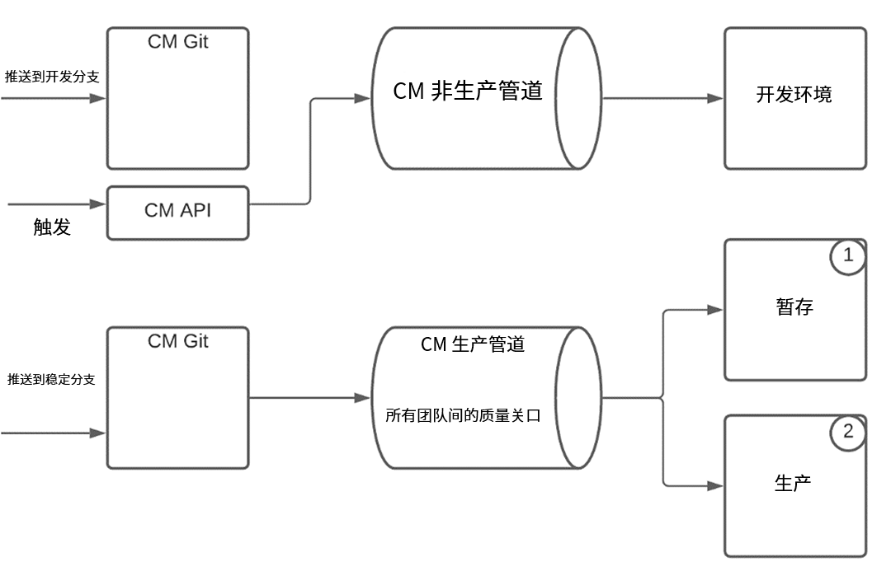
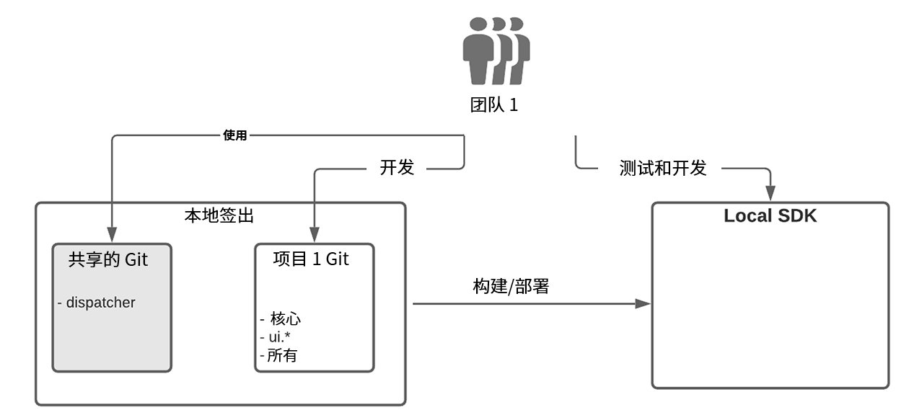

# 将AEM作为Cloud Service{#enterprise-setup}的企业团队开发设置

## 简介 {#introduction}

AEM as Cloud Service是一种云本地产品，它提供AEM即服务，旨在从10多年向企业团队提供企业软件并满足其特定要求中受益。 它将AEM推向云本世界，同时具有随时可用、始终最新、始终安全且始终大规模的新价值，同时它保留了AEM作为客户可自定义平台提供的主要价值主张，并允许企业级团队集成到其开发和投放过程中。

为了通过企业开发设置为客户提供支持，AEM作为一个Cloud Service，与Cloud Manager及其专门构建的有见可循的CI/CD管道完全集成，这些管道配备了最佳实践，并从企业级开发和部署的多年经验中汲取了经验教训 — 确保了全面测试和最高的代码质量，以提供出众的体验。

## 企业团队开发设置中的Cloud Manager支持{#cloud-manager}

为确保客户快速入门，Cloud Manager提供了立即开始开发体验所需的一切，包括用于存储自定义项的git存储库，然后由Cloud Manager构建、验证和部署这些自定义项。
使用Cloud Manager，开发团队可以在不依赖Adobe人员的情况下，频繁致力于更改。

Cloud Manager中提供三种环境类型：

* 开发
* 暂存
* 生产

可以使用非生产管道将代码部署到开发环境。 对于始终协同工作、从而确保在生产部署之前进行验证的Stage和Production，生产管道使用质量门来验证应用程序代码和配置更改。

生产管道首先将代码和配置部署到阶段环境，测试应用程序，最后部署到生产。
Cloud Service SDK始终通过最新的Cloud Service改进进行更新，它允许直接利用开发人员的本地硬件进行本地开发。 这支持快速开发，周转时间非常短。 因此，开发人员可以保持熟悉的本地环境，从各种开发工具中进行选择，并在认为合适时推动开发环境或生产。

Cloud Manager支持灵活的多团队设置，可根据企业需求进行调整。 这适用于Cloud Service和AMS。 为确保与多个团队的稳定部署并避免一个团队影响所有团队的生产，Cloud Managers确信的管道始终会对所有团队的代码进行验证和测试。

## 真实世界示例{#real-world-example}

每个企业都有不同的需求，包括不同的团队设置、流程和开发工作流。 Adobe将下面描述的设置用于以AEM为Cloud Service提供体验的多个项目。

例如，Adobe Creative Cloud应用程序(如Adobe Photoshop或Adobe Illustrator)包括向最终用户提供的教程、示例和指南等内容资源。 通过向AEM Cloud发布层发出API调用以将结构化内容作为JSON流检索，以及利用AEM Cloud Service CDN以最佳性能同时提供结构化和非结构化内容，以&#x200B;*无外设*&#x200B;方式将AEM用作Cloud Service的客户端应用程序会使用此内容。

为本项目作出贡献的小组遵循下文所述的过程。

>[!NOTE]
>请参阅[使用多源Git存储库](https://experienceleague.adobe.com/docs/experience-manager-cloud-manager/using/managing-code/working-with-multiple-source-git-repos.html#managing-code)以了解有关安装的更多信息。

每个团队都在使用自己的开发工作流程，并有一个单独的git存储库。 还有一个共享的git存储库用于项目入门。 此git存储库包含Cloud Manager的git存储库的根结构（包括共享调度程序配置）。 在登入新项目时，需要在共享git存储库的根位置的Reactor Maven项目文件中列出。 对于调度程序配置，将在调度程序项目内创建新配置文件。 然后，主调度程序配置将包含此文件。 每个团队负责自己的调度程序配置文件。 对共享的git存储库所做的更改很少见，通常仅在载入新项目时才需要。 主要工作由每个项目团队在其自己的git存储库中完成。

每个团队的git存储库已使用AEM Maven原型进行设置，因此遵循了设置AEM项目的最佳实践。 唯一的例外是处理调度程序配置，如上所述，在共享的git存储库中完成。
每个团队都使用简化的git工作流，其中有两个+ N分支，遵循Git流模型：

* 稳定的发行分支包含生产代码

* 开发分支包含最新开发

* 对于每个功能，都会创建一个新分支

在特征分支中进行开发，当特征逐渐成熟时，它将合并到开发分支中。 从开发分支中选取已完成和已验证的特征并合并到稳定分支中。 所有更改均通过拉取请求(PR)完成。 每个PR都由质量门自动验证。 声纳用于检查代码的质量，并运行一组测试套件以确保新代码不引入任何回归。

Cloud Manager的git存储库中的设置有两个分支：

* *稳定的发行分支*，包含所有团队的生产代码
* *开发分支*，包含所有团队的开发代码

在开发或稳定分支中向团队的git存储库推送的每次操作都将触发[github操作](https://experienceleague.adobe.com/docs/experience-manager-cloud-manager/using/managing-code/working-with-multiple-source-git-repos.html?lang=en#managing-code)。 所有项目都遵循稳定分支的相同设置。 对项目的稳定分支的推送会自动推送到Cloud Manager的git存储库中的稳定分支。 Cloud Manager中的生产管道配置为通过推送到稳定分支来触发。 因此，通过任何团队的每个推入一个稳定分支来执行生产流水线，并且如果所有质量门都通过，则更新生产部署。

推送到开发分支的处理方式不同。 当推送到团队的git存储库中的开发人员分支也会触发github操作，且代码会自动推送到Cloud Manager的git存储库中的开发分支中时，非生产渠道不会由代码推送自动触发。 它通过调用Cloud Manager的api触发。
运行生产管道包括通过提供的质量门检查所有团队的代码。 将代码部署到舞台后，将执行测试和审核，以确保一切正常工作。 所有门都通过后，更改即可在不发生任何中断或宕机的情况下转出生产。
对于本地开发，使用SDK for Cloud Service。 SDK允许设置本地作者、发布和调度程序。 这使离线开发和周转时间更快。 有时只有作者用于开发，但快速设置调度程序和发布允许在推送到git存储库之前在本地测试所有内容。 每个团队的成员通常从共享的git中签出代码，以及他们自己的项目代码。 无需签出其他项目，因为项目是独立的。

这个真实的设置可用作蓝图，然后根据企业的需求进行自定义。 灵活的分支和整合的git概念允许根据每个团队的需求定制上述工作流的变体。 AEM作为Cloud Service，支持所有这些变量，同时不会牺牲有见地的Cloud Manager渠道的核心价值。

### 多团队设置{#considerations}的注意事项

>[!NOTE]
>对于任何多团队设置，定义治理模式和一套所有团队都必须遵循的标准至关重要。 以上概述的多团队设置蓝图允许在多个团队中进行扩展，您可以将此蓝图用作起点。

借助Cloud Manager的git存储库和生产渠道，始终可以在所有质量门户中运行完整的生产代码，将其视为一个部署单元。 这样，生产系统将始终保持&#x200B;*处于*状态，而不会中断或停机。
相反，如果没有这样的系统，因为每个团队都可以单独部署，所以一个团队的更新可能会导致生产稳定性问题。 此外，推出更新需要协调和计划内停机。 随着团队数量的增加，协调工作将变得复杂得多，并且很快难以管理。

如果在质量门中检测到问题，生产不受影响，并且可以检测并修复该问题，而不需要Adobe人员介入。 如果不进行Cloud Service，并且不总是测试整个部署，部分部署可能会导致停机，这需要请求回滚，甚至需要从备份中进行完全恢复。 部分测试还可能导致其他问题，在事实再次需要Adobe人员的协调和支持之后，这些问题需要解决。