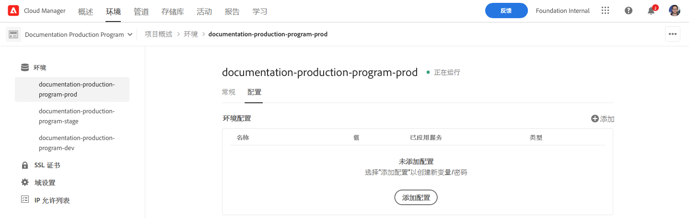
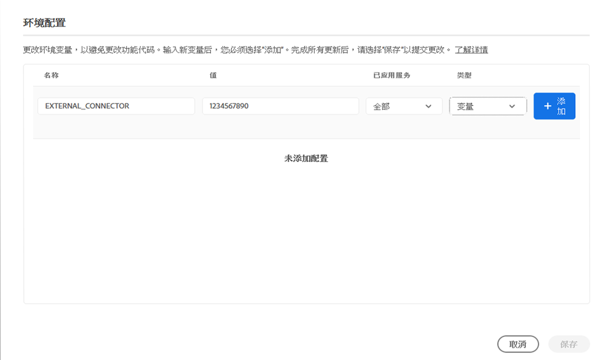
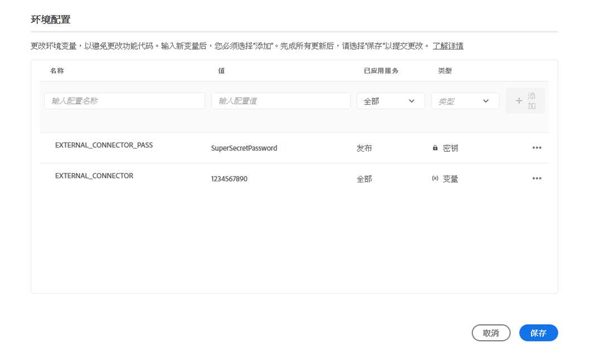
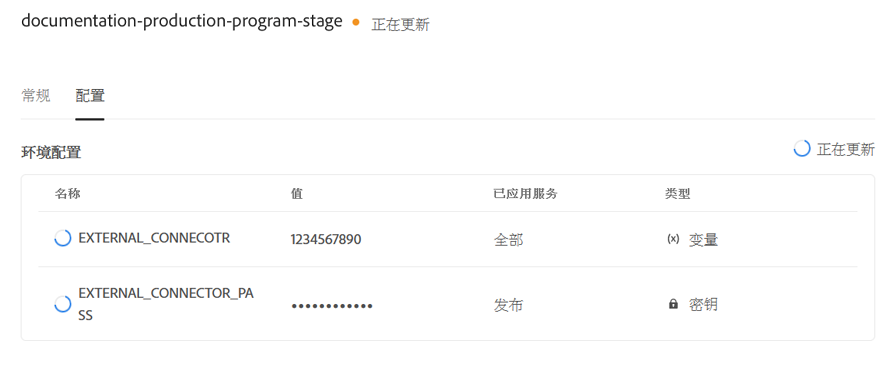
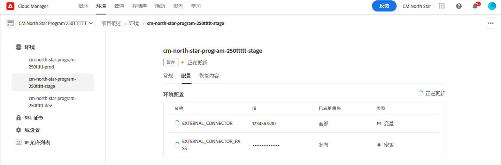
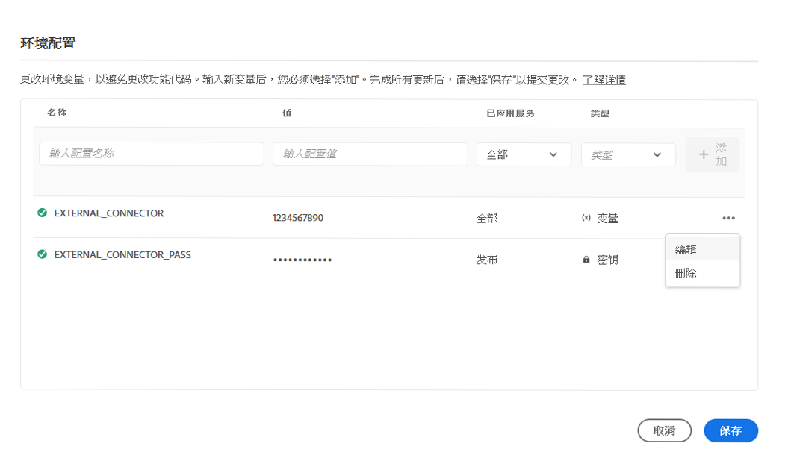
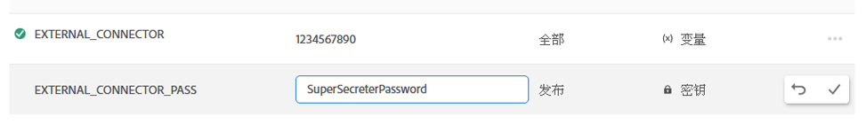

# Cloud Manager环境变量 {#environment-variables}

可以通过Cloud Manager配置和管理标准环境变量。 它们提供给运行时环境，并可用于OSGi配置。 环境变量可以是特定于环境的值，也可以是基于所更改的内容的环境密钥。

## 概述 {#overview}

环境变量为AEMas a Cloud Service的用户提供了许多好处：

* 它们允许代码和应用程序的行为因上下文和环境而异。 例如，它们可用于在开发环境中启用与生产或暂存环境相比的不同配置，以避免代价高昂的错误。
* 只需配置和设置一次，即可在必要时更新和删除。
* 它们的值可以在任何时间点更新，并立即生效，而无需任何代码更改或部署。
* 它们可以将代码与配置分离，并且无需在版本控制中包含敏感信息。
* 由于它们位于代码之外，因此可提高AEMas a Cloud Service应用程序的安全性。

使用环境变量的典型用例包括：

* 使用不同的外部端点连接AEM应用程序
* 在存储密码时使用引用，而不是直接在代码库中使用
* 当一个程序中存在多个开发环境，并且某些配置不同于一个环境和另一个环境时

## 添加环境变量 {#add-variables}

1. 登录 Adobe Cloud Manager，网址为 [my.cloudmanager.adobe.com](https://my.cloudmanager.adobe.com/)。
1. Cloud Manager 列出了可用的各种项目。选择要管理的。
1. 选择 **环境** 选项卡，然后在左侧导航面板中选择要为其创建环境变量的环境。
1. 在环境的详细信息中，选择 **配置** 选项卡，然后选择 **添加** 打开 **环境配置** 对话框。
   * 如果您是首次添加环境变量，您将看到 **添加配置** 按钮。 您可以使用此按钮或 **添加** 打开 **环境配置** 对话框。

   

1. 输入变量详细信息。
   * **名称**
   * **值**
   * **已应用服务**  — 定义变量应用的服务（创作/发布/预览），或变量应用于所有服务
   * **类型**  — 定义变量是普通变量还是密钥

   

1. 输入新变量后，必须选择 **添加** 在包含新变量的行的最后一列中。
   * 您可以一次输入多个变量，方法是输入新行并选择 **添加**.

   

1. 选择 **保存** 来保留变量。

状态为 **更新** 显示在表顶部和新添加变量旁边，以指示正在使用配置更新环境。 完成后，新的环境变量将显示在表中。

>[!TIP]
>
>如果要添加多个变量，建议添加第一个变量，然后使用 **添加** 按钮 **环境配置** 对话框以添加其他变量。 这样，您就可以通过一次环境更新来添加它们。

## 更新环境变量 {#update-variables}

创建环境变量后，可以使用 **添加/更新** 按钮以启动 **环境配置** 对话框。

1. 登录 Adobe Cloud Manager，网址为 [my.cloudmanager.adobe.com](https://my.cloudmanager.adobe.com/)。
1. Cloud Manager 列出了可用的各种项目。选择要管理的。
1. 选择 **环境** 选项卡，然后在左侧导航面板中选择要为其创建环境变量的环境。
1. 在环境的详细信息中，选择 **配置** 选项卡，然后选择 **添加/更新** 在右上方打开 **环境配置** 对话框。

   

1. 使用您要修改的变量行最后一列中的省略号按钮，选择 **编辑** 或 **删除**.

   

1. 根据需要编辑环境变量。
   * 编辑时，省略号按钮将更改为选项，以还原到原始值或确认您所做的更改。
   * 在编辑密钥时，只能更新值，而不能查看值。

   

1. 完成所有必需的配置更改后，请选择 **保存**.

[与添加变量时一样，](#add-variables) 状态为 **更新** 显示在表顶部和新更新变量旁边，表示正在使用配置更新环境。 完成后，更新的环境变量将显示在表中。

>[!TIP]
>
>如果要更新多个变量，建议使用 **环境配置** 对话框，以在点按或单击之前一次更新所有必需变量 **保存**. 这样，您就可以通过一次环境更新来添加它们。

## 使用环境变量 {#using}

环境变量可以 `pom.xml` 配置更加安全和灵活。 例如，密码无需硬编码，您的配置可以根据环境变量中的值进行调整。

您可以按如下方式通过XML分别访问环境变量和密钥。

* `${env.VARIABLE_NAME}`
* `${secret.SECRET_NAME}`

查看文档 [设置项目](/help/implementing/cloud-manager/getting-access-to-aem-in-cloud/setting-up-project.md#password-protected-maven-repository-support-password-protected-maven-repositories) 例如，在 `pom.xml` 文件。
