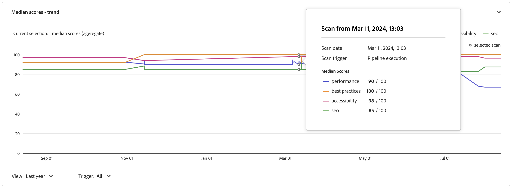
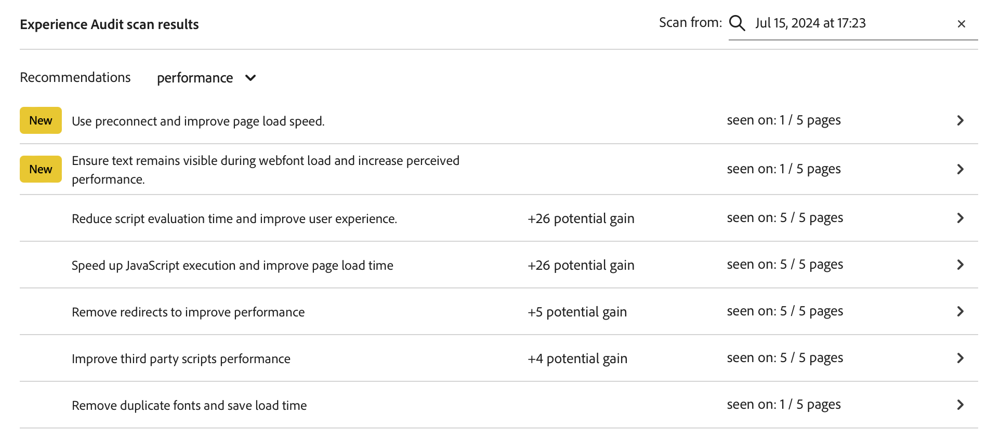
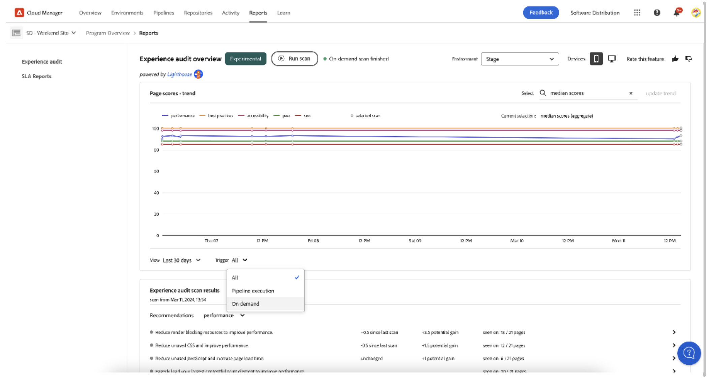

# 体验审核仪表板 {#experience-audit-dashboard}

了解体验审核如何验证您的部署过程，并通过清晰、信息丰富的仪表板界面帮助确保部署的更改符合性能、可访问性、最佳实践和SEO的基线标准。

>[!NOTE]
>
>此功能仅适用于[早期采用者计划。](/help/implementing/cloud-manager/release-notes/current.md#early-adoption)
>
>有关AEM as a Cloud Service现有体验审核功能的详细信息，请参阅文档[体验审核测试](/help/implementing/cloud-manager/experience-audit-testing.md)

## 概述 {#overview}

体验审核会验证部署过程，并帮助确保已部署更改：

1. 满足性能、可访问性、最佳实践、SEO（搜索引擎优化）和 PWA（渐进式 Web 应用程序）的基线标准。

1. 不要引入回归。

Cloud Manager中的体验审核可确保用户在该网站上的体验达到最高标准。

审核结果可提供丰富信息，允许部署管理员查看分数以及当前分数和以前分数之间的变化。此细节对于确定当前部署中是否引入了回归非常有用。

体验审核由[Google Lighthouse](https://developer.chrome.com/docs/lighthouse/overview/)提供支持，这是Google的开源工具，可在所有Cloud Manager生产管道中启用。

## 可用性 {#availability}

体验审核适用于Cloud Manager：

* 默认情况下，站点生产管道
* 开发全栈管道（可选）
* 开发前端管道（可选）

有关如何为可选环境配置审核的更多信息，请参阅[配置部分](#configuration)。

审核作为管道的一部分运行。 审核也可以[在管道外部按需运行](#on-demand)。

## 配置 {#configuration}

默认情况下，生产管道可以使用体验审核。 可以选择启用它来开发全栈管道和前端管道。 在所有情况下，您需要定义在管道执行期间评估哪些内容路径。

1. 根据要配置的管道类型，按照以下说明进行操作：

   * 添加新的[生产管道，](/help/implementing/cloud-manager/configuring-pipelines/configuring-production-pipelines.md)（如果您希望定义要由审核评估的路径）。
   * 添加新的[非生产管道，](/help/implementing/cloud-manager/configuring-pipelines/configuring-non-production-pipelines.md)（如果您希望在前端或开发全栈管道上启用审核）。
   * 或者，您可以[编辑现有管道，](/help/implementing/cloud-manager/configuring-pipelines/managing-pipelines.md)并更新现有选项。

1. 如果要添加或编辑要使用体验审核的非生产管道，则必须选中&#x200B;**Source代码**&#x200B;选项卡上的&#x200B;**体验审核**&#x200B;复选框。

   

   * 这仅对于非生产管道是必需的。
   * 选中该复选框后，将显示&#x200B;**体验审核**&#x200B;选项卡。

1. 对于生产和非生产管道，您定义应包含在&#x200B;**体验审核**&#x200B;选项卡上的体验审核中的路径。

   * 页面路径必须以`/`开头，并且相对于您的网站。
   * 例如，如果您的网站为`wknd.site`，并且希望在体验审核中包含`https://wknd.site/us/en/about-us.html`，请输入路径`/us/en/about-us.html`。

   

1. 点按或单击&#x200B;**添加页面**，路径将自动填写您的环境地址，并添加到路径表中。

   

1. 重复前两步，根据需要继续添加路径。

   * 最多可以添加 25 条路径。
   * 如果您未定义任何路径，则默认情况下，网站主页会包含在体验审核中。

1. 单击&#x200B;**保存**&#x200B;以保存管道。

## 体验审核结果 {#results}

经验审核的结果列于&#x200B;**阶段测试**&#x200B;生产管道阶段[生产管道执行页面。](/help/implementing/cloud-manager/deploy-code.md)

体验审核提供[配置的页面](#configuration)的Google Lighthouse得分中位数以及与上一次扫描的得分差异。

从管道的&#x200B;**阶段测试**&#x200B;阶段的此摘要视图中，您有两个选项：

* **[查看最慢的页面](#view-slowest-pages)**
* **[查看完整报告](#view-full-report)**

除了在管道运行的详细信息中显示的摘要之外，您还可以使用Cloud Manager仪表板的&#x200B;**报告**&#x200B;选项卡直接访问[完整报告](#view-full-report)，以直接访问审核的完整结果。

>[!TIP]
>
>以下部分介绍了如何查看体验审核的结果。
>
>* 如果您想了解有关审核工作方式的详细信息，请参阅[体验审核评估详细信息。](#details)
>* 如果您想了解如何按需运行体验审核，请参阅[按需审核报告](#on-demand)部分。
>* 如果您遇到审核问题，请参阅[体验审核遇到问题](#issues)部分。
>* 有关一般性能提示，请参阅[一般性能提示。](#performance-tips)

### 查看最慢的页面 {#view-slowest-pages}

点击或单击&#x200B;**查看最慢的页面**&#x200B;打开&#x200B;**最慢的5个页面**&#x200B;对话框，显示您[配置为审核的五个性能最低的页面。](#configuration)

得分按&#x200B;**性能**、**辅助功能**、**最佳实践**&#x200B;和&#x200B;**SEO**&#x200B;以及每个指标与上次审核的偏差进行划分。

默认情况下，对话框打开，其中显示移动设备的得分。 你可以使用对话框顶部的&#x200B;**设备**&#x200B;切换开关将此项更改为桌面分数。

该对话框用于快速概述。 有关完整的详细信息，请点按或单击&#x200B;**查看完整报告**。

### 查看完整报告 {#view-full-report}

您可以通过以下方式查看完整的体验审核报告：

* 在&#x200B;**[最慢的5页](#view-slowest-pages)**&#x200B;对话框中点击或单击&#x200B;**查看完整报告**。
* 在查看管道的[执行时，点击或单击&#x200B;**查看完整报告**。](#results)
* 点按或单击Cloud Manager中的&#x200B;**报表**&#x200B;选项卡。

Cloud Manager的&#x200B;**报告**&#x200B;选项卡已打开，显示&#x200B;**体验审核**。

报告分为两个区域：

* **[页面得分 — 趋势](#trend)**
* **[体验审核扫描结果](#results)**

#### 页面分数 - 趋势 {#trend}

默认情况下，**页面得分 — 趋势**&#x200B;的选定视图是&#x200B;**最近6个月**&#x200B;的&#x200B;**中间得分**。

使用图表按钮顶部和底部的&#x200B;**选择**&#x200B;和&#x200B;**查看**&#x200B;下拉列表分别选择特定于页面的详细信息和不同的时间范围。 点按或单击图表顶部的和&#x200B;**更新趋势**&#x200B;按钮以应用选择并刷新图表。

将鼠标悬停在图表上时，工具提示会在特定的时间点显示Google Lighthouse类别的值。

如果您在某个时间点点按或单击图表，将打开一个弹出窗口，其中包含该扫描的详细信息。 点按或单击&#x200B;**打开体验审核扫描**&#x200B;以将该扫描结果加载到&#x200B;**[体验审核扫描结果](#scan-results)**&#x200B;部分。

#### 体验审核扫描结果 {#scan-results}

**体验审核扫描结果**&#x200B;部分提供了有关如何提高得分的建议，以及所有扫描页面的详细信息。 它分为两个部分：

* **[Recommendations](#recommendations)**
* **[扫描的页面](#scanned-pages)**

##### 推荐 {#recommendations}

**Recommendations**&#x200B;部分显示一组聚合见解。 默认情况下，将显示&#x200B;**性能**&#x200B;的建议。 使用&#x200B;**Recommendations**&#x200B;标题旁边的下拉菜单更改为其他类别。

点按或单击任何推荐的V形标记可显示有关该推荐的详细信息。

如果可用，则扩展的推荐详细信息中还包含推荐影响的百分比，以帮助重点关注最具影响力的更改。

点按或单击详细信息视图中的&#x200B;**查看页面**&#x200B;链接，以查看应用推荐的页面。

推荐详细信息的

##### 扫描的页面 {#scanned-pages}

**扫描的页面**&#x200B;部分提供了所有扫描页面的详细信息分数。 您可以使用&#x200B;**上一个**&#x200B;和&#x200B;**下一个**&#x200B;按钮来翻阅结果，并选择显示的页面数量。

点按或单击特定页面的链接可更新&#x200B;[**页面得分 — 趋势**&#x200B;部分](#trend)的&#x200B;**选择**&#x200B;筛选器，并显示选定页面的&#x200B;**得分和推荐**&#x200B;选项卡。

**原始报告**&#x200B;选项卡为您提供了每次页面审核的得分。 点击或单击&#x200B;**下载**&#x200B;图标可检索原始数据的JSON文件。

该操作将在您的浏览器中打开一个新选项卡，指向`https://googlechrome.github.io/lighthouse/viewer/`，其中显示选定页面的Lighthouse原始JavaScript对象表示法(JSON)报告的已签名URL，此选项卡将自动打开以供详细检查

## 按需审核报表 {#on-demand}

除了在管道执行期间运行之外，还可按需生成体验审核报表。 这是一个很好的解决方案，可以快速扫描页面，而无需运行管道。

要运行按需扫描，请导航到&#x200B;**报表**&#x200B;选项卡以查看完整的审核报表，然后点按或单击&#x200B;**运行扫描**&#x200B;按钮。

按需扫描会触发对最新25个[配置页面](#configuration)的体验审核，通常在几分钟内完成。

完成后，分数图表将自动更新，您可以完全按照管道执行扫描来检查结果。

您可以使用&#x200B;**触发器**&#x200B;选择器根据触发器类型筛选得分图表。

>[!NOTE]
>
>仅当未删除环境且同一环境中没有其他待处理扫描时，才能启动按需扫描。

## 体验审核遇到的问题 {#issues}

如果您配置要审核的[页面](#configuration)不可用，则体验审核会反映这一点。

管道显示一个可展开的错误部分，以查看它无法访问的相对URL路径。

体验审核遇到的

如果查看完整报告，将在&#x200B;**[体验审核扫描结果](#results)**&#x200B;部分中显示详细信息。

页面可能不可用的部分原因是：

* 该配置阻止访问。
* 该页面不存在。
* 页面重定向需要基本身份验证以外的身份验证。
* 出现内部问题。
* 等等。

>[!TIP]
>
>[访问页面的原始报告](#scanned-pages)可以提供有关为什么无法审核该页面的详细信息。

## 一般性能提示 {#performance-tips}

易于修复的两个最常见的影响问题与累积版面偏移(CLS)和最大内容绘制(LCP)有关。

可以通过以下方式改善这些缺陷：

* 请勿延迟加载折页上方的图像（浏览器中可见的内容无需向下滚动）。
* 正确排列加载资源的优先顺序（例如，在加载文档后异步加载折叠下方的图像）。
* 预取用于呈现折叠上方内容的JavaScript和CSS文件（如果需要）。
* 通过为加载缓慢或稍后呈现的容器指定纵横比来保留垂直空间。
* 将图像转换为WebP格式以减小其大小。
* 将具有不同图像大小的`<picture>`和图像`srcset`用于不同的视区大小（并确保调整大小有效）。

## 体验审核评估详细信息 {#details}

以下详细信息提供了有关Experience Audit如何评估您的网站的其他信息。 对于功能的常规使用，这些参数不是必需的，此处提供这些参数是为了完整起见。

* 虽然[配置的体验审核页面路径](#configuration)显示了发布者的`.com`域，但审核会扫描源(`.net`)域，以确保检测到开发过程中出现的问题。
   * `.com`域使用CDN，可能会产生更好的分数或包含缓存的结果。
* 在生产全栈管道中，将扫描暂存环境。
   * 要确保审核在审核期间提供相关详细信息，暂存环境的内容应尽可能接近生产环境。
* 在&#x200B;[**页面得分 — 趋势**&#x200B;部分](#trend)的&#x200B;**选择**&#x200B;下拉列表中显示的页面都是体验审核过去扫描过的已知页面。
* [推荐](#recommendations)可能与以前的扫描有潜在增益和差异。
   * 体验审核通过处理每个页面的原始报表并将浪费的字节数或毫秒数与对性能得分具有加权影响的分析进行关联，来估计潜在的增益。
   * 审核会提供此信息（以及受影响的页面），以帮助决定要执行哪项建议。
   * 有关更多详细信息，请参阅[常规性能提示部分](#performance-tips)
* 鉴于前端管道可以部署到现有环境（或者可能有多个前端管道针对同一环境），并且扫描结果在环境级别聚合，因此无论触发扫描的管道执行如何，得分、趋势和推荐都会显示在同一选定环境中。
