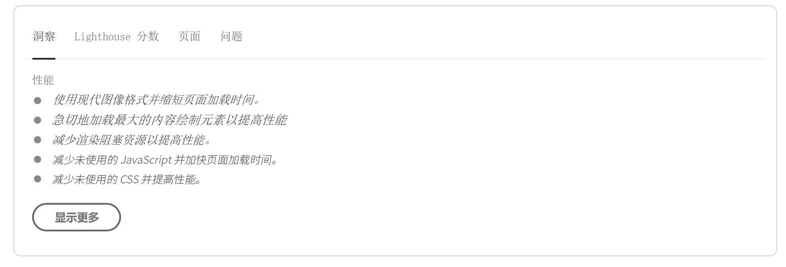
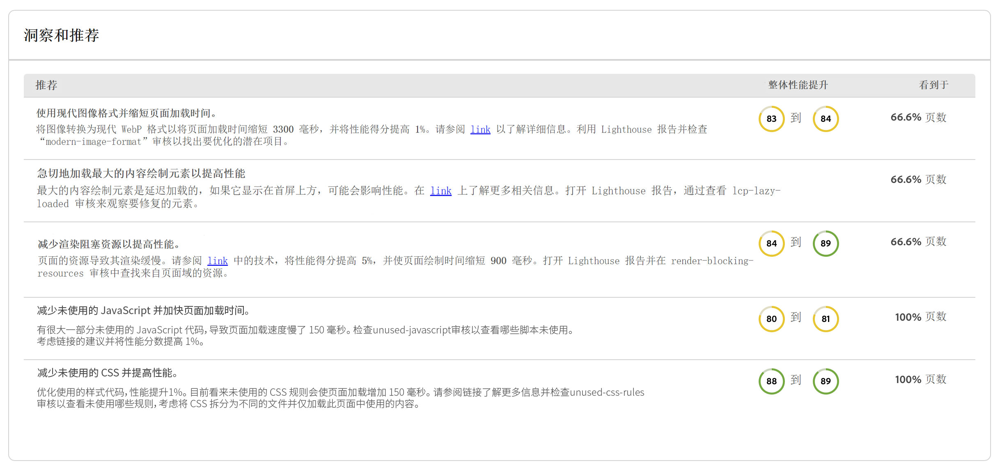
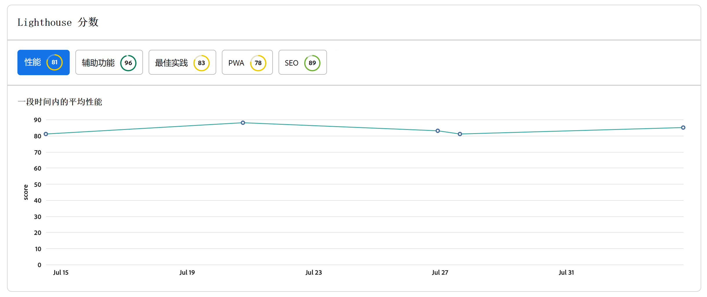
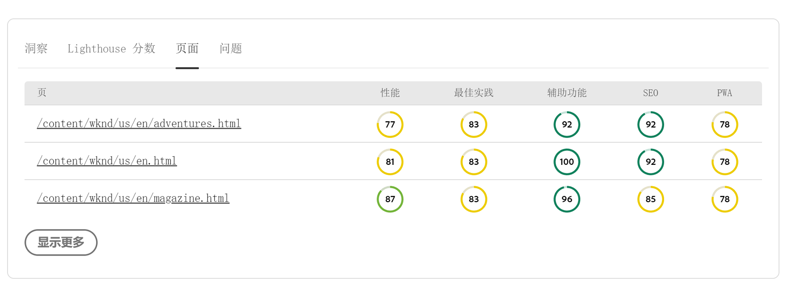
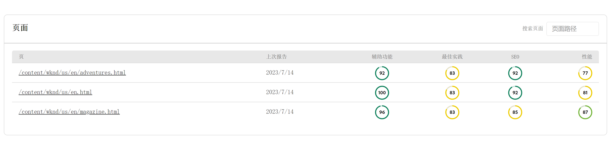
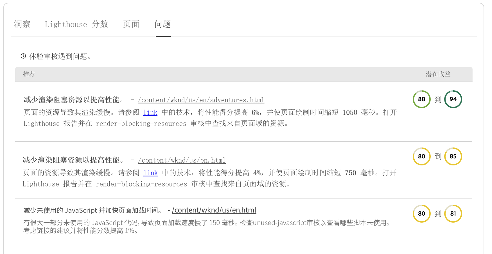
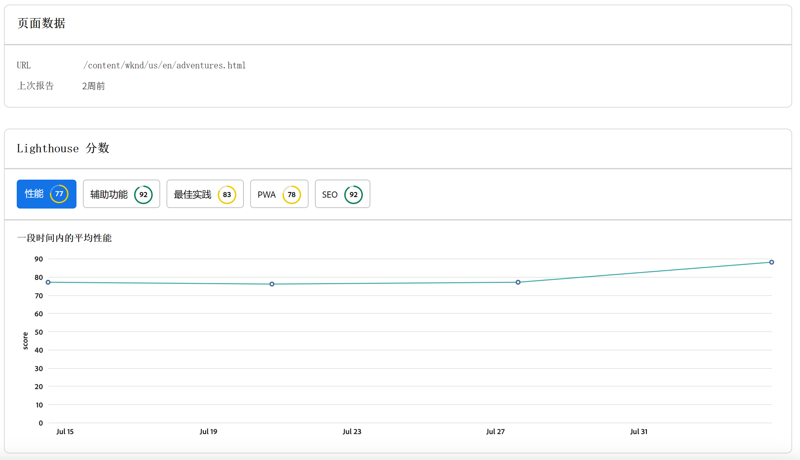

# 体验审核仪表板 {#experience-audit-dashboard}

了解体验审核如何验证您的部署过程，并通过清晰、信息丰富的仪表板界面帮助确保所部署的更改符合性能、可访问性、最佳实践和 SEO 的基准标准。

>[!NOTE]
>
>此功能仅适用于[早期采用者计划。](/help/implementing/cloud-manager/release-notes/current.md#early-adoption)
>
>有关 AEM as a Cloud Service 的现有体验审核功能的详细信息，请参阅文档[体验审核测试。](/help/implementing/cloud-manager/experience-audit-testing.md)

## 概述 {#overview}

体验审核是 Cloud Manager Sites 生产管道中的现有功能，用于验证部署过程并帮助确保部署的更改：

1. 满足性能、可访问性、最佳实践、SEO（搜索引擎优化）和 PWA（渐进式 Web 应用程序）的基线标准。

1. 不要引入回归。

Cloud Manager 中的体验审核可确保最终用户在网站上的体验达到最高标准。

审核结果可提供丰富信息，允许部署管理员查看分数以及当前分数和以前分数之间的变化。此细节对于确定当前部署中是否引入了回归非常有用。

体验审核由 [Google Lighthouse](https://developer.chrome.com/docs/lighthouse/overview/) 提供支持，这是 Google 的开源工具，可在所有 Cloud Manager 生产管道中使用。

>[!TIP]
>
>在[设置您的管道](/help/implementing/cloud-manager/configuring-pipelines/configuring-production-pipelines.md#full-stack-code)时，您可以配置要包含在体验审核中的页面。

## 体验审核仪表板 {#dashboard}

经验审核的结果列于&#x200B;**阶段测试**&#x200B;生产管道阶段[生产管道执行页面。](/help/implementing/cloud-manager/deploy-code.md)

体验审核提供了汇总在四个选项卡上的汇总且详细的页面级测试结果：

* **[见解](#insights)**&#x200B;提供可操作建议的简要说明，以提高网站的性能。
* **[Lighthouse 分数](#lighthouse)**&#x200B;是在此管道执行中部署的代码的 Lighthouse 分数的摘要。
* **[页面](#pages)**&#x200B;是专门配置用于分析的页面性能的摘要。
* **[问题](#issues)**&#x200B;总结了在此管道执行的代码中检测到的任何性能问题。

### 见解 {#insights}

**见解**&#x200B;选项卡提供可操作建议的简要说明，以提高网站的性能。

点击或单击&#x200B;**展示更多**&#x200B;按钮打开完整的仪表板。

在 **见解和推荐**&#x200B;部分中，您会找到可操作建议的详细列表，其中包含与预期性能收益相关的明确价值指标，以及受影响的页面百分比。这使您可以轻松地为您的团队确定这些建议的优先级。

要导航回生产管道执行页面，只需选择浏览器上的后退箭头即可。

### Lighthouse 分数 {#lighthouse}

**Lighthouse 分数**&#x200B;选项卡是在此管道执行中部署的代码的 Lighthouse 分数的摘要。

点击或单击&#x200B;**展示更多**&#x200B;按钮打开完整的仪表板。

在 **Lighthouse 分数**&#x200B;部分，您可以找到各种分数的趋势视图。选择&#x200B;**性能**,**辅助功能**，**PWA**，或者 **SEO** 查看这些值的每月趋势视图。

请注意，图表上的每个点都是相关月份所有部署的平均值。

要导航回生产管道执行页面，只需选择浏览器上的后退箭头即可。

### 页面 {#pages}

**页面**&#x200B;选项卡是专门配置用于分析的页面性能的摘要。

点击或单击&#x200B;**展示更多**&#x200B;按钮打开完整的仪表板。

**页面**&#x200B;部分提供了已测试的页面列表及其最新的 Lighthouse 性能分数和细分。

在[设置您的管道](/help/implementing/cloud-manager/configuring-pipelines/configuring-production-pipelines.md#full-stack-code)时，您可以配置要包含在体验审核中的页面。

要导航回生产管道执行页面，只需选择浏览器上的后退箭头即可。

### 问题 {#issues}

**问题**&#x200B;选项卡总结了在此管道执行的代码中检测到的任何性能问题。

点击或单击&#x200B;**展示更多**&#x200B;按钮打开完整的仪表板。

在 **见解和推荐**&#x200B;部分中，您会找到更多可操作建议的详细列表，其中包含与预期性能收益相关的明确价值指标，以及受影响的页面百分比。这使您可以轻松地为您的团队确定这些建议的优先级。

要导航回生产管道执行页面，只需选择浏览器上的后退箭头即可。

### 页面详细信息 {#page-detail}

如果您点击或单击管道执行页面选项卡的&#x200B;**体验审核**&#x200B;部分的选项卡或完整体验审核仪表板的&#x200B;**页面**&#x200B;部分中的页面链接，您可以查看特定页面的详细信息。

您可以看到各个页面对特定测试的评分以及与上一次测试运行相比的变化。

单击任何单个页面的详细信息，可以提供有关已评估页面元素的信息，以及在检测到改进机会时修复问题的指导。

要导航回生产管道执行页面，只需选择浏览器上的后退箭头即可。
