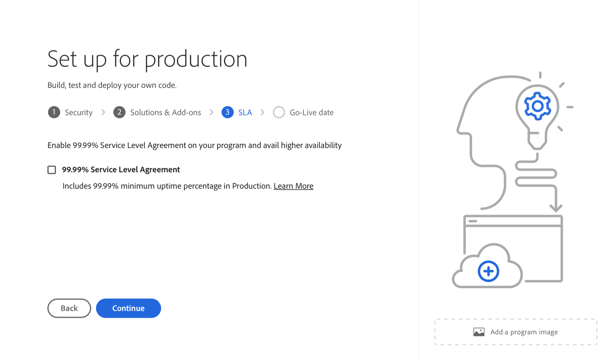

# 创建生产程序 {#create-production-program}

生产程序面向熟悉 AEM 和 Cloud Manager 并准备好开始编写、构建和测试代码的用户，目的是将其部署到托管实时流量。

请参阅[了解程序和程序类型](program-types.md)文档，了解有关程序类型的更多信息。

## 创建生产程序 {#create}

按照以下步骤创建生产程序。 请注意，根据您组织的权限，您可能会看到 [其他选项](#options) 添加项目时。

1. 在 [my.cloudmanager.adobe.com](https://my.cloudmanager.adobe.com/) 登录 Cloud Manager 并选择适当的组织。

1. 在 **[我的项目群](/help/implementing/cloud-manager/navigation.md#my-programs)** 控制台，点按或单击 **添加项目** 在屏幕的右上角。

   

1. 在“创建项目向导”中，选择&#x200B;**设置生产**，以创建生产项目 并提供项目名称。

   

1. 或者，您也可以将图像文件拖放到&#x200B;**添加项目图像**&#x200B;目标，或单击它以从文件浏览器中选择图像，从而将图像添加到项目中。选择&#x200B;**继续**。

1. 在&#x200B;**解决方案和插件** 选项卡，选择要包含在程序中的解决方案。

   * 如果您不确定是否需要一个或多个项目来提供各种解决方案，请选择您最感兴趣的项目。您可以稍后通过[编辑项目](/help/implementing/cloud-manager/getting-access-to-aem-in-cloud/editing-programs.md)来激活其他解决方案。有关更多项目设置建议，请参阅[生产项目简介文件](/help/implementing/cloud-manager/getting-access-to-aem-in-cloud/introduction-production-programs.md)。
   * 程序创建至少需要一个解决方案。
   * 如果您选择了 **[启用增强安全性](#security)** 选项，您只能选择HIPAA权利可用的解决方案。

   

1. 单击解决方案名称前的>形符号显示可选的插件，例如选择 **商务** 下的附加选项 **站点**.

   

1. 选择了解决方案和加载项后，单击&#x200B;**继续**。

1. 在&#x200B;**上线日期**&#x200B;选项卡，输入您计划生产程序上线的日期。

   

   * 可以随时编辑此日期。
   * 此日期仅供参考，并触发上的上线构件 [**项目概述** 页面](/help/implementing/cloud-manager/getting-access-to-aem-in-cloud/editing-programs.md#program-overview) 及时提供产品内链接到AEMas a Cloud Service最佳实践文档，配合您的入门培训历程，最终获得成功、流畅的上线体验。

1. 单击&#x200B;**创建**。

您的程序由 Cloud Manager 创建，并在登陆页面上显示和选择。

## 其他生产程序选项 {#options}

根据组织可用的权利，在创建生产程序时，您可能还有其他可用选项。

### 安全性 {#security}

如果您拥有必要的权限， **安全性** 选项卡将显示为 **为生产设置** 对话框。

此 **安全性** 选项卡提供了激活选项 **HIPAA** 和/或 **WAF-DDOS保护** 用于您的生产程序。

符合AdobeHIPAA和Web应用程序防火墙(WAF)有助于实现基于云的安全性，这是针对漏洞的多层防护方法的一部分。

* **HIPAA**  — 此选项启用Adobe的HIPPA就绪解决方案实施。
   * [详细了解](https://www.adobe.com/go/hipaa-ready_cn) Adobe 的 HIPAA 就绪解决方案实施。
   * 程序创建后无法启用或禁用HIPAA。
* **WAF-DDOS保护**  — 此选项通过规则启用Web应用程序防火墙以保护您的应用程序。
   * 激活后，可以通过设置 [非生产管道。](/help/implementing/cloud-manager/configuring-pipelines/configuring-non-production-pipelines.md)
   * 查看文档 [包含WAF规则的流量过滤器规则](/help/security/traffic-filter-rules-including-waf.md) 以了解如何管理存储库中的流量过滤器规则，以便正确部署这些规则。

### SLA {#sla}

如果您拥有必要的权限， **SLA** 选项卡将显示为中的第二个或第三个选项卡 **为生产设置** 对话框。

AEM Sites提供标准的99.9%服务级别协议(SLA)。 此 **99.99%服务级别协议** 选项可为您的生产环境启用99.99%的最短正常运行时间百分比。

99.99%的SLA可提供更高的可用性和更低的延迟，并需要 [其他发布区域](/help/implementing/cloud-manager/manage-environments.md#multiple-regions) 将应用于程序中的生产环境。

一旦 [要求](#sla-requirements) 要启用99.99%的SLA，您必须运行 [全栈管道](/help/implementing/cloud-manager/configuring-pipelines/configuring-production-pipelines.md) 以激活它。

#### 99.99% SLA的要求 {#sla-requirements}

在所需权利之外，99.99%的SLA还有额外的使用要求。

* 在向方案适用99.99%的SLA时，该组织必须同时享有99.99%的SLA和额外的出版区域权利。
* 为了将99.99% SLA应用于程序，Cloud Manager将检查以确保未使用 [其他发布区域](/help/implementing/cloud-manager/manage-environments.md#multiple-regions) 权利文件也可用，并且可以应用于计划。
* 在编辑程序时，如果它已经包含至少具有一个附加发布区域的生产环境，则Cloud Manager仅检查99.99% SLA权利的可用性。
* 为了启用99.99%的SLA和报告， [生产/暂存环境](/help/implementing/cloud-manager/manage-environments.md#adding-environments) 必须已创建，并且必须在生产/暂存环境中至少应用一个附加发布区域。
   * 如果使用 [高级联网、](/help/security/configuring-advanced-networking.md) 确保检查 [将多个发布区域添加到新环境](/help/implementing/cloud-manager/manage-environments.md#adding-regions) 建议文档，以便在发生地区性故障时保持连通性。
* 您的99.99% SLA计划中必须至少保留一个额外的发布区域。 不允许用户从99.99% SLA程序中删除最后一个附加发布区域。
* 99.99% SLA支持已启用Sites解决方案的生产程序。
* 您必须运行 [全栈管道](/help/implementing/cloud-manager/configuring-pipelines/configuring-production-pipelines.md) 为了激活（或在编辑程序时停用）99.99%的SLA。

## 访问您的程序 {#accessing}

1. 在登陆页面上看到项目卡时，选择省略号按钮以查看可用的菜单选项。

   

1. 选择&#x200B;**程序概述**&#x200B;信息卡，可导航至 Cloud Manager **概述**&#x200B;页面。

1. 概述页面上的主要行动号召信息卡将指导您创建环境、非生产管道，最后创建生产管道。

   

>[!TIP]
>
>请参阅文档 [浏览Cloud Manager UI](/help/implementing/cloud-manager/navigation.md) 有关如何导航Cloud Manager并了解 **我的项目群** 控制台。

>[!NOTE]
>
>与[沙盒程序不同，](introduction-sandbox-programs.md#auto-creation)生产程序将要求具有相应 Cloud Manager 角色的用户通过自助服务 UI 创建项目并添加环境。
