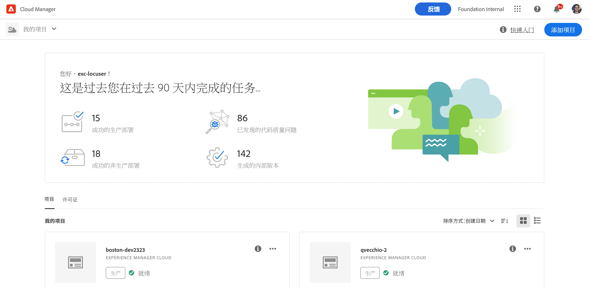
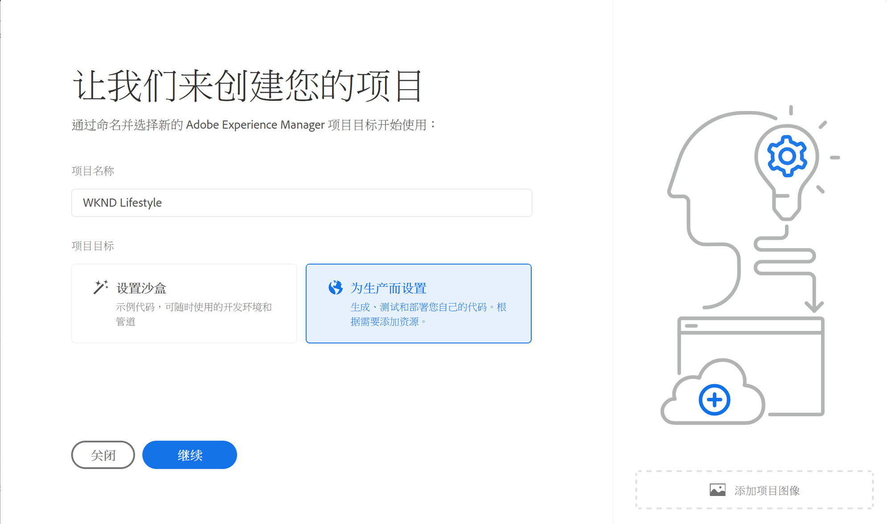
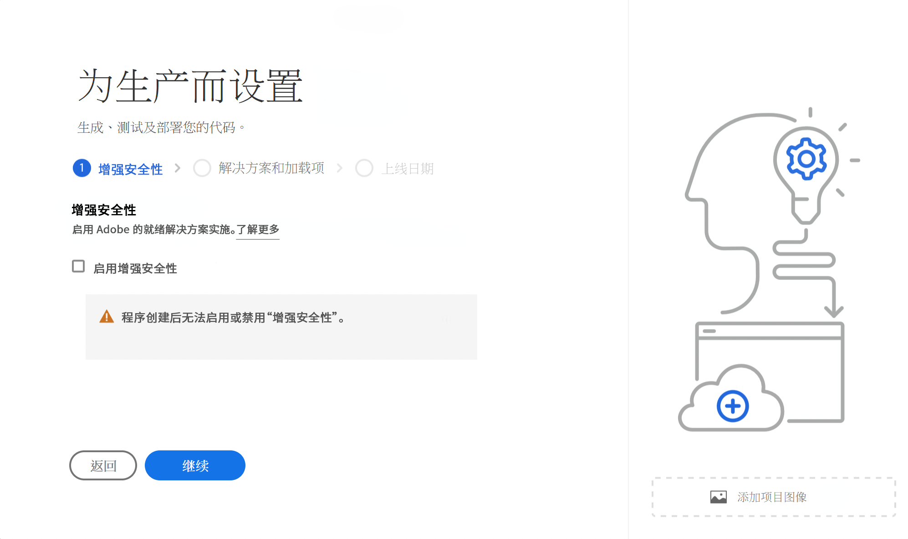

# 创建生产程序 {#create-production-program}

生产程序面向熟悉 AEM 和 Cloud Manager 并准备好开始编写、构建和测试代码的用户，目的是将其部署到托管实时流量。

请参阅[了解程序和程序类型](program-types.md)文档，了解有关程序类型的更多信息。

## 视频教程 {#video-tutorials}

您可以观看这两个教程视频，了解如何在 Cloud Manager 中创建程序，或者[按照我们的说明进行操作。](#create)

>[!VIDEO](https://video.tv.adobe.com/v/334953)

>[!VIDEO](https://video.tv.adobe.com/v/334954)

## 创建生产程序 {#create}

按照以下步骤创建生产程序。

1. 在 [my.cloudmanager.adobe.com](https://my.cloudmanager.adobe.com/) 登录 Cloud Manager 并选择适当的组织。

1. 单击屏幕右上角的&#x200B;**添加程序**。

   

1. 在“创建程序向导”中，选择&#x200B;**设置生产**。 

   1. 您可以接受或编辑默认程序名。
   1. 您可以选择拖放缩略图图像来标识您的程序。
   1. 点按或单击&#x200B;**继续**。

   

1. 如果您拥有增强安全性授权，**增强安全性**&#x200B;选项卡将为您的作品提供&#x200B;**启用增强安全性**&#x200B;选项程序。如果需要，请选中启用增强安全性的选项，然后点击或单击&#x200B;**继续**。

   * 程序创建后无法启用或禁用“增强安全性”。
   * [详细了解](https://www.adobe.com/go/hipaa-ready_cn) Adobe 的 HIPAA 就绪解决方案实施。

   

1. 在&#x200B;**解决方案和插件** 选项卡，选择要包含在程序中的解决方案。

   * 如果您之前选择了&#x200B;**启用增强安全性**，您将只能选择 HIPAA 权利可用的解决方案。

   

1. 单击解决方案名称前的 V 形符号显示可选的插件，例如在 **Sites** 下选择 **Commerce** 插件选项。

   

1. 选择了解决方案和加载项后，单击&#x200B;**继续**。

1. 在&#x200B;**上线日期**&#x200B;选项卡，输入您计划生产程序上线的日期。

   

   * 可以随时编辑此日期。
   * 此日期仅供参考，并触发程序概述页面上的“上线”构件，及时提供 AEM as a Cloud Service 最佳实践文档的产品内链接，配合您的入门培训历程，最终获得成功、顺利的上线体验。

1. 单击&#x200B;**创建**。

您的程序由 Cloud Manager 创建，并在登陆页面上显示和选择。

## 访问您的程序 {#acessing}

1. 在登陆页上看到程序信息卡后，选择省略号按钮查看可用的菜单选项。

   

1. 选择&#x200B;**程序概述**&#x200B;信息卡，可导航至 Cloud Manager **概述**&#x200B;页面。

1. 概述页面上的主要行动号召信息卡将指导您创建环境、非生产管道，最后创建生产管道。

   

如果在任何时候您需要切换到另一个程序或返回概述页面创建另一个程序，请单击屏幕左上角的程序名称，可显示&#x200B;**导航到**&#x200B;选项。

>[!NOTE]
>
>与[沙盒程序不同，](introduction-sandbox-programs.md#auto-creation)生产程序将要求具有相应 Cloud Manager 角色的用户通过自助服务 UI 创建项目并添加环境。
