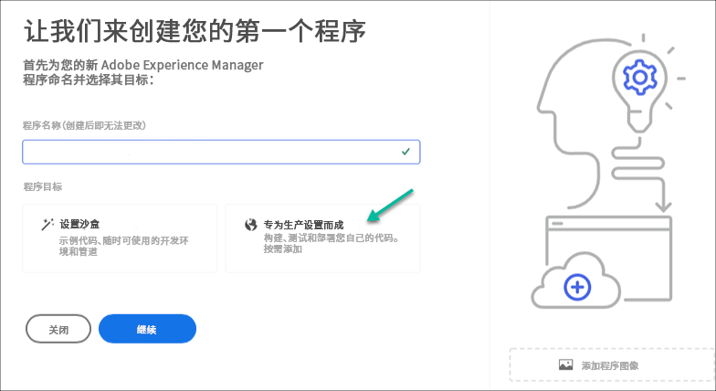
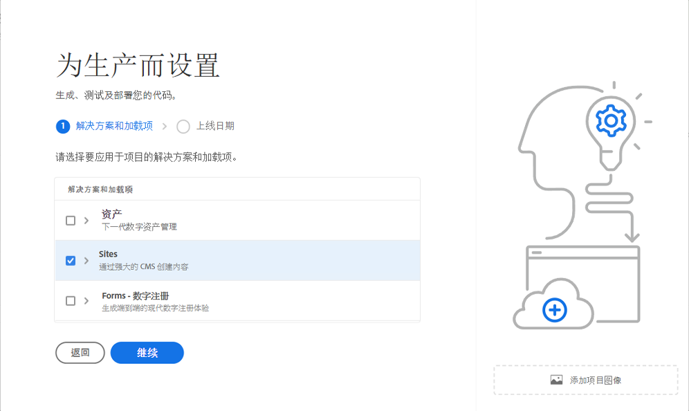
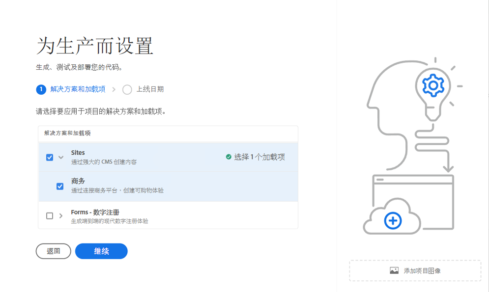
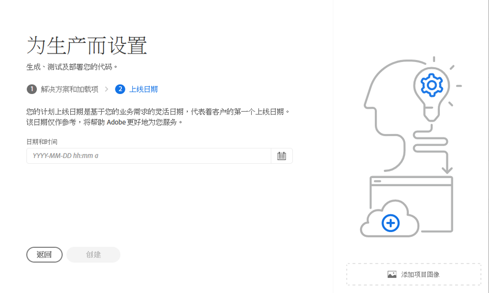
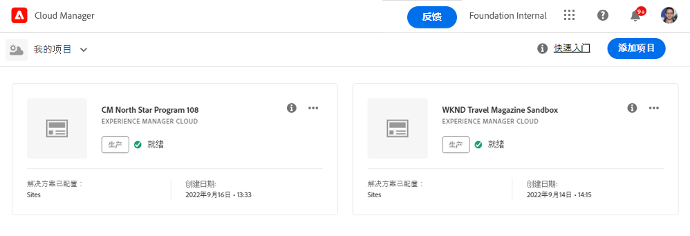
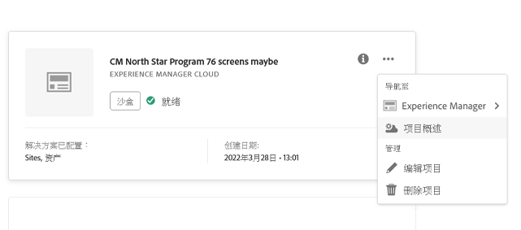
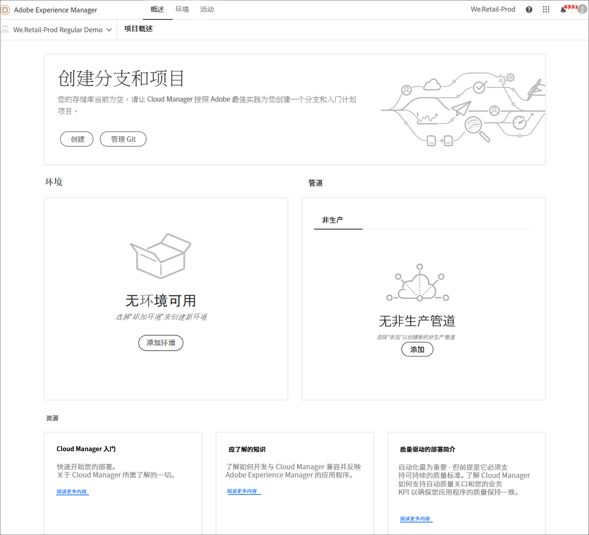

# 创建生产程序 {#create-production-program}

生产计划面向熟悉AEM和Cloud Manager的用户，该用户可以开始编写、构建和测试代码，以将其部署到托管实时流量。

在文档中了解有关程序类型的更多信息 [了解程序和程序类型。](program-types.md)

## 视频Tutorials {#video-tutorials}

您可以观看这两个教程视频，以了解如何在Cloud Manager中创建项目，或 [按照我们记录的说明操作。](#create)

>[!VIDEO](https://video.tv.adobe.com/v/334953)

>[!VIDEO](https://video.tv.adobe.com/v/334954)

## 创建生产程序 {#create}

按照以下步骤创建生产程序。

1. 登录Cloud Manager(位于 [my.cloudmanager.adobe.com](https://my.cloudmanager.adobe.com/) 并选择相应的组织。

1. 单击 **添加程序** 的右上角。

   

1. 选择 **为生产设置** 在创建程序向导中创建生产程序。 您可以接受默认程序名称，或在单击 **继续**.

   

1. 在 **解决方案和附加组件** 选项卡，选择要包含在项目中的解决方案。

   

1. 单击解决方案名称前面的V形标记以显示可选的附加组件，如选择 **商务** 下的附加选项 **站点**.

   

1. 选择解决方案和加载项后，单击 **继续**.

1. 在 **上线日期** 选项卡，输入计划生产计划上线的日期。

   

   * 此日期可随时编辑。
   * 此日期仅供参考，并会触发项目概述页面上的上线小组件，以及时提供指向AEMas a Cloud Service最佳实践文档的产品内链接，从而与您的旅程保持一致，最终获得成功且流畅的上线体验。

1. 单击&#x200B;**创建**。

您的项目由Cloud Manager创建，可在登陆页面上显示和选择。

## 访问您的程序 {#acessing}

1. 在登陆页面上看到您的项目卡片后，选择省略号按钮以查看可供您使用的菜单选项。

   

1. 选择 **计划概述** 导航到Cloud Manager的 **概述** 页面。

1. 概述页面上的主行动动员卡将指导您完成创建环境、非生产管道，最后是生产管道的过程。

   

如果您随时需要切换到其他项目或返回概述页面以创建其他项目，请单击屏幕左上角的项目名称以显示 **导航到** 选项。

>[!NOTE]
>
>与 [沙盒程序，](introduction-sandbox-programs.md#auto-creation) 生产计划需要具有相应Cloud Manager角色的用户通过自助服务UI创建项目并添加环境。
