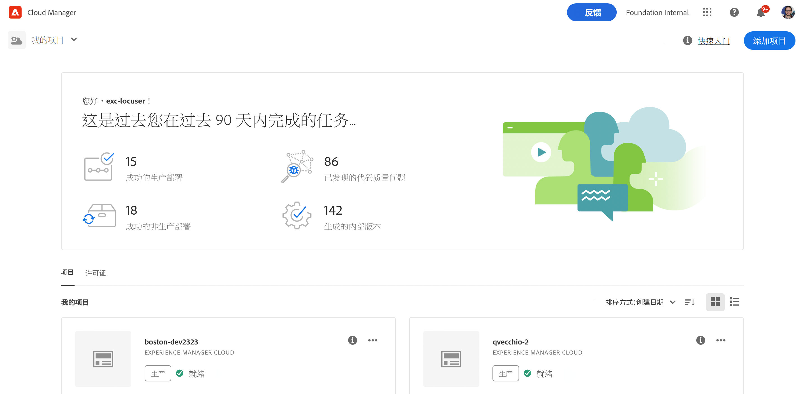
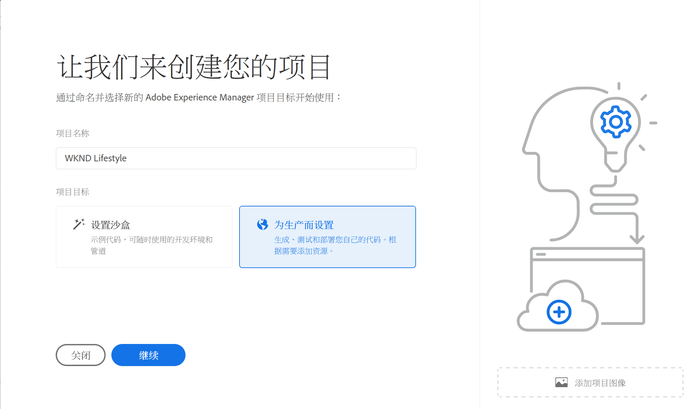
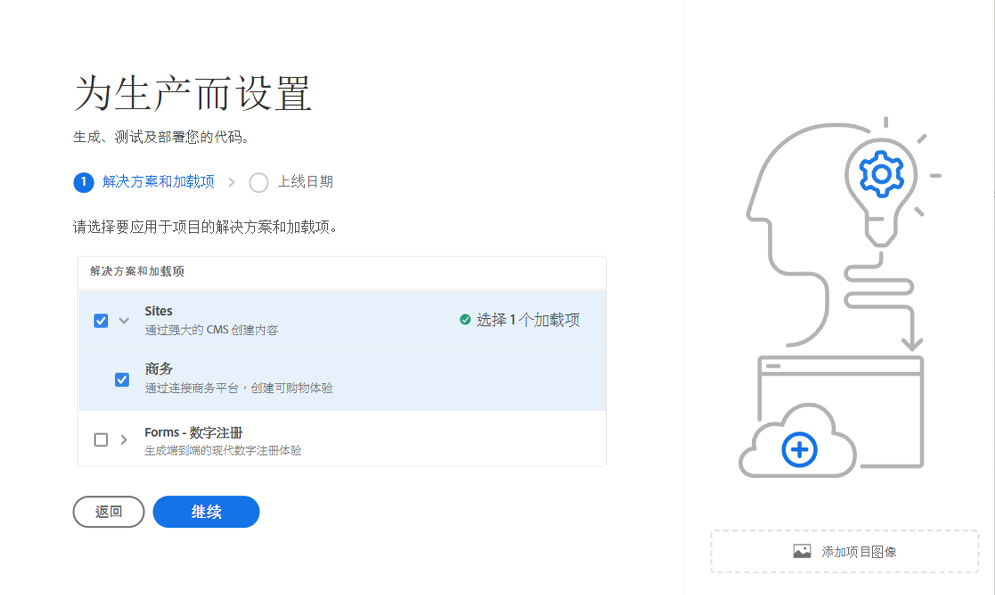
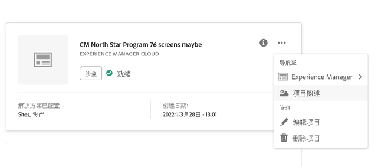
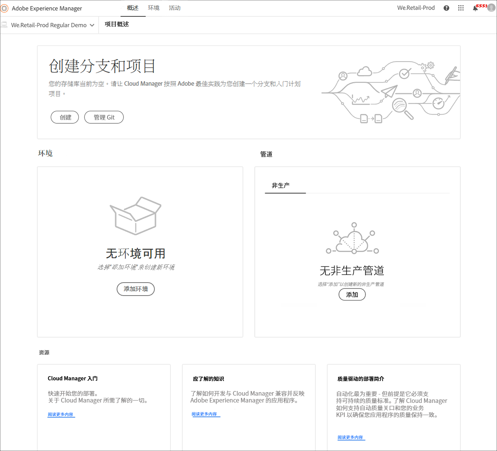

# 创建生产程序 {#create-production-program}

生产程序适用于熟悉Adobe Experience Manager (AEM)和Cloud Manager的用户，这些用户可随时编写、构建和测试代码，其目的是将其部署为处理实时流量。

请参阅文档[了解程序和程序类型](program-types.md)以了解有关程序类型的更多信息。

## 创建生产程序 {#create}

根据您组织的权限，在添加程序时，您可能会看到其他生产程序选项。
查看[其他生产程序选项](#options)。

**创建生产程序：**

1. 在 [my.cloudmanager.adobe.com](https://my.cloudmanager.adobe.com/) 登录 Cloud Manager 并选择适当的组织。

1. 在&#x200B;**[我的程序](/help/implementing/cloud-manager/navigation.md#my-programs)**&#x200B;控制台右上角附近，单击&#x200B;**添加程序**。

   

1. 在&#x200B;*让我们创建程序*&#x200B;向导的&#x200B;**程序名称**&#x200B;文本字段中，键入您希望程序的名称。

1. 在&#x200B;**项目目标**&#x200B;下，选择**为生产设置**。

   

1. （可选）在向导对话框的右下角，执行以下任一操作：

   * 将图像文件拖放到 **添加程序图像**&#x200B;目标上。
   * 单击 **添加程序图像**，然后从文件浏览器中选择图像。
   * 单击可删除您添加的图像。

1. 单击&#x200B;**继续**。

1. 在&#x200B;**安全**&#x200B;选项卡上，选择要使用的安全选项。 请参阅[安全性](#security)。

   为生产设置向导中的

1. 单击&#x200B;**继续**。

1. 在&#x200B;**解决方案和加载项**&#x200B;列表框中，选择要包含在程序中的一个或多个解决方案。

   * 如果您不确定是否需要一个或多个项目来提供各种解决方案，请选择您最感兴趣的项目。您可以稍后通过[编辑项目](/help/implementing/cloud-manager/getting-access-to-aem-in-cloud/editing-programs.md)来激活其他解决方案。有关更多项目设置建议，请参阅[生产项目简介文件](/help/implementing/cloud-manager/getting-access-to-aem-in-cloud/introduction-production-programs.md)。
   * 需要您至少选择一个解决方案来创建程序。 例如，您可以选择为优化数字体验的完全托管的CDN解决方案选择&#x200B;**Edge Delivery Services**。 请参阅[关于使用Edge Delivery Services交付您的Cloud Manager项目](/help/implementing/cloud-manager/edge-delivery/introduction-to-edge-delivery-services.md)。

   * 单击解决方案名称左侧的以显示任何可选的加载项。<!-- such as the **Commerce** add-on option under **Sites**. -->

<!--    -->

    >[！NOTE]
    >
    >如果您的程序使用Edge Delivery Services进行交付，则可能不需要发布层。 借助灵活的发布层功能(Beta)，您可以配置是否在“解决方案和插件”选项卡上预配发布层。 请参阅[灵活发布层(Beta)](/help/implementing/cloud-manager/getting-access-to-aem-in-cloud/creating-production-programs.md#flexible-publish-tier)。
    
    

1. 单击&#x200B;**继续**。

1. 在&#x200B;**投放类型**&#x200B;选项卡中，请注意，已根据上一步骤中选择的解决方案和加载项预填充该类型。 如果您选择&#x200B;**AEM Publish**，则以后可以按需配置它。

   

   <!-- * If you selected the **[Enable Enhanced Security](#security)** option, you can select only as many solutions for which HIPAA entitlements are available. -->

1. 单击&#x200B;**继续**。

1. 如果您拥有必要的权限，**SLA**&#x200B;选项卡在&#x200B;**`Set up for production`**&#x200B;对话框中将显示为第二个或第三个选项卡。 请参阅[SLA](#sla)。

   

   Sites和Forms提供标准的99.9%service level agreement (SLA)。

1. 单击&#x200B;**继续**。

1. 在&#x200B;**上线日期**&#x200B;选项卡上，输入您计划让生产程序上线的日期。

   

   * 您可以随时编辑此日期。
   * 日期用于提供信息并触发&#x200B;[**项目概述**&#x200B;页面](/help/implementing/cloud-manager/getting-access-to-aem-in-cloud/editing-programs.md#program-overview)上的上线构件。 此功能提供了到AEM as a Cloud Service最佳实践的及时产品内链接，以支持流畅的上线体验。

1. 单击&#x200B;**创建**。Cloud Manager会创建您的项目并将其显示在登录页面上以供选择。

   

## 其他生产程序选项 {#options}

根据组织可用的权利，在创建生产程序时，您可能具有以下其他可用选项。

### 安全性 {#security}

如果您拥有必要的权限，**安全**&#x200B;选项卡在&#x200B;**`Set up for production`**&#x200B;对话框中会显示为第一个选项卡。

“**安全性**”选项卡提供用于为生产程序激活&#x200B;**HIPAA**&#x200B;或&#x200B;**WAF-DDOS保护**，或同时激活这两者的选项。

Adobe HIPAA兼容和WAF-DDOS（Web应用程序防火墙 — 分布式拒绝服务）促进了基于云的安全性，这是针对漏洞的多层防护方法的一部分。

* **HIPAA** — 此选项启用Adobe的HIPAA就绪解决方案实施。
   * [详细了解](https://www.adobe.com/trust/compliance/hipaa-hds/hipaa-ready.html) Adobe 的 HIPAA 就绪解决方案实施。
   * 程序创建后无法启用或禁用HIPAA。
* **WAF-DDOS保护** — 此选项通过规则启用Web应用程序防火墙以保护您的应用程序。
   * 激活后，可通过设置[非生产管道](/help/implementing/cloud-manager/configuring-pipelines/configuring-non-production-pipelines.md)来配置WAF-DDOS保护。
   * 请参阅[流量过滤器规则（包括WAF规则）](/help/security/traffic-filter-rules-including-waf.md)，了解如何管理存储库中的流量过滤器规则，以便正确部署这些规则。

### 灵活发布层(Beta) {#flexible-publish-tier}

>[!NOTE]
>
>此处介绍的灵活发布层位于Beta中。 要加入Beta，请使用您的Adobe组织ID和项目ID向[grp-beta_xwalk-publish_config@adobe.com](mailto:grp-beta_xwalk-publish_config@adobe.com)发送电子邮件。

如果您的组织启用了灵活的发布层功能，则可以配置项目的环境是否需要发布层。 此选项显示在&#x200B;**为生产设置**&#x200B;对话框的&#x200B;**投放类型**&#x200B;选项卡中（在[程序创建](/help/implementing/cloud-manager/getting-access-to-aem-in-cloud/creating-production-programs.md)期间）。

在生产设置向导中的

它也出现在&#x200B;**编辑程序**&#x200B;对话框中（当您[编辑程序](/help/implementing/cloud-manager/getting-access-to-aem-in-cloud/editing-programs.md)时）。

并非所有架构都需要发布层。 下表显示了哪些体系结构需要发布层，哪些不需要发布层：

| 架构 | 发布层 |
| --- | --- |
| 传统AEM Sites | 必需 |
| Headless/API优先 | 必需 |
| Edge Delivery Services | 不必需 |

通过在仅在需要时启用发布层，团队可以执行以下操作：

* 更快地调配环境。
* 简化基础架构。
* 减少不必要的组件。

**工作方式**
为您的组织启用灵活的发布层功能后：

* 默认情况下，项目中的所有新环境仅使用&#x200B;**创作层**&#x200B;进行配置。 用户界面中显示的信息性消息用于确认此行为。
* 如果用户在创建项目期间选择&#x200B;**AEM发布**，则发布层将被激活并配置有&#x200B;*新环境*。
* 发布层也可以稍后通过编辑项目来激活。 请参阅[编辑程序](/help/implementing/cloud-manager/getting-access-to-aem-in-cloud/editing-programs.md)。

>[!NOTE]
>
>如果您的程序使用Edge Delivery Services进行内容交付，使用AEM Author创建内容，则不需要发布层。 内容通过Edge Delivery交付，不会通过AEM发布层。 请参阅关于带AEM创作功能的Edge Delivery Services (Beta)。

### SLA {#sla}

如果您拥有必要的权限，**SLA**&#x200B;选项卡在&#x200B;**`Set up for production`**&#x200B;对话框中将显示为第二个或第三个选项卡。

Sites和Forms提供标准的99.9%service level agreement (SLA)。 **99.99% Service level agreement**&#x200B;选项可确保您的生产环境正常运行时间至少为99.99%，无论是Sites、Forms、Edge Delivery Services还是所有这三个环境。

99.99%的SLA可提供更高的可用性和更低的延迟。

对于Sites和Forms程序，99.99%的SLA要求将[附加发布区域](/help/implementing/cloud-manager/manage-environments.md#multiple-regions)应用于程序中的生产环境。 在满足启用99.99%SLA的[要求](#sla-requirements)时，必须运行[全栈管道](/help/implementing/cloud-manager/configuring-pipelines/configuring-production-pipelines.md)才能激活它。

对于Edge Delivery Services，除了在程序上配置99.99%的SLA许可证外，还有&#x200B;*否*&#x200B;要求。

#### SLA要求99.99% {#sla-requirements}

除了所需权利之外，使用适用于站点或Forms程序的99.99% SLA还附带以下其他要求：

* 在将99.99%的SLA应用于计划时，该组织必须具有99.99%的SLA和附加的发布区域权利。
* Cloud Manager在将99.99%的SLA应用于程序之前，验证未使用的[附加发布区域](/help/implementing/cloud-manager/manage-environments.md#multiple-regions)权利是否可用。
* 在编辑项目时，如果项目已包含至少具有一个其他发布区域的生产环境，则Cloud Manager仅检查99.99%的SLA权利的可用性。
* 为了激活99.99%的SLA和报表，必须已创建[生产/暂存环境](/help/implementing/cloud-manager/manage-environments.md#adding-environments)，并且必须在生产/暂存环境中至少应用了一个附加发布区域。
   * 如果使用[高级联网](/help/security/configuring-advanced-networking.md)，请务必查看[将多个发布区域添加到新环境](/help/implementing/cloud-manager/manage-environments.md#adding-regions)文档以获取建议，以便在出现区域故障时保持连接。
* 您的99.99%SLA计划必须始终包括至少一个额外的发布区域。 不允许用户从项目群中删除剩余的最后一个附加发布区域。
* 对于已启用Sites或SLA解决方案的生产程序，您的99.99%的Forms受支持。
* 运行[全栈管道](/help/implementing/cloud-manager/configuring-pipelines/configuring-production-pipelines.md)以激活或在编辑程序时停用99.99%的SLA。

## 访问您的项目 {#accessing}

1. 当您在登录页面上看到您的项目卡时，请单击以查看您可用的菜单选项。

   

1. 选择&#x200B;**程序概述**&#x200B;信息卡，可导航至 Cloud Manager **概述**&#x200B;页面。

1. 概述页面上的主call-to-action信息卡将指导您创建环境、非生产管道，最后创建生产管道。

   

>[!TIP]
>
>有关如何导航Cloud Manager以及了解[我的程序](/help/implementing/cloud-manager/navigation.md)控制台的详细信息，请参阅&#x200B;**导航Cloud Manager UI**。

>[!NOTE]
>
>与[沙盒程序](introduction-sandbox-programs.md#auto-creation)不同，生产程序要求具有相应Cloud Manager角色的用户通过自助服务UI创建项目并添加环境。

