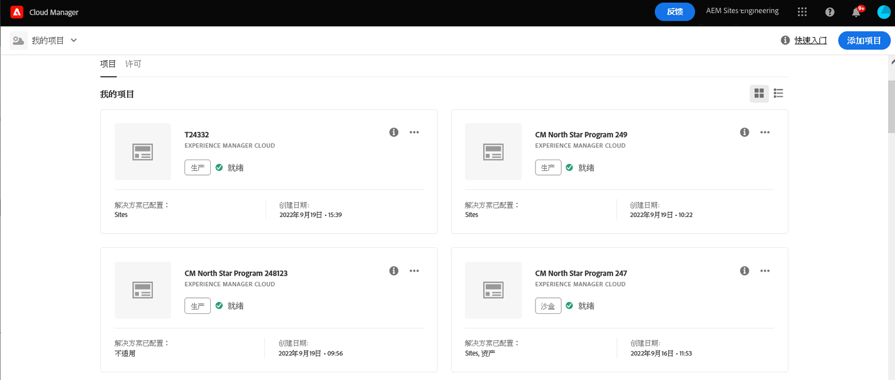
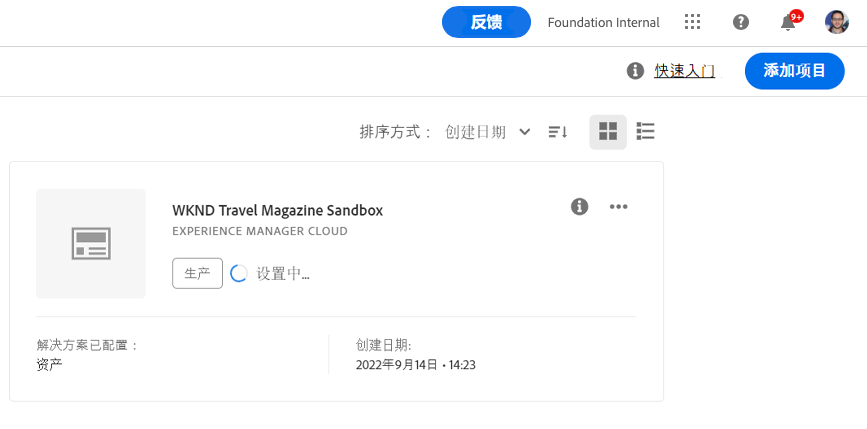
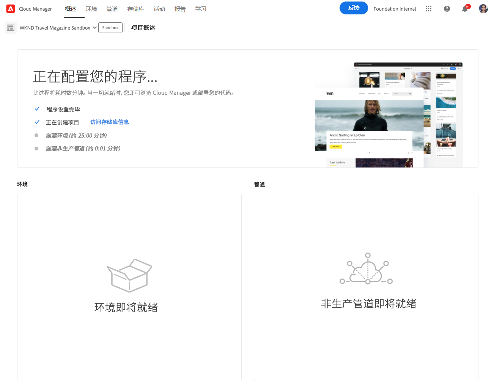
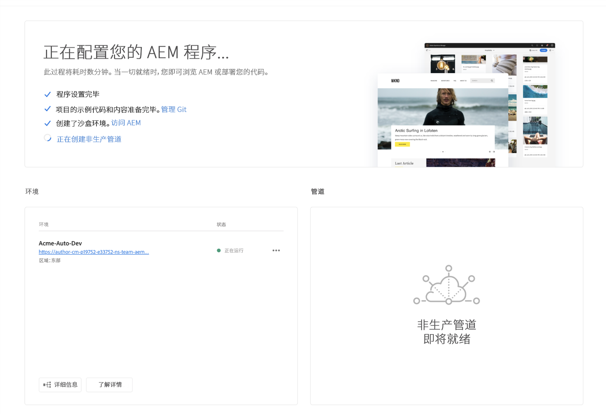
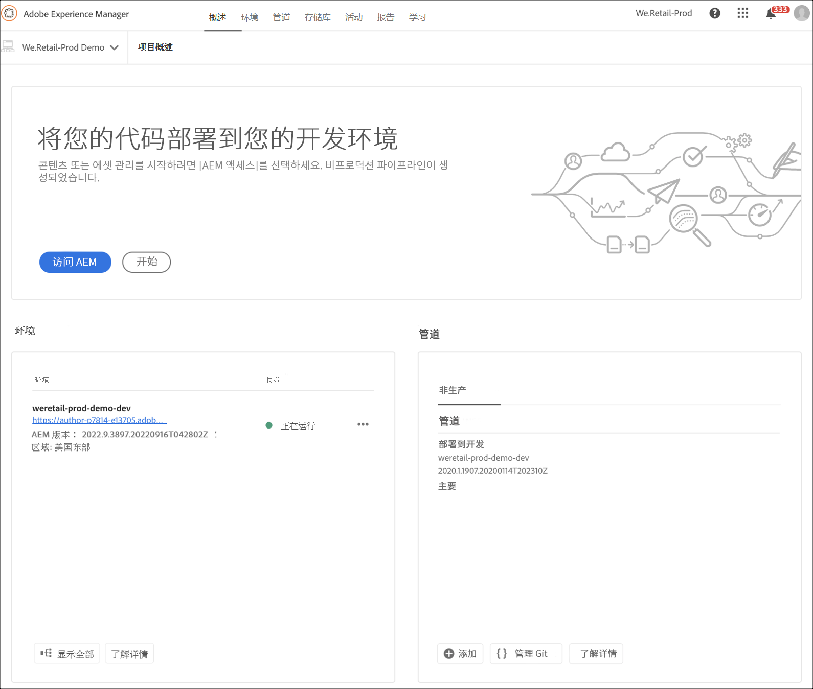
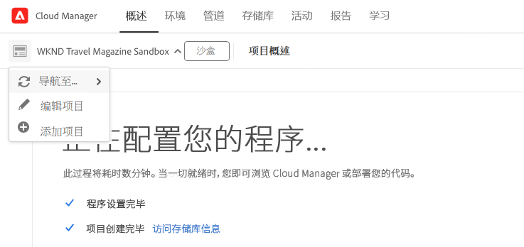

# 创建沙盒项目 {#create-sandbox-program}

按照以下步骤创建沙盒项目：

1. 启动Cloud Manager的登陆页面，然后单击屏幕右上角的&#x200B;**添加项目** 。

   

   >[!NOTE]
   >要了解如何访问Cloud Manager，请参阅[Cloud Manager登录页面](/help/onboarding/what-is-required/navigate-to-cloud-manager.md)以获取更多详细信息。

1. 在创建程序向导中，选择&#x200B;**设置沙盒**。 用户在选择&#x200B;**创建**&#x200B;之前提交程序名称。

   

1. 用户将在登陆页面上看到新的沙盒项目卡片，并且可以将鼠标悬停在该卡片上以选择Cloud Manager图标以导航到Cloud Manager概述页面。 卡片会告知用户新创建的沙盒程序的自动设置状态。 用户将看到进度。

   

1. 在程序设置和项目创建步骤完成后，用户可以访问&#x200B;**管理Git**&#x200B;链接，如下图所示：

   

   >[!NOTE]
   >
   >要了解有关从Cloud Manager UI中使用自助服务Git帐户管理访问和管理Git存储库的更多信息，请参阅[访问Git](/help/implementing/cloud-manager/accessing-git.md)。

1. 创建开发环境后，用户可以&#x200B;**访问AEM**&#x200B;链接，如下图所示：

   

1. 完成部署到开发的非生产管道后，向导会指导用户访问AEM（在开发时）或将代码部署到开发环境：

   

   >[!NOTE]
   >您还可以从Cloud Manager概述页面编辑、切换或添加项目，如下所示：

   
