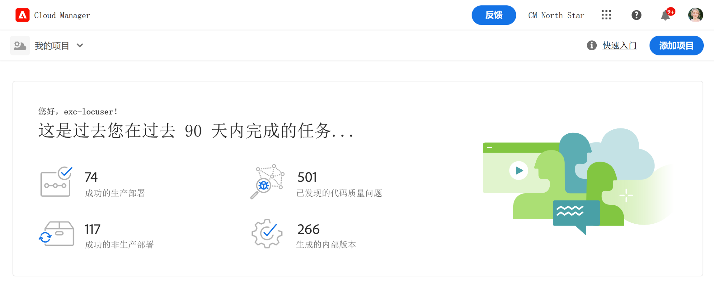
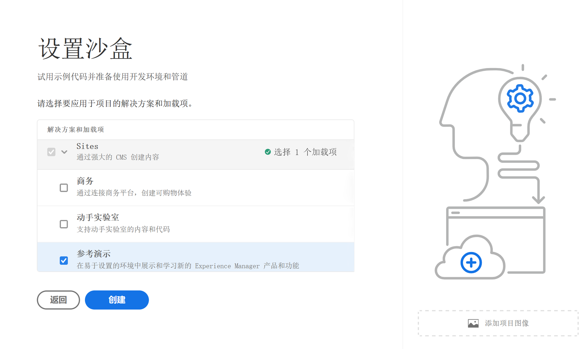
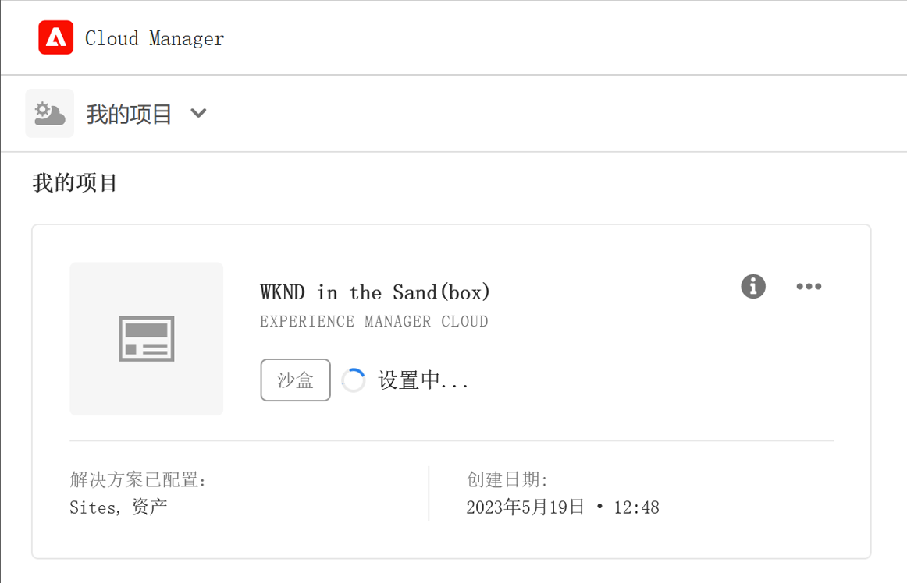

# 创建沙盒程序 {#create-sandbox-program}

通常，创建沙盒程序是为了提供培训、运行演示、支持、概念验证 (POC) 或归档等目的，并不意味着要承载实时流量。

请参阅文档[解程序和程序类型](program-types.md)，了解有关程序类型的更多信息。

## 创建沙盒程序 {#create}

1. 在 [my.cloudmanager.adobe.com](https://my.cloudmanager.adobe.com/) 登录 Cloud Manager 并选择相应的组织。

1. 从 Cloud Manager 的登陆页面，在屏幕右上角附近，点击&#x200B;**添加程序。**

   

1. 在“创建项目向导”中，选择&#x200B;**设置沙盒**，并提供项目名称。

   

1. 或者，您也可以将图像文件拖放到&#x200B;**添加项目图像**&#x200B;目标，或单击它以从文件浏览器中选择图像，从而将图像添加到项目中。选择 **继续**.

   * 该图像仅用作项目概览窗口中的磁贴，有助于识别项目。

1. 在 **设置沙盒** 对话框中，通过选中 **解决方案和加载项** 表格。

   * 使用该解决方案名称旁边的 V 形符号来显示解决方案的其他可选附加组件。

   * **Sites** 和 **Assets** 解决方案始终会包含在沙盒项目中并且不能取消选择。

   

1. 为沙盒项目选择解决方案和附加组件后，单击&#x200B;**创建。**

在安装过程中，您会在登陆页面上看到一个带有状态指示器的新沙盒程序信息卡。

## 沙盒访问权限 {#access}

您可以查看沙盒设置的详细信息，也可以通过查看程序概述页面访问该环境（在可用后）。

1. 从Cloud Manager登陆页面，单击所创建程序上的省略号按钮。

   

1. 项目创建步骤完成后，您可以访问&#x200B;**访问存储库信息**&#x200B;链接，以便能够使用您的 Git 存储库。

   

   >[!TIP]
   >
   >若要了解有关访问和管理 Git 存储库的更多信息，请参阅[访问 Git。](/help/implementing/cloud-manager/managing-code/accessing-repos.md)

1. 创建开发环境后，您可以使用 **Access AEM** 链接登录 AEM。

   

1. 完成非生产管道部署到开发后，向导将指导您访问 AEM 开发环境或将代码部署到开发环境。

   

如果您必须切换到另一个程序或需要返回概述页面以创建另一个程序时，请单击屏幕左上角的程序名称，以显示&#x200B;**导航至**&#x200B;选项。

