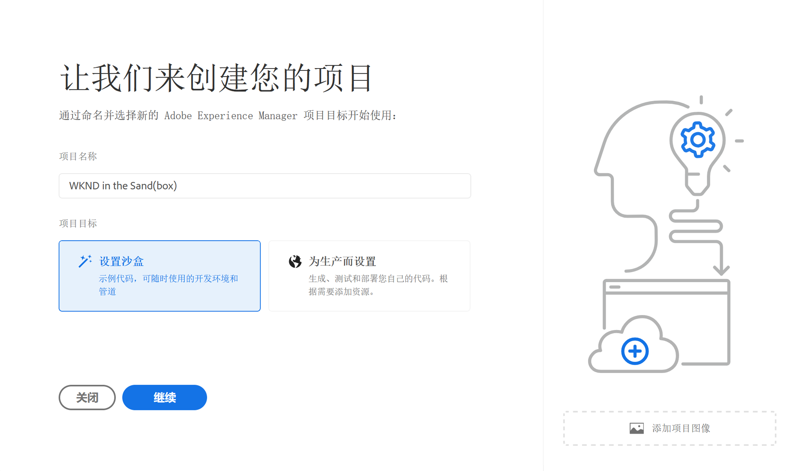

# 创建沙盒程序 {#create-sandbox-program}

通常，创建沙盒程序是为了提供培训、运行演示、支持、概念验证(POC)或归档等目的，而不是为了承载实时流量。 请参阅[沙盒程序简介](/help/implementing/cloud-manager/getting-access-to-aem-in-cloud/introduction-sandbox-programs.md)。

请参阅文档[了解程序和程序类型](program-types.md)以了解有关程序类型的更多信息。

## 创建沙盒程序 {#create}

1. 在 [my.cloudmanager.adobe.com](https://my.cloudmanager.adobe.com/) 登录 Cloud Manager 并选择相应的组织。

1. 在&#x200B;**[我的程序](/help/implementing/cloud-manager/navigation.md#my-programs)**&#x200B;控制台右上角附近，单击&#x200B;**添加程序**。

   

1. 在&#x200B;*让我们创建程序*&#x200B;向导的&#x200B;**程序名称**&#x200B;文本字段中，键入您希望程序的名称。

1. 在&#x200B;**项目目标**&#x200B;下，选择&#x200B;**`Set up a sandbox`**。

   

1. （可选）在向导对话框的右下角，执行以下任一操作：

   * 将图像文件拖放到&#x200B;**添加项目图像**&#x200B;目标上。
   * 单击&#x200B;**添加程序图像**，然后从文件浏览器中选择图像。
   * 单击垃圾桶图标可删除您添加的图像。

1. 单击&#x200B;**继续**。

1. 在&#x200B;**解决方案和加载项**&#x200B;列表框中，选择要包含在程序中的一个或多个解决方案。

   * 单击解决方案名称左侧的>形标记以显示您要包含在所选解决方案中的任何可用可选加载项。
   * 创建沙盒程序时，默认情况下始终选中&#x200B;**Sites**、**Assets**&#x200B;和&#x200B;**Edge Deliver Servicesy**&#x200B;解决方案。 不能取消选择它们。

   

1. 单击&#x200B;**创建**。Cloud Manager会创建沙盒程序并将其显示在登陆页面上以供选择。

## 沙盒访问 {#access}

新沙盒程序创建完成后，您可以查看沙盒设置的详细信息，并通过查看程序概述页面访问环境。

1. 从Cloud Manager登录页面，单击已创建沙盒程序上的省略号按钮。

   

1. 项目创建步骤完成后，您可以单击&#x200B;**访问存储库信息**&#x200B;链接以便能够使用您的Git存储库。

   

   >[!TIP]
   >
   >要了解有关访问和管理Git存储库的更多信息，请参阅[访问Git](/help/implementing/cloud-manager/managing-code/accessing-repos.md)。

1. 创建开发环境后，您可以单击&#x200B;**访问AEM**&#x200B;并登录到AEM。

   

1. 完成非生产管道部署到开发后，行动号召中的向导将指导您访问AEM开发环境或将代码部署到开发环境。

   

>[!TIP]
>
>有关如何浏览Cloud Manager以及了解&#x200B;**我的程序**&#x200B;控制台的详细信息，请参阅[浏览Cloud Manager UI](/help/implementing/cloud-manager/navigation.md)。
