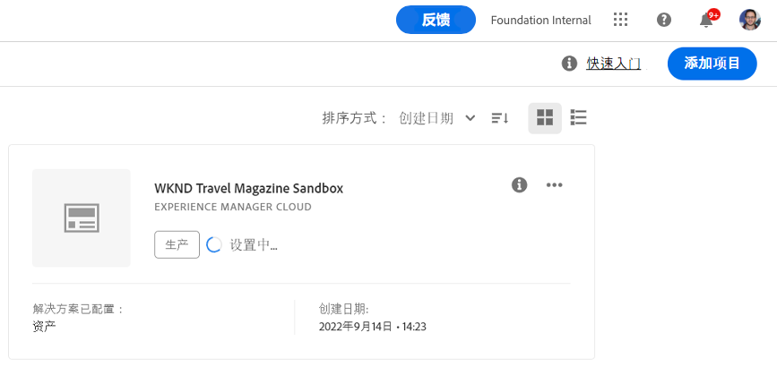

# 创建沙盒程序 {#create-sandbox-program}

沙盒计划通常用于提供培训、运行演示、支持、POC或文档目的，并且不适用于传输实时流量。

在文档中了解有关程序类型的更多信息 [了解程序和程序类型。](program-types.md)

## 创建沙盒项目 {#create}

按照以下步骤创建沙盒项目。

1. 在 [my.cloudmanager.adobe.com](https://my.cloudmanager.adobe.com/) 登录 Cloud Manager 并选择适当的组织。

1. 从Cloud Manager的登陆页面，单击 **添加程序** 中。

   

1. 从创建程序向导中，选择 **设置沙盒**，请提供项目名称，然后单击 **创建**.

   

随着设置过程的进行，您将在登陆页面上看到一个新的沙盒项目卡，其中包含状态指示器。

## 访问沙盒 {#access}

您可以查看沙盒设置的详细信息，并通过查看项目概述页面访问环境（一旦可用）。

1. 从Cloud Manager登录页面中，单击您新创建项目上的省略号按钮。

   

1. 项目创建步骤完成后，您可以访问 **访问存储库信息** 链接，以便能够使用您的git存储库。

   

   >[!TIP]
   >
   >要了解有关访问和管理git存储库的更多信息，请参阅此文档 [访问Git。](/help/implementing/cloud-manager/managing-code/accessing-repos.md)

1. 创建开发环境后，您可以使用 **访问AEM** 链接以登录AEM。

   

1. 完成部署到开发的非生产管道后，向导会指导您访问AEM开发环境或将代码部署到开发环境。

   

如果您随时需要切换到其他项目或返回概述页面以创建其他项目，请单击屏幕左上角的项目名称以显示 **导航到** 选项。

