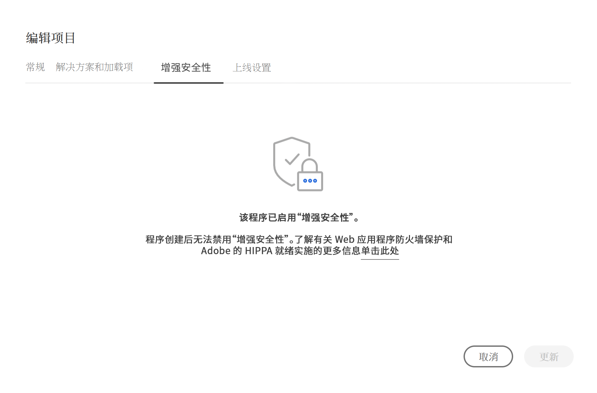

# 编辑程序 {#editing-programs}

具有必要权限的用户可以编辑[在您的组织中创建的生产项目](creating-production-programs.md)以及在您的企业中创建的[沙盒项目。](creating-sandbox-programs.md) 通过编辑项目，您可以：

* 将 Sites 解决方案添加到具有 Assets 的现有项目，反之亦然。
* 从具有 Sites 和 Assets 的现有项目中删除 Sites 或 Assets。
* 将另一未使用的解决方案权利添加到现有项目或添加为新项目。
* 删除沙盒项目。

## 权限 {#permissions}

您必须是&#x200B;**业务负责人**&#x200B;角色的成员才能编辑程序或删除沙盒程序。

## 编辑程序 {#editing}

1. 在 [my.cloudmanager.adobe.com](https://my.cloudmanager.adobe.com/) 登录 Cloud Manager 并选择适当的组织。

1. 单击要编辑的项目以显示其详细信息。

1. 单击页面左上方的项目名称，然后选择&#x200B;**编辑项目**。

   

1. **编辑程序**&#x200B;页面将打开。在&#x200B;**常规**&#x200B;选项卡上，编辑程序名称和描述。

   * 必须为程序选择至少一个解决方案。

   

1. 在&#x200B;**解决方案和插件**&#x200B;选项卡，修改程序的解决方案。

   

1. 单击解决方案名称前的 V 形符号以显示可选的加载项，例如在 **Sites** 下选择 **Commerce** 加载项选项。

   

1. 在&#x200B;**上线设置**&#x200B;选项卡，修改程序的计划上线日期。

   

   * 该日期仅供参考。它会触发项目概述页面上的“上线”构件。反过来，它提供了 Adobe Experience Manager (AEM) as a Cloud Service 最佳实践文档的产品内链接以与您的历程保持一致，最终提供成功的上线体验。
   * 该选项卡在沙盒项目中不可用。

1. 单击&#x200B;**更新**&#x200B;以将更改保存到项目。

无论何时编辑项目，包括添加或删除解决方案或加载项，这些更改都将在下次部署后生效。

如果您的生产程序启用了增强安全性，则&#x200B;**编辑程序**&#x200B;窗口中会提供一个额外的&#x200B;**增强安全性**&#x200B;选项卡以确认该程序的功能已激活。

创建项目后无法编辑此设置。有关增强安全选项的更多信息，请参阅[创建生产项目](creating-production-programs.md)。

## 删除沙盒项目 {#delete-sandbox-program}

删除沙盒项目将删除与其关联的所有环境和管道。

>[!TIP]
>
>具有&#x200B;**业务负责人**&#x200B;或&#x200B;**部署管理员**&#x200B;角色的用户可以选择删除其生产和暂存环境，而非整个沙盒项目。

要删除沙盒项目，请执行以下操作。

1. 在 [my.cloudmanager.adobe.com](https://my.cloudmanager.adobe.com/) 登录 Cloud Manager 并选择适当的组织。

1. 单击要编辑的项目以显示其详细信息。

1. 单击页面左上方的项目名称，然后选择&#x200B;**删除项目**。

   

或者，您可以从 Cloud Manager 概述页面单击程序卡上的省略号按钮，然后选择&#x200B;**删除程序**。

>[!NOTE]
>
>只能删除沙盒程序。无法删除生产项目。
