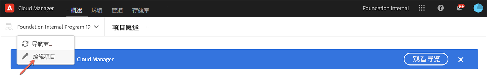
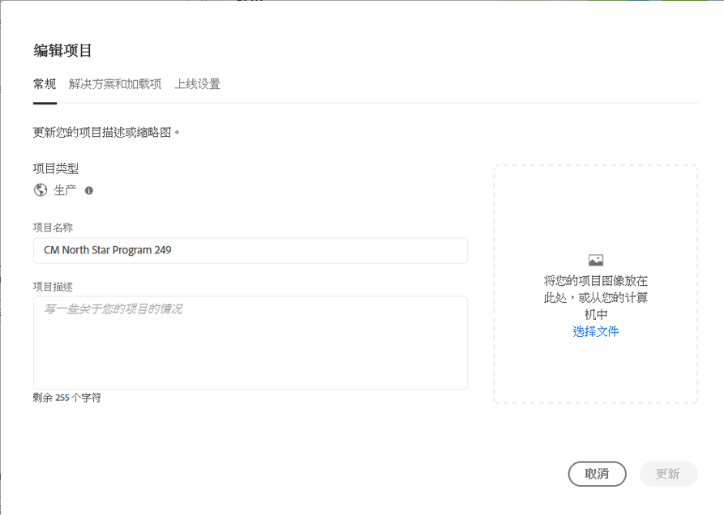
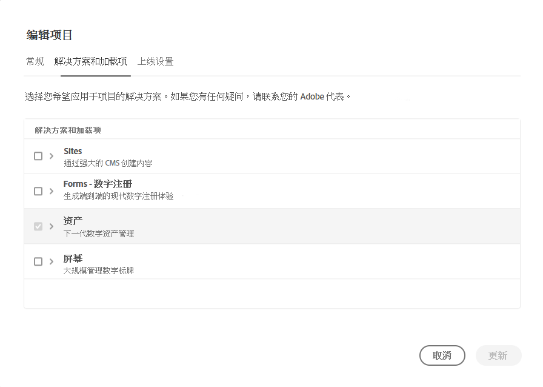
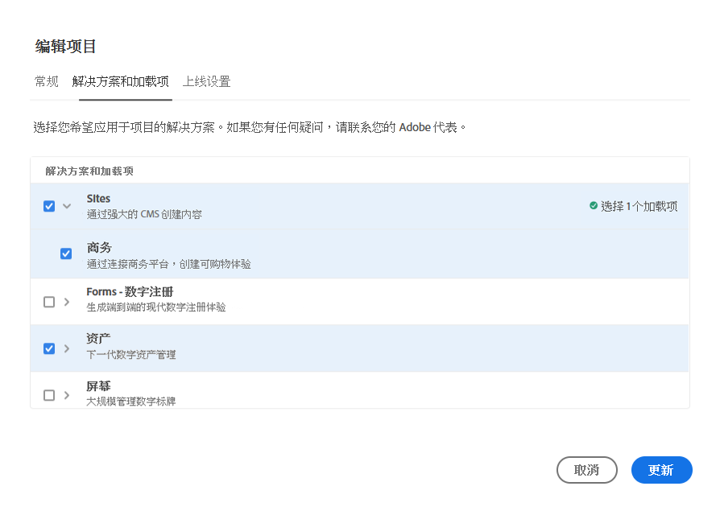
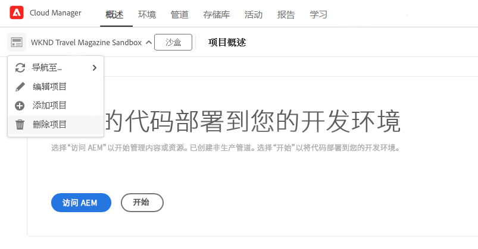

# 编辑程序 {#editing-programs}

具有必要权限的用户可以编辑 [在您的组织中创建的生产程序](creating-production-programs.md) 以及 [在您的组织中创建的沙盒程序。](creating-sandbox-programs.md) 通过编辑程序，您可以：

* 将站点解决方案添加到包含资产的现有项目中，反之亦然。
* 从同时具有站点和资产的现有项目中删除站点或资产。
* 将第二个未使用的解决方案权利添加到现有项目或作为新项目。
* 删除沙盒项目。

>[!NOTE]
>
>您必须是 **业务所有者** 角色来编辑项目或删除沙盒项目。

按照以下步骤编辑程序。

1. 登录Cloud Manager(位于 [my.cloudmanager.adobe.com](https://my.cloudmanager.adobe.com/) 并选择相应的组织。

1. 单击要编辑的程序以显示其详细信息。

1. 单击页面左上角的程序名称，然后选择 **编辑程序**.

   

1. 的 **编辑程序** 页面显示两个选项卡： **常规** 和 **解决方案和附加组件**. 选择 **常规** 选项卡，以编辑项目名称和说明。

   * 必须为程序至少选择一个解决方案。

   

1. 选择 **解决方案和附加组件** 选项卡来修改程序的解决方案。

   

1. 单击解决方案名称前面的V形标记以显示可选的附加组件，如选择 **商务** 下的附加选项 **站点**.

   

1. 单击 **更新** 以保存对程序所做的更改。

更新后，如果选定的解决方案发生更改，这些更改将在下次部署后生效。

## 删除沙盒程序 {#delete-sandbox-program}

删除沙盒项目将删除与其关联的所有环境和管道。

>[!TIP]
>
>具有 **业务所有者** 或 **部署管理器** 角色也可以删除其生产和暂存环境，而不是整个沙盒项目。

按照以下步骤删除沙盒项目。

1. 登录Cloud Manager(位于 [my.cloudmanager.adobe.com](https://my.cloudmanager.adobe.com/) 并选择相应的组织。

1. 单击要编辑的程序以显示其详细信息。

1. 单击页面左上角的程序名称，然后选择 **删除程序**.

   

或者，您也可以从Cloud Manager概述页面中单击您项目卡片上的省略号按钮，然后选择 **删除程序**.

>[!NOTE]
>
>只能删除沙盒程序。 无法删除生产程序。
