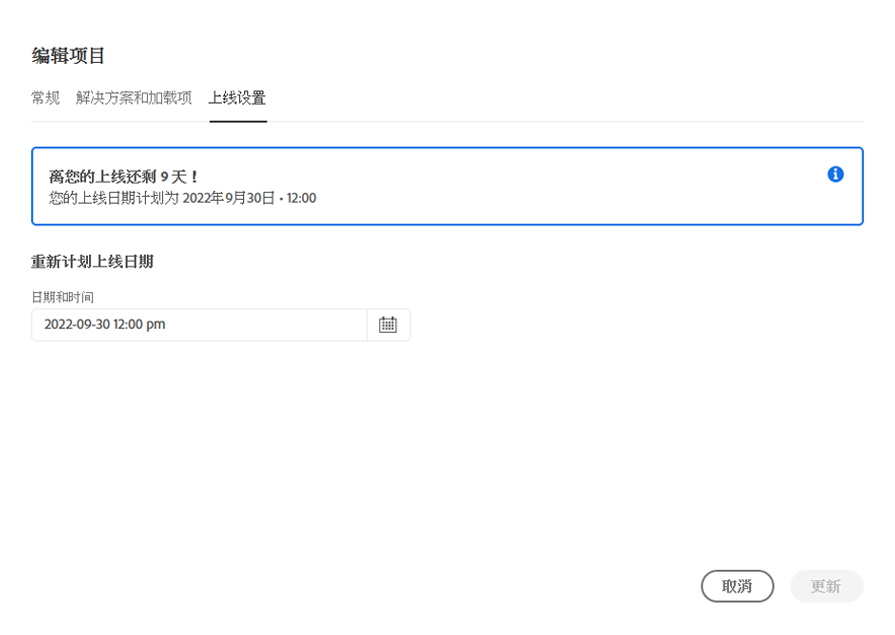

# 管理和编辑程序 {#editing-programs}

此 **我的项目群** 页面提供了您有权访问的所有程序的概述。 在选择单个项目时， **项目概述** 页面提供程序的详细信息概览。

从 **项目概述**，具有必要权限的用户可以编辑 [在您的组织中创建的生产程序](creating-production-programs.md) 和 [在您的组织中创建的沙盒程序。](creating-sandbox-programs.md) 通过编辑项目，您可以：

* 将 Sites 解决方案添加到具有 Assets 的现有项目，反之亦然。
* 从具有 Sites 和 Assets 的现有项目中删除 Sites 或 Assets。
* 将另一未使用的解决方案权利添加到现有项目或添加为新项目。
* 删除沙盒项目。

## 权限 {#permissions}

您必须是 **业务负责人** 用于编辑程序或删除沙盒程序以及访问许可证仪表板的角色。

## 我的项目群 {#my-programs}

1. 在 [my.cloudmanager.adobe.com](https://my.cloudmanager.adobe.com/) 登录 Cloud Manager 并选择适当的组织。

1. 此 **我的项目群** 页面以图块形式显示您有权访问的所有程序的列表。

### 行动号召 {#cta}

页面顶部是与组织状态相关的行动号召。 例如，如果您已成功设置项目，则可能会显示过去90天内的活动统计数据，包括：

* 数量 [部署](/help/implementing/cloud-manager/deploy-code.md)
* 数量 [代码质量问题](/help/implementing/cloud-manager/code-quality-testing.md) 已识别
* 内部版本数

或者，如果您刚刚开始设置组织，则可能会提供有关后续步骤或文档资源的提示。

### “程序”选项卡 {#programs-tab}

此 **程序** 选项卡列出了代表您有权访问的每个程序的卡片。 点按或单击卡片以访问 **项目概述** 页面，了解有关计划的详细信息。

使用排序选项更好地查找您需要的程序。

* 排序方式
   * 创建日期（默认）
   * 项目名称
   * 状态
* 升序（默认）/降序
* 网格视图（默认）
* 列表视图

### “许可证”选项卡 {#license-tab}

此 **许可证** 选项卡可让您快速访问 [许可证仪表板。](/help/implementing/cloud-manager/license-dashboard.md)

## 项目概述 {#program-overview}

一旦您从 **[我的项目群](#my-programs)** 页面，Cloud Manager打开 **项目概述** 页面。

点按或单击页面左上角的项目名称，可快速切换到另一个项目或返回 **[我的项目群](#my-programs)** 页面。 您还可以 [编辑所选项目](#editing) 或 [添加项目。](/help/implementing/cloud-manager/getting-access-to-aem-in-cloud/creating-production-programs.md)

顶部的行动号召将根据项目的状态为您提供有用的信息。 对于新计划，您可以看到提供的后续步骤以及上线日期提醒， [在程序创建期间设置。](/help/implementing/cloud-manager/getting-access-to-aem-in-cloud/editing-programs.md)

对于实时项目，显示上次部署的状态，其中包含详细信息链接和开始新部署的链接。

**环境** 和 **管道** 信息卡可快速概述所选项目中的这两者。

此 **性能** 信息卡提供了 **[CDN功能板。](/help/implementing/cloud-manager/cdn-performance.md)**

## 编辑程序 {#editing}

1. 在 [my.cloudmanager.adobe.com](https://my.cloudmanager.adobe.com/) 登录 Cloud Manager 并选择适当的组织。

1. 在 **[我的项目群](#my-programs)** 页面上，单击要编辑的程序以显示其详细信息。

1. 单击页面左上方的项目名称，然后选择&#x200B;**编辑项目**。

   

1. **编辑程序**&#x200B;页面将打开。在&#x200B;**常规**&#x200B;选项卡上，编辑程序名称和描述。

   * 必须为程序选择至少一个解决方案。

   

1. 在&#x200B;**解决方案和插件**&#x200B;选项卡，修改程序的解决方案。

   

1. 单击解决方案名称前的 V 形符号以显示可选的加载项，例如在 **Sites** 下选择 **Commerce** 加载项选项。

   

1. 在&#x200B;**上线设置**&#x200B;选项卡，修改程序的计划上线日期。

   

   * 该日期仅供参考。它会触发项目概述页面上的“上线”构件。反过来，它提供了 Adobe Experience Manager (AEM) as a Cloud Service 最佳实践文档的产品内链接以与您的历程保持一致，最终提供成功的上线体验。
   * 该选项卡在沙盒项目中不可用。

1. 如果程序有所需的权利， **安全性** 选项卡将显示可在何处修改程序的安全选项。

   

   * HIPAA无法在以下时间后启用或禁用 [项目创建。](/help/implementing/cloud-manager/getting-access-to-aem-in-cloud/creating-production-programs.md)
      * [详细了解](https://www.adobe.com/go/hipaa-ready_cn) Adobe 的 HIPAA 就绪解决方案实施。
   * 激活后，可以通过设置 [非生产管道。](/help/implementing/cloud-manager/configuring-pipelines/configuring-non-production-pipelines.md)

1. 单击&#x200B;**更新**&#x200B;以将更改保存到项目。

无论何时编辑项目，包括添加或删除解决方案或加载项，这些更改都将在下次部署后生效。

## 删除沙盒项目 {#delete-sandbox-program}

删除沙盒项目将删除与其关联的所有环境和管道。

>[!TIP]
>
>具有&#x200B;**业务负责人**&#x200B;或&#x200B;**部署管理员**&#x200B;角色的用户可以选择删除其生产和暂存环境，而非整个沙盒项目。

要删除沙盒项目，请执行以下操作。

1. 在 [my.cloudmanager.adobe.com](https://my.cloudmanager.adobe.com/) 登录 Cloud Manager 并选择适当的组织。

1. 在 **[我的项目群](#my-programs)** 页面上，单击要编辑的程序以显示其详细信息。

1. 单击页面左上角的程序名称，然后选择 **删除项目群**.

   

或者，您可以从 Cloud Manager 概述页面单击程序卡上的省略号按钮，然后选择&#x200B;**删除程序**。

>[!NOTE]
>
>只能删除沙盒程序。无法删除生产项目。
