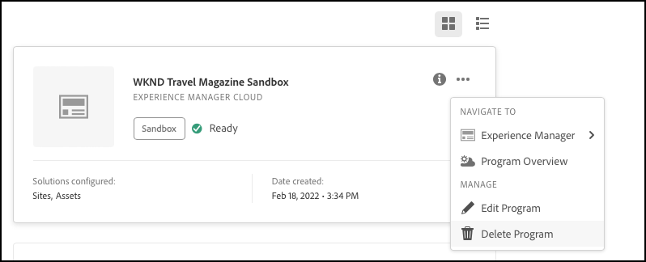

# 编辑项目群 {#editing-programs}

要管理和编辑程序，请从&#x200B;[**我的程序**&#x200B;控制台](/help/implementing/cloud-manager/navigation.md)开始。 **我的程序**&#x200B;页面提供了您有权访问的所有程序的概述。 选择单个项目时，**项目概述**&#x200B;页面会提供项目详细信息的概述。

在&#x200B;**程序概述**&#x200B;中，具有必要权限的用户可以编辑在您组织中创建的[生产程序](creating-production-programs.md)以及在您的组织中创建的[沙盒程序](creating-sandbox-programs.md)。 通过编辑程序，您可以执行以下操作：

* 将 Sites 解决方案添加到具有 Assets 的现有项目，反之亦然。
* 从同时具有Sites和Assets的现有程序中删除Sites或Assets。
* 将未使用的解决方案权利添加到现有计划或创建新计划。
* 将生产程序标记为删除。
* 删除沙盒项目。

## 权限 {#permissions}

您必须具有&#x200B;**业务负责人**&#x200B;角色才能编辑程序、删除沙盒程序、将生产程序标记为删除以及访问许可证仪表板。

## 编辑程序 {#editing}

无论何时编辑项目，包括添加或删除解决方案或加载项，这些更改都将在下次部署后生效。

**要编辑程序：**

1. 在[experience.adobe.com](https://experience.adobe.com)登录Cloud Manager。
1. 在&#x200B;**快速访问**&#x200B;部分，单击 **Experience Manager**。
1. 在左侧面板中点击 **Cloud Manager**。
1. 选择相应的组织。
1. 在&#x200B;**我的程序**&#x200B;页面上，单击要编辑的程序。
1. 在页面的左上角附近，单击程序的名称，然后选择&#x200B;**编辑程序**。

   

1. 在&#x200B;**编辑程序**&#x200B;对话框中，使用选项卡设置所需的各种选项。

   

   可用于编辑程序的选项与用于创建程序的选项相同。
   * 您可以配置是否为新环境(Beta)配置了发布层。 请参阅[灵活发布层(Beta)](/help/implementing/cloud-manager/getting-access-to-aem-in-cloud/creating-production-programs.md#flexible-publish-tier)。
   * 有关各个选项的详细信息，请参阅[创建生产程序](/help/implementing/cloud-manager/getting-access-to-aem-in-cloud/creating-production-programs.md)和[创建沙盒程序](/help/implementing/cloud-manager/getting-access-to-aem-in-cloud/creating-sandbox-programs.md)。
   * [其他选项](/help/implementing/cloud-manager/getting-access-to-aem-in-cloud/creating-production-programs.md#options)可能适用于您的生产程序，具体取决于您组织的权限。

1. 单击&#x200B;**更新**&#x200B;以保存更改。

## 将生产程序标记为删除 {#delete-production-program}

删除生产程序分为两个阶段。 业务负责人将程序标记为删除，这会触发验证和结束周期。 然后，该程序将在删除期结束后永久删除。

当生产程序标记为删除时，会发生以下情况：

* 与生产程序相关的信用将返还给客户。
* 属于生产程序的所有环境都会被关闭。

在开始标记为删除之前，系统验证生产程序是否适于删除。 如果标记失败，则生产程序将改为移至`Failed to mark for deletion`状态。

>[!NOTE]
>
>沙盒程序不受此进程的影响。 要删除沙盒程序，请参阅[删除沙盒程序](#delete-sandbox-program)。

**将生产程序标记为删除：**

1. 在[experience.adobe.com](https://experience.adobe.com)登录Cloud Manager。
1. 在&#x200B;**快速访问**&#x200B;部分，单击 **Experience Manager**。
1. 在左侧面板中点击 **Cloud Manager**。
1. 选择相应的组织。
1. 在&#x200B;**我的程序**&#x200B;页面上，对于要标记为删除的生产程序，单击，然后单击&#x200B;**删除程序**。

   *以上所示的示例生产程序仅供说明之用。*

1. 在&#x200B;**将生产程序标记为删除**&#x200B;对话框中，查看列出连接到程序的资源（包括生产、暂存和开发环境）的警告。

   

   >[!NOTE]
   >
   >如果生产程序具有阻止资源，例如当前正在更新的环境，则&#x200B;**标记为删除**&#x200B;按钮将被禁用。 请等待所有程序资源都解除锁定，然后才能将程序标记为删除。
   >
   >

1. 若要确认，请键入对话框中所显示的程序名称，然后单击&#x200B;**标记为删除**。

   确认后，生产程序在进程运行时显示&#x200B;**标记为删除**&#x200B;状态。

   

   完成后，生产程序信息卡将更新为&#x200B;**已标记为删除**，并带有关联的警报徽章。

   

1. 单击生产程序信息卡上的“警报”标记，显示计划的永久删除日期。

   

   在删除期过后，程序将永久删除且无法恢复。

### 取消将生产程序标记为删除 {#unmark-from-deletion}

只要尚未发生永久删除，您就可以恢复&#x200B;*标记为*&#x200B;要删除的生产程序。

>[!IMPORTANT]
>
>恢复标记为删除的生产程序要求客户具有可用积分。

**取消标记生产程序以进行删除：**

1. 在&#x200B;**我的程序**&#x200B;页面上，找到显示&#x200B;**已标记为删除**&#x200B;的生产程序卡。

1. 在生产程序信息卡上，单击，然后单击&#x200B;**取消标记为删除**。

   

   生产程序未标记为待删除。

## 删除沙盒程序 {#delete-sandbox-program}

删除沙盒项目将删除与其关联的所有环境和管道。

>[!TIP]
>
>具有&#x200B;**业务负责人**&#x200B;或&#x200B;**部署管理员**&#x200B;角色的用户可以选择删除其生产和暂存环境，而非整个沙盒项目。

**要删除沙盒程序：**

1. 在[experience.adobe.com](https://experience.adobe.com)登录Cloud Manager。
1. 在&#x200B;**快速访问**&#x200B;部分，单击 **Experience Manager**。
1. 在左侧面板中点击 **Cloud Manager**。
1. 选择相应的组织。

1. 在&#x200B;**[我的程序](#my-programs)**&#x200B;页面上，单击要编辑的沙盒程序以显示其详细信息。

1. 单击页面左上角的沙盒程序名称，然后选择&#x200B;**删除程序**。

   

或者，您可以从Cloud Manager概述页面单击沙盒程序卡上的，然后选择&#x200B;**删除程序**。

