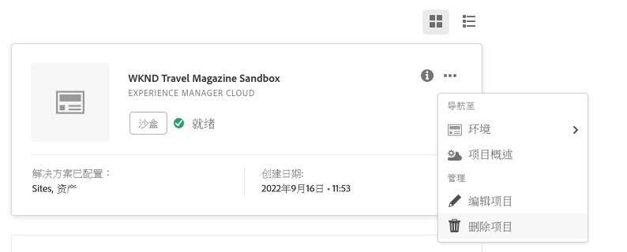

# 编辑程序 {#editing-programs}

具有必要权限的用户可以编辑[在您的组织中创建的生产程序](creating-production-programs.md)以及在您的企业中创建的[沙盒程序。](creating-sandbox-programs.md)通过编辑程序，您可以：

* 将 Sites 解决方案添加到具有 Assets 的现有程序，反之亦然。
* 从具有 Sites 和 Assets 的现有计划中删除 Sites 或 Assets。
* 将另一未使用的解决方案权利添加到现有程序或添加为新程序。
* 删除沙盒程序。

>[!NOTE]
>
>您必须是&#x200B;**业务负责人**&#x200B;角色的成员才能编辑程序或删除沙盒程序。

执行以下步骤来编辑项目。

1. 在 [my.cloudmanager.adobe.com](https://my.cloudmanager.adobe.com/) 登录 Cloud Manager 并选择适当的组织。

1. 单击要编辑的程序，显示其详细信息。

1. 单击页面左上方的程序名称，然后选择&#x200B;**编辑程序**。

   

1. **编辑程序**&#x200B;页面将打开。 在&#x200B;**常规**&#x200B;选项卡上，编辑程序名称和描述。

   * 必须为程序选择至少一个解决方案。

   

1. 在&#x200B;**解决方案和插件**&#x200B;选项卡，修改程序的解决方案。

   

1. 单击解决方案名称前的 V 形符号显示可选的插件，例如在 **Sites** 下选择 **Commerce** 插件选项。

   

1. 在&#x200B;**上线设置**&#x200B;选项卡，修改程序的计划上线日期。

   

   * 此日期仅供参考，并触发程序概述页面上的“上线”构件，及时提供 AEM as a Cloud Service 最佳实践文档的产品内链接，配合您的入门培训历程，最终获得成功、顺利的上线体验。

1. 单击&#x200B;**更新**，将更改保存到程序。

无论何时编辑程序，包括添加或删除解决方案或插件，这些更改都将在下次部署后生效。

如果您的生产程序启用了增强安全性，则&#x200B;**编辑程序**&#x200B;窗口中将提供一个额外的&#x200B;**增强安全性**&#x200B;选项卡以确认该程序的功能已激活。

一旦创建了程序，就不能修改此设置。有关增强安全选项的更多信息，请参阅[创建生产程序](creating-production-programs.md)文档。

## 删除沙盒程序 {#delete-sandbox-program}

删除沙盒程序将删除与其关联的所有环境和管道。

>[!TIP]
>
>具有&#x200B;**业务负责人**&#x200B;或&#x200B;**部署管理员**&#x200B;角色的用户可以选择删除其生产和暂存环境，而非整个沙盒程序。

按照以下步骤删除沙盒程序。

1. 在 [my.cloudmanager.adobe.com](https://my.cloudmanager.adobe.com/) 登录 Cloud Manager 并选择适当的组织。

1. 单击要编辑的程序，显示其详细信息。

1. 单击页面左上方的程序名称，然后选择&#x200B;**删除程序**。

   

或者，您可以从 Cloud Manager 概述页面单击程序卡上的省略号按钮，然后选择&#x200B;**删除程序**。

>[!NOTE]
>
>只能删除沙盒程序。 无法删除生产程序。
