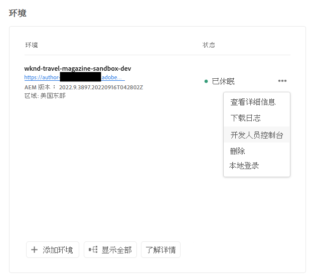

# 休眠和解除休眠沙盒环境 {#hibernating-introduction}

如果在八小时内未检测到任何活动，沙盒项目的环境将进入休眠模式。休眠是沙盒项目环境特有的。 生产程序环境不休眠。

## 休眠 {#hibernation-introduction}

休眠可以自动或手动进行。

* **自动**  — 沙盒项目环境在处于不活动状态八小时后会自动休眠。 非活动状态定义为创作服务或预览或发布服务都未收到请求。
* **手动**  — 作为用户，您可以手动为沙盒项目环境休眠。 无需执行此操作，因为将像之前所述自动进行休眠。

沙盒项目环境可能需要多达几分钟才能进入休眠模式。 数据在休眠期间保留。

### 使用手动休眠 {#using-manual-hibernation}

您可以从开发人员控制台手动将沙盒项目休眠。 Cloud Manager的任何用户都可以访问沙盒项目的开发人员控制台。

按照以下步骤手动将沙盒项目环境休眠。

1. 在 [my.cloudmanager.adobe.com](https://my.cloudmanager.adobe.com/) 登录 Cloud Manager 并选择适当的组织。

1. 单击要休眠的程序以显示其详细信息。

1. 在 **环境** 卡，单击省略号按钮并选择 **开发人员控制台**.

   * 请参阅文档 [访问开发人员控制台](/help/implementing/cloud-manager/manage-environments.md#accessing-developer-console) 有关开发人员控制台的其他详细信息。

   

1. 在开发人员控制台中，单击 **休眠**.

   

1. 单击 **休眠** 以确认步骤。

   

休眠成功后，您将在 **开发人员控制台** 屏幕。

在开发人员控制台中，您还可以单击 **环境** 链接 **面板** 要休眠的环境列表的下拉列表。

## 取消休眠 {#de-hibernation-introduction}

您可以从开发人员控制台手动将沙盒项目休眠。

>[!IMPORTANT]
>
>具有 **开发人员** 角色可以解除沙盒项目环境的休眠。

1. 在 [my.cloudmanager.adobe.com](https://my.cloudmanager.adobe.com/) 登录 Cloud Manager 并选择适当的组织。

1. 单击要休眠的程序以显示其详细信息。

1. 在 **环境** 卡，单击省略号按钮并选择 **开发人员控制台**.

   * 请参阅文档 [访问开发人员控制台](/help/implementing/cloud-manager/manage-environments.md#accessing-developer-console) 有关开发人员控制台的其他详细信息。

1. 单击 **解除休眠**.

   

1. 单击 **解除休眠** 以确认步骤。

   

1. 您会收到取消休眠进程已启动的通知，并且该进程已更新。

   

1. 流程完成后，沙盒项目环境将再次处于活动状态。

   

在开发人员控制台中，您还可以单击 **环境** 链接 **面板** 要解除休眠的环境列表的下拉列表。

### 解除休眠的权限 {#permissions-de-hibernate}

任何具有产品配置文件(赋予其访问AEMas a Cloud Service的权限)的用户都应该能够访问 **开发人员控制台**，允许他们将环境解除休眠。

## 访问休眠环境 {#accessing-hibernated-environment}

当针对休眠环境的创作、预览或发布服务发出任何浏览器请求时，用户将会遇到一个登陆页面，其中描述了该环境的休眠状态，并包含一个指向开发人员控制台的链接，可以在该控制台中取消休眠该服务。

## 部署和AEM更新 {#deployments-updates}

休眠环境仍允许进行部署和手动AEM升级。

* 用户可以使用管道将自定义代码部署到休眠环境。 环境将保持休眠状态，在解除休眠后，新代码将显示在环境中。

* AEM升级可以应用于休眠环境，并且可以从Cloud Manager手动触发。 环境将保持休眠状态，在解除休眠后，新版本将显示在环境中。

## 休眠和删除 {#hibernation-deletion}

* 沙盒项目中的环境在处于不活动状态八小时后会自动休眠。
   * 非活动状态定义为创作服务或预览或发布服务都未收到请求。
   * 休眠后，可以手动解除休眠。
* 沙盒项目在处于连续休眠模式的六个月后会被删除，之后可以重新创建它们。
