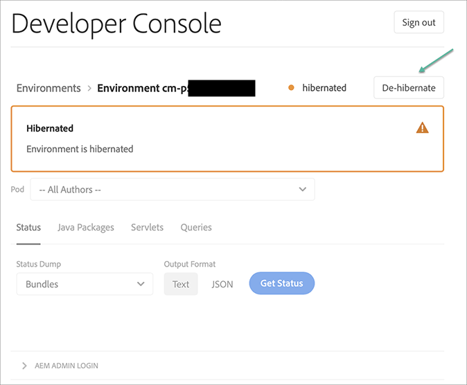
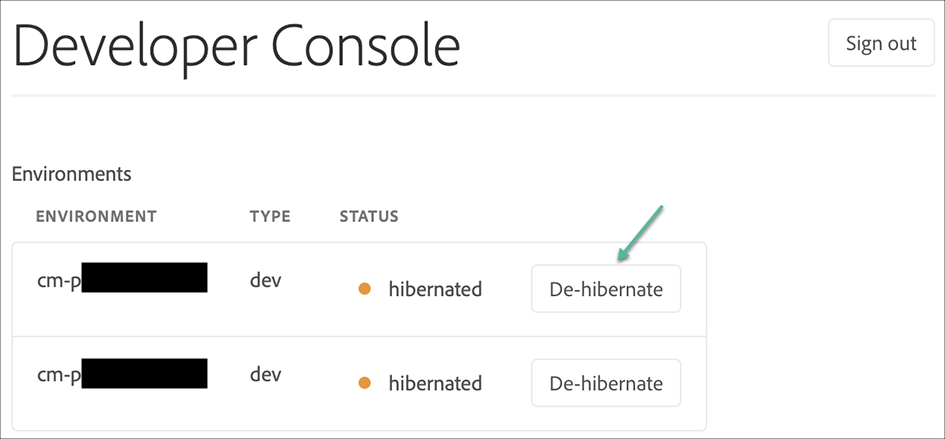

# 休眠和解除休眠沙盒环境 {#hibernating-introduction}

如果八小时内未检测到任何活动，沙盒程序的环境将进入休眠模式。 休眠是沙盒程序环境所特有的。 生产程序环境无法休眠。

## 休眠 {#hibernation-introduction}

休眠可以自动或手动进行。

* **自动** – 沙盒程序环境在八小时不活动后自动休眠。 非活动性定义为缺少对作者、预览和发布服务的请求。
* **手动** – 作为用户，您可以手动休眠沙盒程序环境。 无需这样做，因为如前所述，休眠会自动发生。

沙盒程序环境可能需要几分钟才能进入休眠模式。 数据在休眠期间保存。

### 手动休眠沙盒程序环境 {#using-manual-hibernation}

您可以从 Developer Console 手动休眠沙盒程序。 Cloud Manager的任何用户都可以访问Developer Console获取沙盒程序。

**手动休眠沙盒程序环境：**

1. 在 [my.cloudmanager.adobe.com](https://my.cloudmanager.adobe.com/) 登录 Cloud Manager 并选择适当的组织。

1. 在&#x200B;**[我的程序](/help/implementing/cloud-manager/navigation.md#my-programs)**&#x200B;控制台上，单击要休眠的&#x200B;*沙盒程序*&#x200B;以显示其详细信息。

1. 在&#x200B;**环境**&#x200B;信息卡上，单击，然后单击&#x200B;**Developer Console**。

   * 有关 Developer Console 的更多详细信息，请参阅[访问 Developer Console。](/help/implementing/cloud-manager/manage-environments.md#accessing-developer-console)

   

1. 在&#x200B;**Developer Console**&#x200B;页面上，单击&#x200B;**休眠**。

<!-- UPDATE THESE SCREENSHOTS WHEN NEW AEM DEVELOPER CONSOLE UI IS RELEASED. AS OF OCTOBER 14, 2024, NEW UI IS STILL IN BETA -->

1. 单击&#x200B;**休眠**&#x200B;确认步骤。

   

当休眠成功时，您会在&#x200B;**Developer Console**&#x200B;屏幕中看到针对您环境的休眠进程完成通知。

在Developer Console中，单击&#x200B;**Pod**&#x200B;下拉列表上方的痕迹导航中的&#x200B;**环境**&#x200B;链接，以查看可用于休眠的环境。

## 从Developer Console手动休眠沙盒程序 {#de-hibernation-introduction}

您可以从Developer Console手动休眠沙盒程序。

>[!IMPORTANT]
>
>具有&#x200B;**开发人员**&#x200B;角色的用户，可以手动休眠沙盒程序环境。

**要手动从Developer Console解除沙盒程序休眠，请执行以下操作：**

1. 在 [my.cloudmanager.adobe.com](https://my.cloudmanager.adobe.com/) 登录 Cloud Manager 并选择适当的组织。

1. 在&#x200B;**[我的程序](/help/implementing/cloud-manager/navigation.md#my-programs)**&#x200B;控制台上，单击要解除休眠的程序以显示其详细信息。

1. 在&#x200B;**环境**&#x200B;信息卡上，单击https://spectrum.adobe.com/static/icons/workflow_18/Smock_More_18_N.svg，然后单击&#x200B;**Developer Console**。

   * 有关 Developer Console 的更多详细信息，请参阅[访问 Developer Console。](/help/implementing/cloud-manager/manage-environments.md#accessing-developer-console)

1. 单击&#x200B;**解除休眠**。

   

1. 单击&#x200B;**解除休眠**&#x200B;确认步骤。

   

1. 您会收到通知，告知解除休眠进程已启动，并随进度更新。

   

1. 一旦过程完成，沙盒程序环境将再次处于活动状态。

   

在Developer Console中，单击&#x200B;**Pod**&#x200B;下拉列表上方的痕迹导航中的&#x200B;**环境**&#x200B;链接，以访问可用于解除休眠的环境。

### 解除休眠的权限 {#permissions-de-hibernate}

任何拥有将 AEM as a Cloud Service 访问权限的产品配置文件的用户都应该能够访问&#x200B;**Developer Console**，从而使他们能够解除环境休眠。

## 访问休眠环境 {#accessing-hibernated-environment}

当用户向休眠环境的作者、预览或发布服务发出浏览器请求时，他们会遇到登陆页面。 本页说明环境的休眠状态，并提供用于解除休眠的Developer Console的链接。

## 部署和AEM更新 {#deployments-updates}

休眠环境仍然允许部署和手动 AEM 升级。

* 用户可以使用管道将自定义代码部署到休眠环境。 环境将保持休眠状态，一旦解除休眠，新代码将出现在环境中。

* AEM 升级可应用于休眠环境，并可从 Cloud Manager 手动触发。 环境将保持休眠状态，一旦解除休眠，新版本将出现在环境中。

## 休眠和删除 {#hibernation-deletion}

* 沙盒程序中的环境在八小时不活动后自动休眠。
   * 非活动性定义为缺少对作者、预览和发布服务的请求。
   * 一旦休眠，它们可以[手动解除休眠](#de-hibernation-introduction)。
* 沙盒程序在连续休眠模式下运行六个月后被删除，之后可以重新创建它们。

>[!NOTE]
>
>在连续休眠六个月后，只有沙盒环境会自动删除。保留沙盒程序及其存储库和代码。
