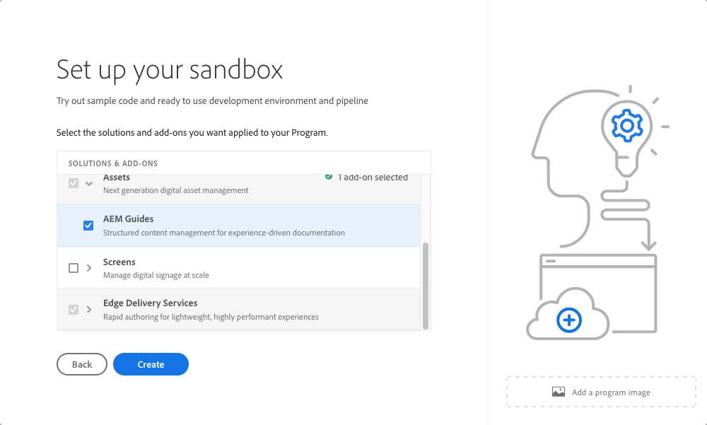

# 沙盒程序简介 {#sandbox-programs}

了解沙盒程序是什么以及它们与生产程序有何不同。

## 简介 {#introduction}

沙盒程序通常是为了满足培训、运行演示、启用或概念验证 (POC) 的目的而创建的，因此不会承载实时流量。

沙盒程序是AEM Cloud Service中可用的两种程序之一，另一种是[生产程序](introduction-production-programs.md)。 请参阅[了解程序和程序类型](/help/implementing/cloud-manager/getting-access-to-aem-in-cloud/program-types.md)，了解有关程序类型的更多信息。

## 自动创建 {#auto-creation}

沙盒程序具有自动创建功能。 每当[创建沙盒程序](/help/implementing/cloud-manager/getting-access-to-aem-in-cloud/creating-sandbox-programs.md)时，Cloud Manager都会自动：

* 将AEM Sites、Assets和Edge Delivery Services作为默认解决方案添加到您的项目中。

  

* 使用基于[AEM项目原型](https://experienceleague.adobe.com/zh-hans/docs/experience-manager-core-components/using/developing/archetype/overview)的示例项目设置项目git存储库。
* 创建开发环境。
* 创建部署到开发环境的非生产管道。

沙盒程序只有一个开发环境。

## 限制和条件 {#limitations}

由于沙盒程序不适用于实时流量，因此其使用有一定的限制和条件，这使得沙盒程序与生产程序不同。

| 限制/条件 | 描述 |
| --- | --- |
| 无实时流量 | 沙盒程序不会承载实时流量，因此不受[AEM as a Cloud Service承诺](https://www.adobe.com/cn/legal/service-commitments.html)的约束。 |
| 无自动缩放 | 在沙盒程序中创建的环境未配置为自动缩放。 因此，这些环境不适合进行性能或负载测试。 |
| 无自定义域或IP允许列表 | [自定义域](/help/implementing/cloud-manager/custom-domain-names/introduction.md)和[IP允许列表](/help/implementing/cloud-manager/ip-allow-lists/introduction.md)在沙盒程序中不可用。 |
| 无其他发布区域 | [其他发布区域](/help/operations/additional-publish-regions.md)在沙盒程序中不可用。 |
| 否99.99%SLA | [99.99% SLA](/help/implementing/cloud-manager/getting-access-to-aem-in-cloud/creating-production-programs.md#sla)不适用于沙盒程序。 |
| 无高级联网 | [高级网络功能](/help/security/configuring-advanced-networking.md)（例如 VPN、非标准端口、专用出口 IP 地址的自助供应等） 在沙盒程序中不可用。 |
| 无自动AEM更新 | AEM 更新不会自动推送到沙盒程序，但可以手动应用到沙盒程序中的环境。 ·仅当目标环境具有正确配置的管道时，才能运行手动更新。 ·对生产环境或暂存环境的手动更新会自动更新其他环境。 生产 + 暂存环境集必须位于同一 AEM 版本上。 有关详细信息，请参阅[AEM版本更新](/help/implementing/deploying/aem-version-updates.md)。 请参阅[更新环境](/help/implementing/cloud-manager/manage-environments.md#updating-dev-environment)以了解如何更新环境。 |
| 无技术支持 | 由于沙盒程序通常是为了提供培训、运行演示、支持或POC（概念验证）的目的而创建的，因此技术支持不适用于沙盒程序中遇到的问题。 如果您在创建和管理沙盒程序时遇到问题，这些问题属于技术支持范围。 |
| 休眠和删除 | 沙盒程序中的环境在八小时不活动后自动休眠。沙盒环境在连续休眠六个月后将被删除。 有关如何解除环境休眠和自动删除沙盒的更多详细信息，请参阅[使沙盒环境休眠和解除沙盒环境休眠](/help/implementing/cloud-manager/getting-access-to-aem-in-cloud/hibernating-environments.md)。 |
