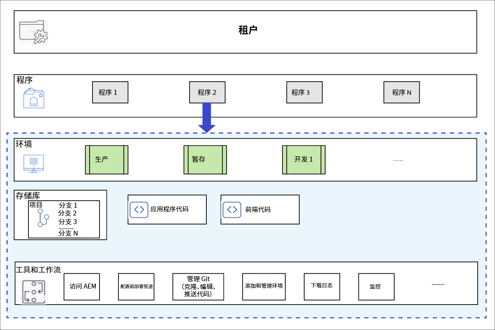

# 程序和程序类型 {#understanding-programs}

Cloud Manager是围绕实体层次结构构建的。 此内容的详细信息对您在Cloud Manager中的日常工作并不重要，但是，概述此内容将有助于您了解程序并设置自己的程序。



* **租户**  — 这是层级的顶部。 每个客户都配置了租户。
* **程序。**  — 每个租户都有一个或多个程序， [这通常反映客户的授权解决方案。](introduction-production-programs.md)
* **环境** – 每个项目都有多个环境，例如用于实时内容的生产环境、一个用于暂存的环境，一个用于开发的环境。
   * 每个计划只能有一个生产环境，但有多个非生产环境。
* **存储库**  — 程序具有git存储库，其中为环境维护了应用程序和前端代码。
* **工具和工作流**  — 管道管理从存储库到环境的代码部署，而其他工具则允许访问日志、监控和环境管理。

示例通常有助于将此层级置于上下文中。

* WKND 旅游和冒险企业可能是专注于旅游相关媒体的&#x200B;**租户**。
* WKND 旅游和冒险企业租户可能具有两个&#x200B;**项目**：一个针对 WKND 杂志的 Sites 项目和一个针对 WKND 媒体的 Assets 项目。
* WKND 杂志和 WKND 媒体项目都具有开发、暂存和生产&#x200B;**环境**。

## 源代码存储库 {#source-code-repository}

Cloud Manager程序将自动配置其自己的git存储库。

要访问Cloud Manager git存储库，用户需要将git客户端与命令行工具、独立的可视git客户端或用户选择的IDE（如Eclipse、IntelliJ或NetBeans）一起使用。

设置git客户端后，您可以从Cloud Manager UI中管理git存储库。 要了解如何使用Cloud Manager UI管理Git，请参阅此文档 [访问Git。](/help/implementing/cloud-manager/managing-code/accessing-repos.md)

要开始开发AEM Cloud应用程序，必须通过将应用程序代码从Cloud Manager存储库签出到本地计算机上的某个位置来制作应用程序代码的本地副本。

```java
$ git clone {URL}
```

因此，工作流是标准的git工作流。

1. 用户克隆Git存储库的本地副本。
1. 用户在本地代码存储库中进行更改。
1. 准备就绪后，用户将更改提交回远程git存储库。

唯一的区别在于，远程git存储库是Cloud Manager的一部分，该存储库对开发人员而言是透明的。

## 程序类型 {#program-types}

用户可以创建 **生产** 项目或 **沙盒** 项目。

* A **生产计划** 用于启用网站的实时流量。
   * 请参阅该文档 [生产计划简介](/help/implementing/cloud-manager/getting-access-to-aem-in-cloud/introduction-production-programs.md) 以了解更多详细信息。
* A **沙盒程序** 通常创建用于提供培训、运行演示、启用、POC或文档目的。
   * 沙盒环境不用于传输实时流量，并且具有生产程序不会受到的限制。
   * 它将包括站点和资产，并将自动填充一个git分支，该分支包含示例代码、开发环境和非生产管道。
   * 请参阅该文档 [沙盒程序简介](/help/implementing/cloud-manager/getting-access-to-aem-in-cloud/introduction-sandbox-programs.md) 以了解更多详细信息。
