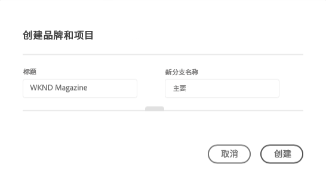
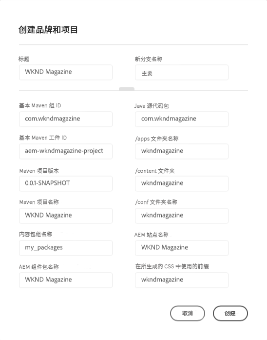
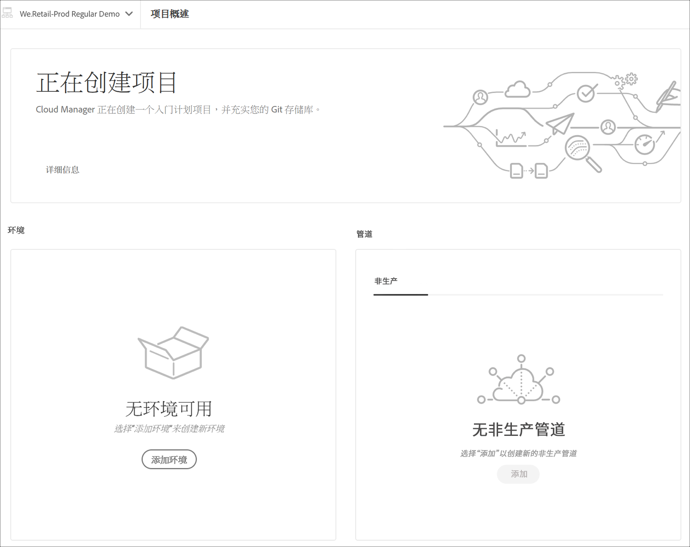

# 项目创建向导 {#project-creation-wizard}

在创建生产程序后，Cloud Manger会提供一个向导，用于根据 [AEM项目原型](https://experienceleague.adobe.com/docs/experience-manager-core-components/using/developing/archetype/overview.html) 来快速入门。

请按照以下步骤在Cloud Manager中使用向导创建AEM应用程序项目。

1. 按照文档中的步骤创建生产程序 [创建生产程序](creating-production-programs.md)

1. 程序设置完成后，访问 **概述** 屏幕，并查看 **创建分支和项目** 行动动员卡。

   

1. 单击 **创建** 启动向导并确认项目 **标题** 和 **新建分支名称** 在 **创建分支和项目** 窗口。

   

1. （可选）单击分隔线以显示项目的其他参数。 默认值由AEM项目原型提供，通常不需要更改。

   

1. 单击 **创建** 以启动项目创建过程。

A **正在创建项目** 现在，卡取代了 **创建分支和项目** 行动动员卡作为 **计划概述** 屏幕。

程序创建完成后， **添加环境** 卡取代了 **正在创建项目** 卡 **计划概述** 屏幕。

现在，您将基于AEM原型的AEM项目添加到git存储库，以用作您自己项目开发的基础。 接下来，您可以创建可在其中部署项目代码的环境。

请参阅该文档 [管理环境](/help/implementing/cloud-manager/manage-environments.md) 了解如何添加或管理环境。

>[!NOTE]
>
>向导仅适用于生产程序。 因为 [沙盒程序](introduction-sandbox-programs.md#auto-creation) 包括自动创建项目，则无需向导。