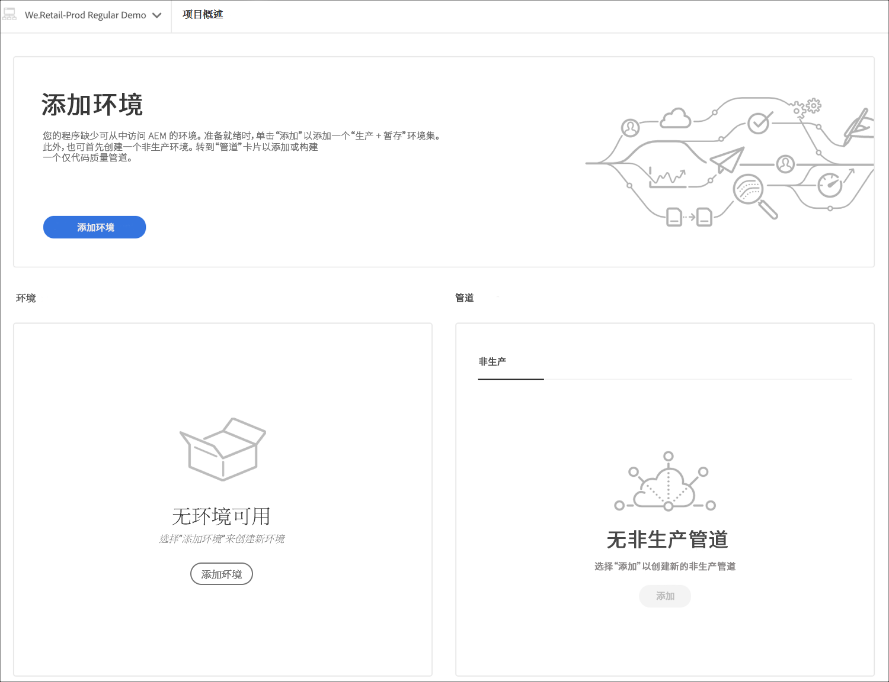

# 项目创建向导 {#project-creation-wizard}

创建生产程序后，Cloud Manger 会提供一个向导，根据 [AEM 项目原型](https://experienceleague.adobe.com/docs/experience-manager-core-components/using/developing/archetype/overview.html)创建一个最小的 AEM 项目，以便快速入门。

按照以下步骤使用向导在 Cloud Manager 中创建 AEM 应用程序项目。

1. 按照文档[创建生产程序](creating-production-programs.md)中的步骤创建生产程序

1. 程序设置完成后，访问程序的&#x200B;**概述**&#x200B;屏幕，并查看顶部的&#x200B;**创建分支和项目**&#x200B;行动号召信息卡。

   

1. 单击&#x200B;**创建**&#x200B;启动向导，并在&#x200B;**创建分支和项目**&#x200B;窗口中确认项目的&#x200B;**标题**&#x200B;和&#x200B;**新分支名称**。

   

1. 或者，单击分隔线显示项目的其他参数。 默认值由 AEM 项目原型提供，通常不需要更改。

   

1. 单击&#x200B;**创建**，开始项目创建过程。

**正在创建项目**&#x200B;信息卡现在取代了&#x200B;**创建分支和项目**&#x200B;行动号召信息卡，出现在&#x200B;**程序概述**&#x200B;屏幕的顶部。

一旦程序创建完成，**添加环境**&#x200B;信息卡会取代&#x200B;**程序概述**&#x200B;屏幕顶部的&#x200B;**正在创建项目**&#x200B;信息卡。

现在，您有一个基于 AEM 原型的 AEM 项目添加到您的 Git 存储库中，作为您自己项目的开发基础。 接下来，您可以创建可以在其中部署项目代码的环境。

参见 [管理环境](/help/implementing/cloud-manager/manage-environments.md) 以了解如何添加或管理环境。

>[!NOTE]
>
>该向导仅适用于生产程序。 因为[沙盒程序](introduction-sandbox-programs.md#auto-creation)包含自动项目创建，所以不需要向导。