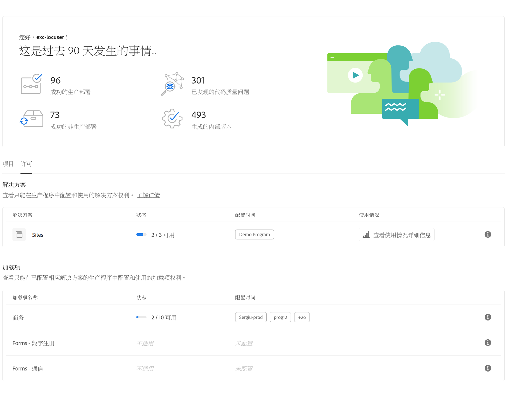

# 许可证功能板 {#license-dashboard}

Cloud Manager提供了一个功能板，用于轻松查看您的组织或租户可用的AEMaCS产品权利。

## 概述 {#overview}

Cloud Manager许可证功能板提供对以下信息的轻松访问：

1. 您可以在所有项目中获得的解决方案授权，包括使用的内容和可用的内容
1. 站点解决方案的内容请求使用情况量度（按月）趋势

## 使用许可证功能板 {#using-dashboard}

要访问您的许可证仪表板，请执行以下步骤。

>[!NOTE]
>
>中的用户 **业务所有者** 角色必须登录才能查看许可证功能板。

1. 登录Cloud Manager(位于 [my.cloudmanager.adobe.com](https://my.cloudmanager.adobe.com/) 并选择相应的组织。

1. 在产品概述页面上，切换到 **许可证** 选项卡。

功能板分为三个部分，显示您：

* **解决方案**  — 本部分概述您已获得许可的解决方案，如Sites或Assets。
* **附加组件**  — 本部分概述您拥有的授权解决方案的哪些附加组件。
* **沙盒和开发环境**  — 此部分概述了您可用的环境。

每个部分都会总结可用内容以及当前使用方式（如果根本没有）。 当前，即使租户中存在其他解决方案，也只显示Sites解决方案。

* 的 **状态** 列显示租户未使用的授权数量与可用的权限总数。
* 的 **配置于** 列指示应用了解决方案权利的程序。
   * 仅当创建了生产环境或已存在（如果已对其运行更新管道）时，才会将授权视为使用。
* 的 **使用情况** 列会将过去12个月内使用的内容请求显示为一个图表，以供单击。

>[!TIP]
>
>请参阅 [Admin Console概述](https://helpx.adobe.com/cn/enterprise/using/admin-console.html) 了解如何从Adobe管理整个组织的Admin Console权限。

## 常见问题解答 {#faq}

### 什么是内容请求？ {#what-is-a-content-request}

内容请求是指进入AEM Sites或任何客户提供的缓存系统（如内容交付网络）的请求，用于以HTML格式（作为页面查看）或JSON格式（作为API调用）来交付内容或数据。

在第一缓存系统的入口处测量每个页面查看或每五个API调用计为一个内容请求，以接收内容请求。 内容请求仅针对生产环境进行计数。

内容请求会排除由Adobe发起或代表客户发起的仅用于提供产品和服务的请求或活动。 Adobe识别的用户代理流量也会排除与常用搜索引擎和社交媒体服务相关的机器人、爬网程序和蜘蛛程序的流量。

### Adobe Experience Manager如何测量内容请求？ {#how-are-content-requests-measured}

内容请求会在AEM as a Cloud Service的边缘服务器上进行跟踪。 原始流量不计入内容请求。 内置于AEMas a Cloud Service的CDN可跟踪有效的HTML和JSON请求。

AEM还制定了规则来排除知名机器人，包括定期访问网站的知名服务，以刷新其搜索索引或服务。

以下是排除的知名服务示例的非详尽列表。

* AddSearchBot
* AhrefsBot
* Applebot
* 询问Jeeves公司蜘蛛
* Bingbot
* BingPreview
* BLEXBot
* BuiltWith
* 字节蜘蛛
* CrawlerKengo
* Facebookexternalhit
* Google AdsBot
* Google AdsBot Mobile

### 为什么我的Analytics报表显示的结果与AEM内容请求不同？ {#why-are-reports-different}

如此表所概述，内容请求与组织的Analytics报表工具将存在差异。

| 差异原因 | 说明 |
|---|---|
| 标记 | 作为AEM内容请求进行跟踪的所有页面，可能会标记为Analytics跟踪，也可能未标记为Analytics跟踪。 作为AEM内容请求进行跟踪的所有API调用都不会由组织的Analytics工具进行标记。 可以标记页面或API调用以跟踪操作而不是视图。 |
| Tag Management规则 | 标签管理规则设置可能会导致页面上出现各种数据收集配置，从而导致内容请求跟踪出现一些差异。 |
| 机器人 | 尚未由AEM预先识别和删除的未知机器人可能导致跟踪差异。 |
| 报告包 | 属于同一AEM实例和域的页面可能会将数据发送到不同的Analytics报表包。 |
| 第三方监控和安全工具 | 监控和安全扫描工具可能会为Analytics报表中未跟踪的AEM生成内容请求。 |
| 预取请求 | 使用预取服务预加载页面以提高速度，可能会导致内容请求流量显着增加。 |
| DDOS | 虽然Adobe会竭尽全力自动检测和过滤来自DDOS攻击的流量，但无法保证会检测到所有可能的DDOS攻击。 |

### 如果我使用自己的CDN，该怎么办？ {#using-own-cdn}

Cloud Manager中的内容请求功能板将不显示您自己的CDN的跟踪。
