# 管理环境 {#managing-environments}

了解您可以创建的环境类型以及如何为Cloud Manager项目创建环境。

## 环境类型 {#environment-types}

具有必要权限的用户可以创建以下环境类型（在特定租户可用的范围内）。

* **生产和暂存**  — 生产和暂存环境可作为一对使用，并分别用于生产和测试目的。

* **开发**  — 开发环境可用于开发和测试目的，并且只能与非生产管道关联。

各个环境的功能取决于容器中启用的解决方案 [项目。](/help/implementing/cloud-manager/getting-access-to-aem-in-cloud/program-types.md)

* [站点](/help/sites-cloud/home.md)
* [资产](/help/assets/home.md)
* [表单](/help/forms/home.md)
* [Screens](/help/screens-cloud/home.md)

>[!NOTE]
>
>生产和暂存环境仅创建为一对。 您不能仅创建暂存环境，也不能仅创建生产环境。

## 添加环境 {#adding-environments}

1. 登录Cloud Manager(位于 [my.cloudmanager.adobe.com](https://my.cloudmanager.adobe.com/) 并选择相应的组织。

1. 单击要为其添加环境的程序。

1. 从 **计划概述** 页面，单击 **添加环境** 在 **环境** 卡以添加环境。

   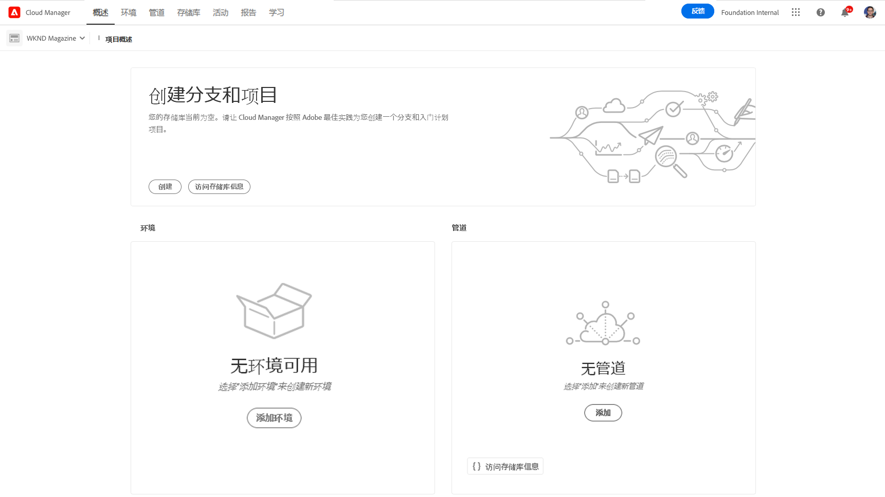

   * 的 **添加环境** 选项 **环境** 选项卡。

      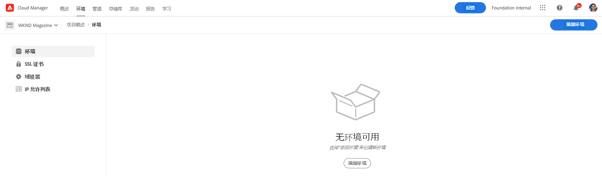

   * 的 **添加环境** 选项可能会因缺少权限或取决于授权资源而被禁用。

1. 在 **添加环境** 对话框：

   * 选择 **环境类型**.
      * 可用/已使用的环境数显示在“开发”环境类型后面的括号中。
   * 提供 **环境名称**.
   * 提供 **环境描述**.
   * 选择 **云区域**.

   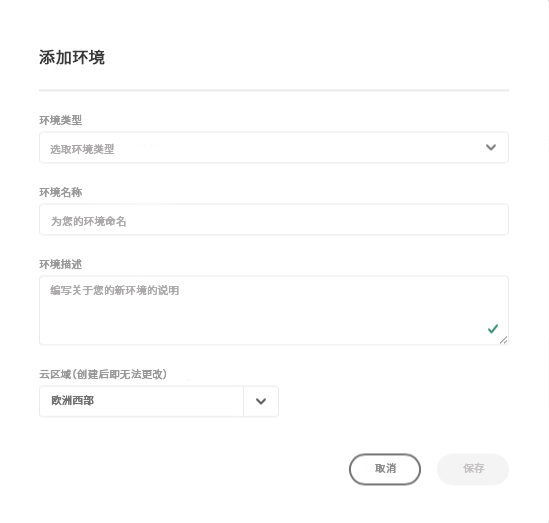

1. 单击 **保存** 添加指定的环境。

的 **概述** 屏幕现在会在 **环境** 卡。 您现在可以为新环境设置管道。

## 环境详细信息 {#viewing-environment}

您可以使用 **环境** 在概述页面中添加信息，可通过两种方式访问环境详细信息。

1. 从 **概述** 页面，单击 **环境** 选项卡。

   

   * 或者，单击 **显示全部** 按钮 **环境** 直接跳到 **环境** 选项卡。

      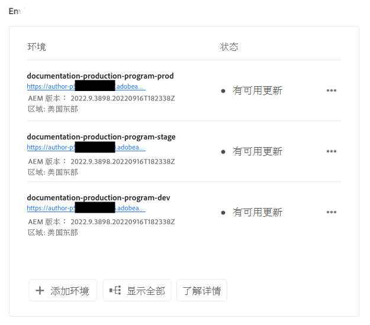

1. 的 **环境** 打开并列出项目的所有环境。

   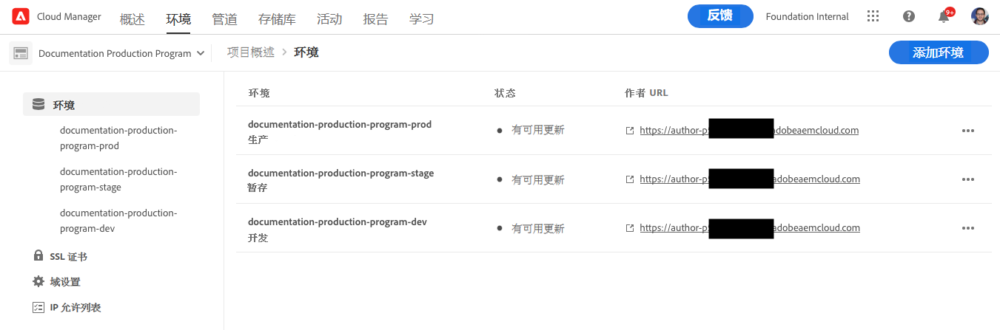

1. 单击列表中的某个环境以显示其详细信息。

   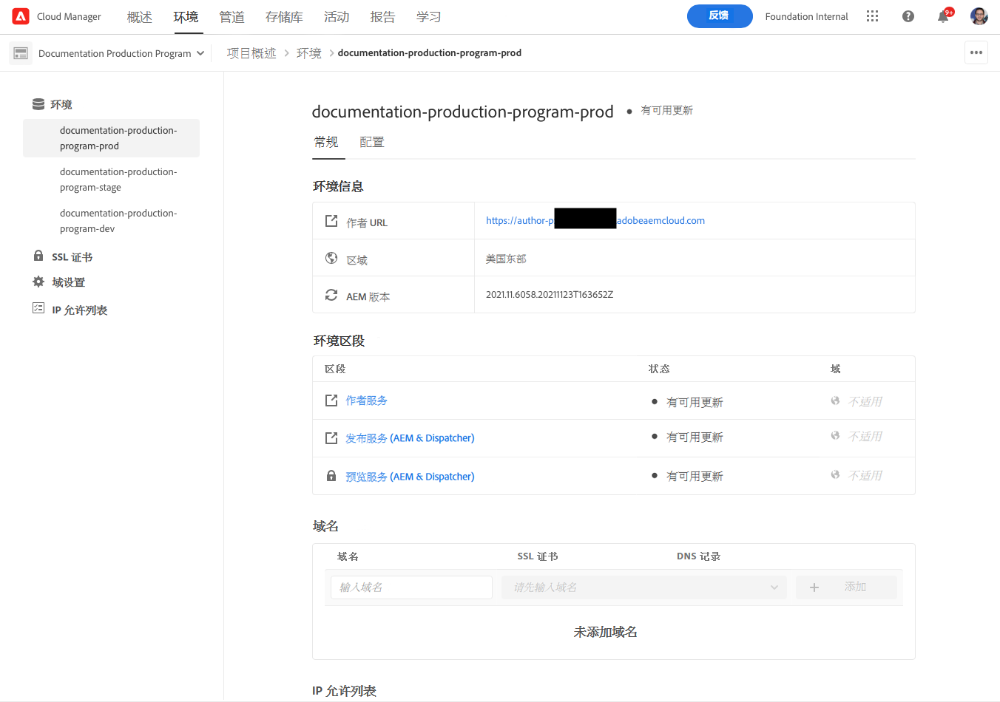

或者，单击所需环境的省略号按钮，然后选择 **查看详细信息**.

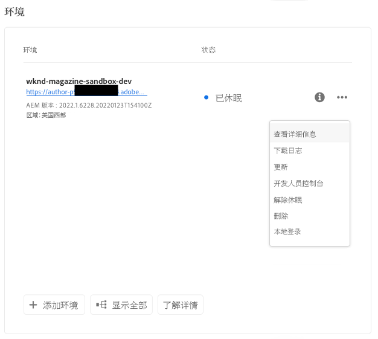

>[!NOTE]
>
>的 **环境** 卡片仅列出三个环境。 单击 **显示全部** 按钮以查看项目的所有环境。

### 访问预览服务 {#access-preview-service}

Cloud Manager向每个AEMas a Cloud Service环境提供预览服务（作为附加发布服务提供）。

使用该服务，您可以在网站到达实际发布环境并公开可用之前预览网站的最终体验。

创建后，预览服务将应用默认的IP允许列表，标记为 `Preview Default [<envId>]`，会阻止预览服务的所有流量。 您必须主动从预览服务中取消应用默认IP允许列表，才能启用访问权限。

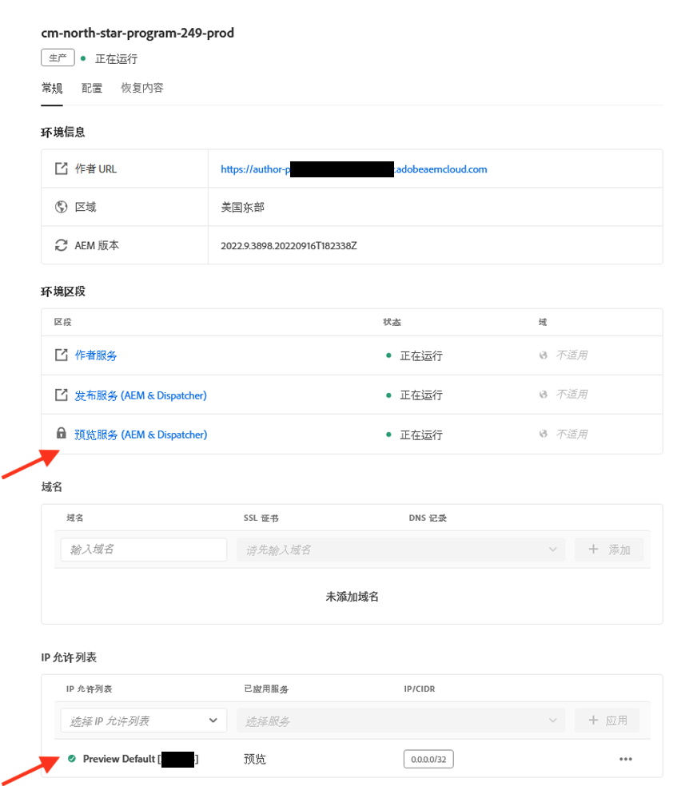

具有必需权限的用户必须在与您的任何团队共享预览服务URL之前完成以下选项的步骤，才能确保访问预览URL。

1. 创建适当的IP允许列表，将其应用到预览服务，然后立即取消应用 `Preview Default [<envId>]` 允许列表。

   * 请参阅 [取消应用IP允许列表](/help/implementing/cloud-manager/ip-allow-lists/unapply-ip-allow-list.md) 以了解更多详细信息。

1. 使用更新 **IP允许列表** 工作流，以删除默认IP并添加相应的IP。 请参阅 [查看和更新IP允许列表](/help/implementing/cloud-manager/ip-allow-lists/view-update-ip-allow-list.md) 以了解更多。

解锁对预览服务的访问后，预览服务名称前面的锁定图标将不再显示。

激活后，您可以使用AEM中的管理发布UI将内容发布到预览服务。 请参阅该文档 [预览内容](/help/sites-cloud/authoring/fundamentals/previewing-content.md) 以了解更多详细信息。

>[!NOTE]
>
>您的环境必须为AEM版本 `2021.05.5368.20210529T101701Z` 或更新版本。 为此，请确保更新管道已在您的环境中成功运行。

## 更新环境 {#updating-dev-environment}

作为云原生服务，生产程序中暂存和生产环境的更新由Adobe自动管理。

但是，开发环境以及沙盒项目中的环境的更新会在项目中进行管理。 如果此类环境未运行最新的公开可用AEM版本，则 **环境** 卡 **概述** 将显示节目屏幕 **更新可用**.

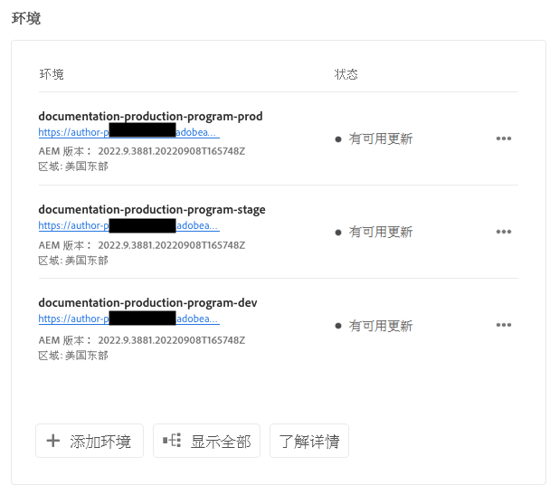

### 更新和管道 {#updates-pipelines}

管道是 [将代码部署到AEMas a Cloud Service的环境。](deploy-code.md) 因此，每个管道都与特定AEM版本关联。

如果Cloud Manager检测到可用的AEM版本比上次随管道部署的版本高，则会显示 **更新可用** 环境的状态。

因此，更新过程分为两步：

1. 使用最新的AEM版本更新管道
1. 运行管道以将新版本的AEM部署到环境

### 更新环境 {#updating-your-environments}

的 **更新** 选项 **环境** 单击环境的省略号按钮，可为沙盒项目中的开发环境和环境卡片。

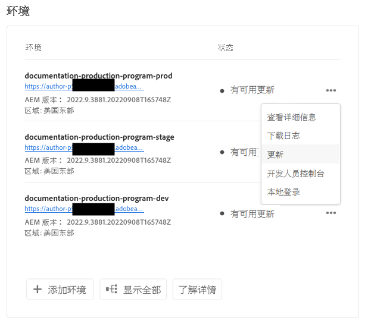

此外，通过单击 **环境** 选项卡，然后选择环境的省略号按钮。

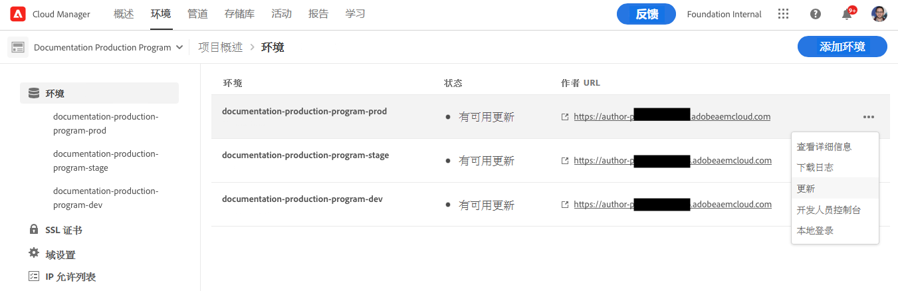

具有 **部署管理器** 角色可以使用此选项将与此环境关联的管道更新为最新的AEM版本。

将管道版本更新到最新的公开可用AEM版本后，系统会提示用户运行关联的管道以将最新版本部署到环境。

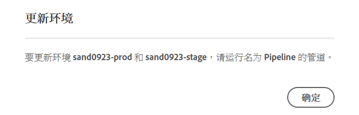

的 **更新** 选项的行为因程序的配置和当前状态而异。

* 如果管道已更新，则 **更新** 选项会提示用户执行管道。
* 如果管道已在更新，则 **更新** 选项会通知用户更新已在运行。
* 如果不退出相应的管道，则 **更新** 选项会提示用户创建一个。

## 删除开发环境 {#deleting-environment}

具有所需权限的用户将能够删除开发环境。

从 **概述** 屏幕 **环境** 卡，单击要删除的开发环境的省略号按钮。

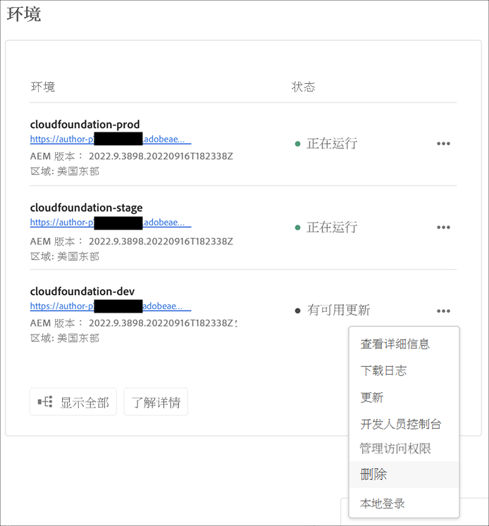

删除选项也可从 **环境** 选项卡 **概述** 窗口。 单击环境的省略号按钮并选择 **删除**.

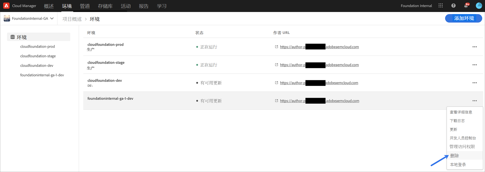

>[!NOTE]
>
>* 无法删除在生产程序中创建的生产和暂存环境。
>* 可以删除沙盒项目中的生产和暂存环境。

## 管理访问权限 {#managing-access}

选择 **管理访问权限** 从环境的省略号菜单 **环境** 卡。 您可以直接导航到创作实例并管理环境的访问权限。

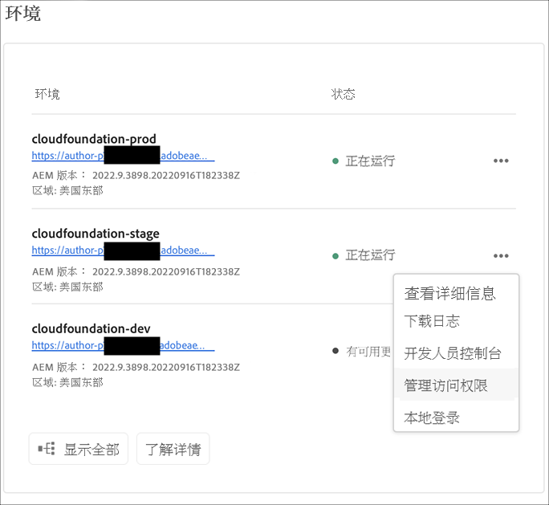

## 访问开发人员控制台 {#accessing-developer-console}

选择 **开发人员控制台** 从环境的省略号菜单 **环境** 卡。 这将在您的浏览器中打开一个新选项卡，其中的登录页面指向 **开发人员控制台**.

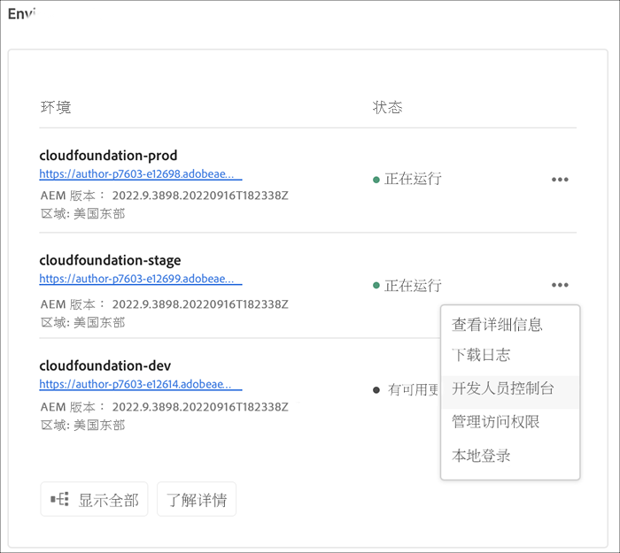

仅使用 **开发人员** 角色将有权访问 **开发人员控制台**. 但是，对于沙盒程序，有权访问沙盒程序的任何用户都将有权访问 **开发人员控制台**.

请参阅该文档 [休眠和解除休眠沙盒环境](https://experienceleague.adobe.com/docs/experience-manager-cloud-service/onboarding/getting-access/cloud-service-programs/sandbox-programs.html#hibernating-introduction) 以了解更多详细信息。

此选项也可从 **环境** 选项卡 **概述** 窗口。

## 本地登录 {#login-locally}

选择 **本地登录** 从 **环境** 卡以本地登录到Adobe Experience Manager。

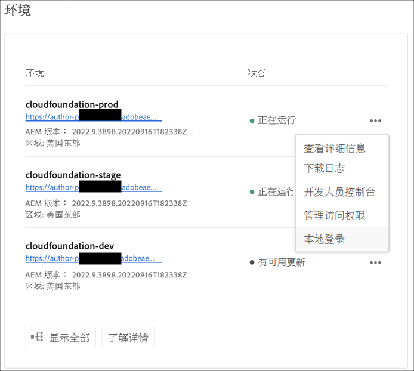

此外，您还可以从本地登录 **环境** 选项卡 **概述** 页面。

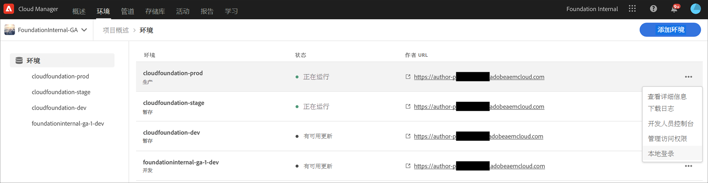

## 管理自定义域名 {#manage-cdn}

Cloud Manager的站点程序支持发布和预览服务的自定义域名。 每个Cloud Manager环境最多可托管250个自定义域。

要配置自定义域名，请导航到 **环境** 选项卡，然后单击某个环境可查看环境详细信息。

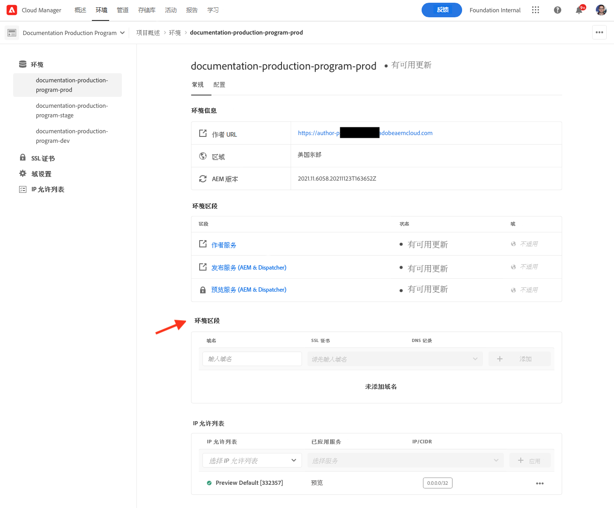

可以对环境的发布服务执行以下操作。

* [添加自定义域名](/help/implementing/cloud-manager/custom-domain-names/add-custom-domain-name.md)

* [查看和更新自定义域名](/help/implementing/cloud-manager/custom-domain-names/view-update-replace-custom-domain-name.md)

* [删除自定义域名](/help/implementing/cloud-manager/custom-domain-names/delete-custom-domain-name.md)

* [检查自定义域名的状态](/help/implementing/cloud-manager/custom-domain-names/check-domain-name-status.md#pre-existing-cdn) 或 [SSL证书](/help/implementing/cloud-manager/managing-ssl-certifications/check-status-ssl-certificate.md#pre-existing-cdn).

* [检查IP允许列表的状态](/help/implementing/cloud-manager/ip-allow-lists/check-ip-allow-list-status.md#pre-existing-cdn)

## 管理 IP 允许列表 {#manage-ip-allow-lists}

Cloud Manager支持IP允许列表，以便提供站点程序的创作、发布和预览服务。

要管理IP允许列表，请导航到 **环境** 选项卡 **概述** 页面。 单击单个环境可管理其详细信息。

### 应用 IP 允许列表 {#apply-ip-allow-list}

应用IP允许列表会将允许列表定义中包含的所有IP范围与环境中的创作或发布服务相关联。 中的用户 **业务所有者** 或 **部署管理器** 必须记录角色才能应用IP允许列表。

IP允许列表必须存在于Cloud Manager中，才能将其应用到环境。 要在Cloud Manager中了解有关IP允许列表的更多信息，请参阅此文档[Cloud Manager中的IP允许列表简介。](/help/implementing/cloud-manager/ip-allow-lists/introduction.md)

请按照以下步骤应用IP允许列表。

1. 从 **环境** 选项卡 **概述** 屏幕，然后导航到 **IP允许列表** 表。
1. 使用IP允许列表表顶部的输入字段选择IP允许列表以及要应用到的创作或发布服务。
1. 单击 **应用** 并确认您的提交。

### 取消应用IP允许列表 {#unapply-ip-allow-list}

取消应用IP允许列表会将允许列表定义中包含的所有IP范围与环境中的作者或发布者服务取消关联。 中的用户 **业务所有者** 或 **部署管理器** 必须记录角色才能取消应用IP允许列表。

按照以下步骤取消应用IP允许列表。

1. 从 **环境** 选项卡 **概述** 屏幕，然后导航到 **IP允许列表** 表。
1. 确定要取消应用的IP允许列表规则列在的行中。
1. 从行末尾选择省略号按钮。
1. 选择 **取消应用** 并确认您的提交。
