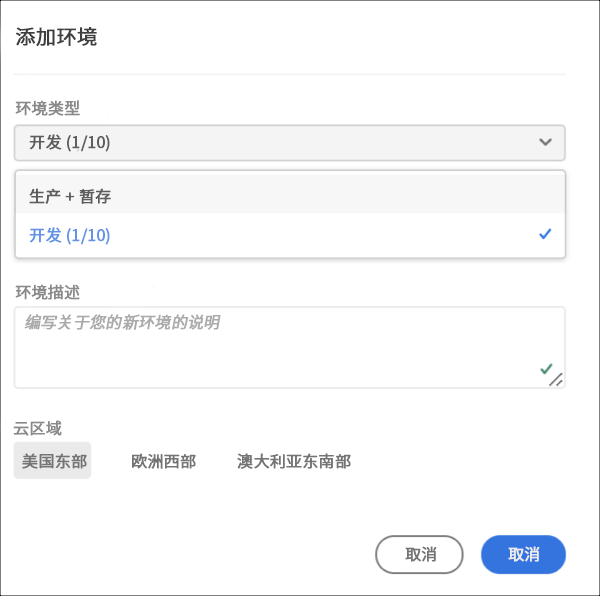
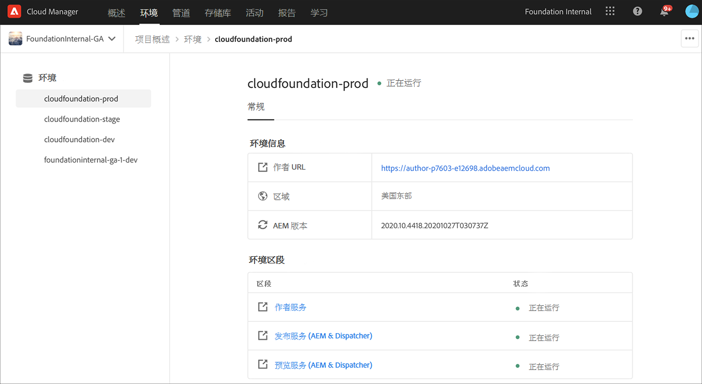

# 管理环境 {#manage-environments}

以下部分介绍用户可以创建的环境类型以及用户如何创建环境。

## 环境类型{#environment-types}

具有必要权限的用户可以创建以下环境类型（在特定租户可用的范围内）。

* **生产和暂存环境**:生产和暂存作为两个组件提供，用于测试和生产目的。

* **开发**:开发环境可用于开发和测试目的，并且仅与非生产管道关联。

   >[!NOTE]
   >将自动在沙盒项目中创建的开发环境将配置为包含站点和资产解决方案。

   下表汇总了环境类型及其属性：

   | 名称 | 创作层 | 发布层 | 用户可以创建 | 用户可以删除 | 可与环境关联的管道 |
   |--- |--- |--- |--- |---|---|
   | 生产 | 是 | 是 如果包含站点 | 是 | 否 | 生产管道 |
   | 暂存 | 是 | 是 如果包含站点 | 是 | 否 | 生产管道 |
   | 开发 | 是 | 是 如果包含站点 | 是 | 是 | 非生产管道 |

   >[!NOTE]
   >生产和暂存作为两个组件提供，用于测试和生产目的。  用户将无法仅创建暂存环境或生产环境。

## 添加环境{#adding-environments}

1. 单击&#x200B;**Add Environment**&#x200B;以添加环境。 此按钮可从&#x200B;**Environments**屏幕访问。
   

   当程序中没有环境时， **Environments**&#x200B;卡上也提供了&#x200B;**Add Environment**&#x200B;选项。

   

   >[!NOTE]
   >将因缺少权限或可能签订合同的内容而禁用&#x200B;**添加环境**&#x200B;选项。

1. 出现 **“添加环境** ”对话框。用户需要提交详细信息，如“环境类型 **”和“环境名称********** ”和“环境描述”（具体取决于用户在特定租户可用的范围内创建环境时的目标）。

   

   >[!NOTE]
   >创建环境时，会在Adobe I/O中创建一个或多个&#x200B;*集成*。这些配置文件对有权访问Adobe I/O控制台的客户用户可见，且不得删除。 在Adobe I/O控制台的描述中不会声明此内容。

   

1. 单击&#x200B;**Save**&#x200B;以添加具有填充条件的环境。  现在， *Overview*&#x200B;屏幕会显示可从中设置管道的卡。

   >[!NOTE]
   >如果尚未设置非生产管道，则&#x200B;*概述*&#x200B;屏幕会显示可从中创建非生产管道的卡。

## 环境详细信息{#viewing-environment}

“概述”页面上的&#x200B;**Environments**&#x200B;卡最多列出了三个环境。

1. 选择&#x200B;**显示所有**&#x200B;按钮以导航到&#x200B;**环境**&#x200B;摘要页以查看包含环境完整列表的表。

   

1. **Environments**&#x200B;页面显示所有现有环境的列表。

   

1. 从列表中选择任一环境，以查看环境详细信息。

   

## 更新环境{#updating-dev-environment}

暂存和生产环境的更新由Adobe自动管理。

开发环境的更新由计划的用户管理。 当环境未运行最新的公开可用AEM版本时，主屏幕上的“环境卡”上的状态将显示&#x200B;**UPDATE AVAILABLE**。

**Update**&#x200B;选项可从&#x200B;**Environments**卡中获取。
如果单击**Environments**&#x200B;卡中的&#x200B;**Details**，则也可以使用此选项。 将打开&#x200B;**Environments**&#x200B;页面，选择开发环境后，单击&#x200B;**...**&#x200B;并选择&#x200B;**更新**，如下图所示：

选择此选项将允许部署管理器将与此环境关联的管道更新为最新版本，然后执行管道。

如果管道已更新，则系统会提示用户执行管道。

## 删除环境{#deleting-environment}

具有所需权限的用户将能够删除开发环境。

**Delete**&#x200B;选项可从&#x200B;**Environments**&#x200B;卡的下拉菜单中访问。 单击&#x200B;**...**。

如果单击&#x200B;**Environments**&#x200B;卡中的&#x200B;**Details**，则删除选项也可用。 将打开&#x200B;**Environments**&#x200B;页面，选择开发环境后，单击&#x200B;**...**&#x200B;并选择&#x200B;**删除**，如下图所示：

>[!NOTE]
>此功能不适用于为生产目的而设置的生产计划中设置的生产/暂存环境。 但是，该功能也可用于沙盒项目中的生产/暂存环境。

## 管理访问{#managing-access}

从&#x200B;**Environments**&#x200B;卡的下拉菜单中选择&#x200B;**Manage Access**。 您可以直接导航到创作实例并管理环境的访问权限。

请参阅[管理对创作实例的访问](/help/onboarding/what-is-required/accessing-aem-instance.md)以了解更多信息。

## 访问开发人员控制台{#accessing-developer-console}

从&#x200B;**Environments**&#x200B;卡的下拉菜单中选择&#x200B;**Developer Console**。 这将在您的浏览器中打开一个新选项卡，其中登录页面指向&#x200B;**开发人员控制台**。

只有具有开发人员角色的用户才有权访问&#x200B;**开发人员控制台**。 沙盒程序除外，在沙盒程序中，任何有权访问Cloud Manager沙盒程序的用户都将有权访问&#x200B;**开发人员控制台**。

有关更多详细信息，请参阅[休眠和解除休眠沙盒环境](https://docs.adobe.com/content/help/en/experience-manager-cloud-service/onboarding/getting-access/cloud-service-programs/sandbox-programs.html#hibernating-introduction)。

如果单击&#x200B;**Environments**&#x200B;卡中的&#x200B;**Details**，则也可以使用此选项。 将打开&#x200B;**Environments**&#x200B;页面，选择某个环境后，单击&#x200B;**...**&#x200B;并选择&#x200B;**开发人员控制台**。

## 本地登录{#login-locally}

从&#x200B;**Environments**&#x200B;卡的下拉菜单中选择&#x200B;**Local Login** ，以本地登录到Adobe Experience Manager。

此外，您还可以从&#x200B;**Environments**&#x200B;摘要页面本地登录。

## 管理自定义域名{#manage-cdn}

从“环境摘要”页面导航到&#x200B;**Environments**&#x200B;详细信息页面。

可以对环境的发布服务执行以下操作，如下所述：

1. [添加自定义域名](/help/implementing/cloud-manager/custom-domain-names/add-custom-domain-name.md)

1. [查看和更新自定义域名](/help/implementing/cloud-manager/custom-domain-names/view-update-replace-custom-domain-name.md)

1. [删除自定义域名](/help/implementing/cloud-manager/custom-domain-names/delete-custom-domain-name.md)

1. [检查自定义域名或](/help/implementing/cloud-manager/custom-domain-names/check-domain-name-status.md#pre-existing-cdn) SSL证书 [的状态](/help/implementing/cloud-manager/managing-ssl-certifications/check-status-ssl-certificate.md#pre-existing-cdn)。

1. [检查IP允许列表的状态](/help/implementing/cloud-manager/ip-allow-lists/check-ip-allow-list-status.md#pre-existing-cdn)

## 管理IP允许列表{#manage-ip-allow-lists}

从环境摘要页面导航到环境详细信息页面。 您可以在此处对环境的发布和/或创作服务执行以下操作。

### 应用IP允许列表{#apply-ip-allow-list}

应用IP允许列表的过程是允许列表定义中包含的所有IP范围都与环境中的创作或发布服务相关联的过程。 必须登录具有业务所有者或部署管理员角色的用户，才能应用IP允许列表。

>[!NOTE]
>IP允许列表必须存在于Cloud Manager中，才能将其应用于环境服务。 要进一步了解Cloud Manager中的IP允许列表，请导航至[Cloud Manager中的IP允许列表简介](/help/implementing/cloud-manager/ip-allow-lists/introduction.md)。

请按照以下步骤应用IP允许列表:

1. 从&#x200B;**Environments**&#x200B;详细信息页面导航到特定环境，然后导航到&#x200B;**IP允许列表**&#x200B;表。
1. 使用IP允许列表表顶部的输入字段选择IP允许列表以及要应用该服务的创作或发布服务。
1. 单击&#x200B;**Apply**&#x200B;并确认您的提交。

### 取消应用IP允许列表{#unapply-ip-allow-list}

取消应用IP允许列表是指在环境中，允许列表定义中包含的所有IP范围都与创作或发布者服务取消关联的过程。 必须登录具有“业务所有者”或“部署管理器”角色的用户，才能取消应用IP允许列表。

请按照以下步骤取消应用IP允许列表:

1. 从“环境”屏幕中导航到特定的&#x200B;**Environments**&#x200B;详细信息页面，然后导航到&#x200B;**IP允许列表**&#x200B;表。
1. 确定要取消应用的IP允许列表规则所在的行。
1. 选择&#x200B;**...**&#x200B;菜单。
1. 选择&#x200B;**取消应用**&#x200B;选项并确认您的提交。
