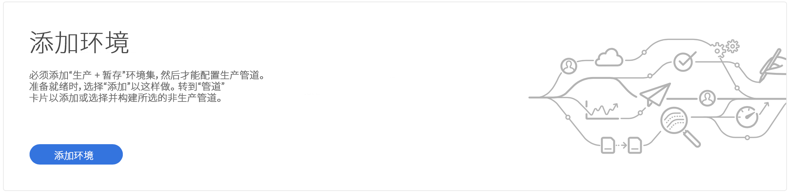
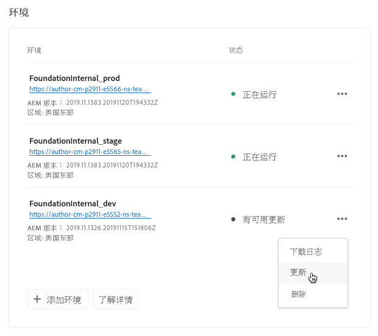
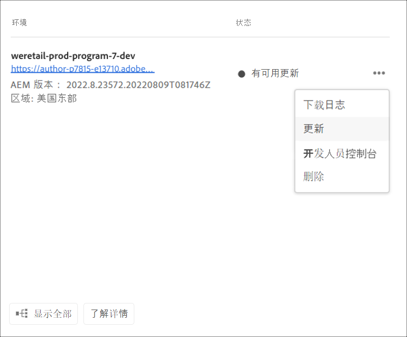

# 管理环境 {#manage-environments}

以下部分介绍用户可以创建的环境类型以及用户可以创建环境的方式。

## 环境类型 {#environment-types}

具有必要权限的用户可以创建以下环境类型（在特定租户可用的范围内）。

* **生产和阶段环境**:生产和级作为双核提供，用于测试和生产目的。

* **开发**:开发环境可创建用于开发和测试目的，并且仅与非生产管道相关。

   >[!NOTE]
   >将在沙箱项目中自动创建的开发环境将配置为包括站点和资产解决方案。

   下表汇总了环境类型及其属性：

   | 名称 | 作者层 | 发布层 | 用户可以创建 | 用户可以删除 | 可与环境关联的管道 |
   |--- |--- |--- |--- |---|---|
   | 生产 | 是 | 是 如果包含站点 | 是 | 否 | 生产管道 |
   | 暂存 | 是 | 是 如果包含站点 | 是 | 否 | 生产管道 |
   | 开发 | 是 | 是 如果包含站点 | 是 | 是 | 非生产管道 |

   >[!NOTE]
   >生产和级作为双核提供，用于测试和生产目的。  用户将不能仅创建舞台或仅创建生产环境。

## 添加环境 {#adding-environments}

1. 用户单击“添 **加环境** ”按钮可添加环境。

   

1. 出现 **“添加环境** ”对话框。用户需要提交详细信息，如“环境类型 **”和“环境名称********** ”和“环境描述”（具体取决于用户在特定租户可用的范围内创建环境时的目标）。

   

   >[!NOTE]
   >创建环境时，将在Adobe I/O *中创建* 一个或多个集成。对于有权访问Adobe I/O控制台的客户用户，这些控制台是可见的，并且不得删除。 Adobe I/O控制台的说明中不提供此功能。

   

1. 单击 **保存** ，以添加包含已填充条件的环境。  现在，“ *概述* ”屏幕显示了可从中设置管道的卡。

   >[!NOTE]
   >如果尚未设置非生产管道，“概述 ** ”屏幕将显示卡，您可以从中创建非生产管道。

## 更新环境 {#updating-dev-environment}

Stage和生产环境的更新由Adobe自动管理。

开发环境的更新由项目的用户管理。 当环境未运行最新的可公开发布的AEM版本时，主屏幕上的环境卡状态将显示“可 **用更新”**。

)

显示此状态时，如果单 **击“环境卡** ”和“管理”菜单中的“详细信息” **，则“更新** ”选项将从下拉菜单中 ******** 可用。

从下拉菜单中选择此选项将允许部署管理器将与此环境关联的管道更新到最新版本，然后执行该管道。

如果管道已更新，则提示用户执行该管道。
