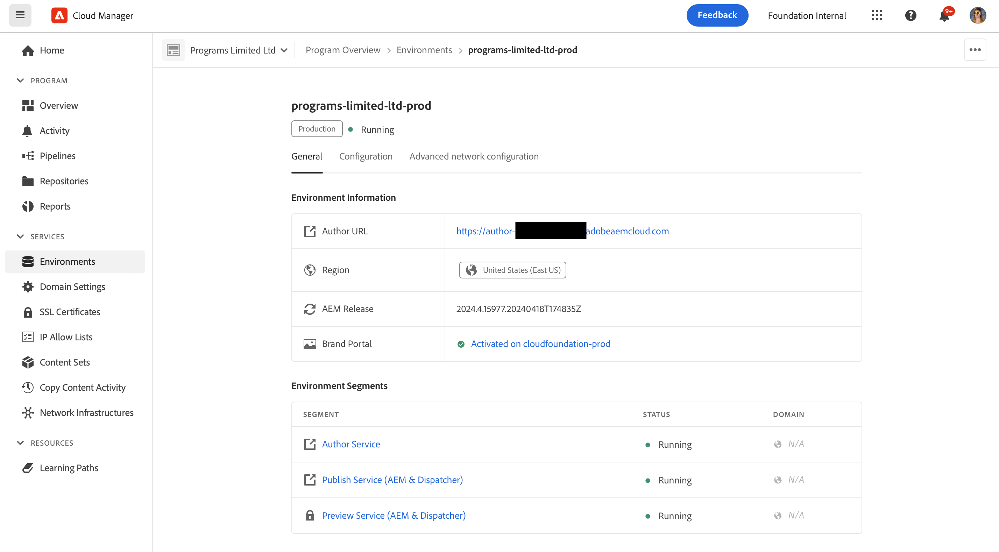

# 管理环境 {#managing-environments}

了解您可以创建的环境类型以及如何为Cloud Manager项目创建环境。

## 环境类型 {#environment-types}

具有必要权限的用户可以创建以下环境类型（在特定租户可用的范围内）。

* **生产和暂存** – 生产和暂存环境成对可用，分别用于生产和测试目的。

* **开发** – 开发环境可以创建用于开发和测试目的，并且只能与非生产管道相关联。

* **快速开发**  — 快速开发环境(RDE)允许开发人员快速部署和审查更改，从而最大限度地减少测试经验证可在本地开发环境中工作的功能所需的时间。 参见 [快速开发环境文档](/help/implementing/developing/introduction/rapid-development-environments.md) 以了解有关如何使用RDE的详细信息。

单个环境的功能取决于环境的[程序](/help/implementing/cloud-manager/getting-access-to-aem-in-cloud/program-types.md)中启用的解决方案。

* [Sites](/help/sites-cloud/home.md)
* [Assets](/help/assets/home.md)
* [表单](/help/forms/home.md)
* [屏幕](/help/screens-cloud/home.md)

>[!NOTE]
>
>生产和暂存环境只能成对创建。 您不能仅创建暂存环境或生产环境。

## 添加环境 {#adding-environments}

1. 在 [my.cloudmanager.adobe.com](https://my.cloudmanager.adobe.com/) 登录 Cloud Manager 并选择适当的组织。

1. 单击要为其添加环境的程序。

1. 从 **计划概述** 页面，单击 **添加环境** 在 **环境** 信息卡以添加环境。

   

   * **添加环境**&#x200B;选项也可在&#x200B;**环境**&#x200B;选项卡上使用。

     

   * **添加环境**&#x200B;选项可能由于缺少权限或根据许可的资源而被禁用。

1. 在出现的&#x200B;**添加环境**&#x200B;对话框中：

   * 选择&#x200B;[**环境类型**。](#environment-types)
      * 可用/使用的环境数显示在环境类型名称后面的括号中。
   * 提供环境&#x200B;**名称**。
   * 提供环境&#x200B;**描述**。
   * 如果您要添加 **生产+暂存** 环境，您必须为生产和暂存环境提供环境名称和描述。
   * 从下拉列表中选择&#x200B;**主要区域**。
      * 创建后无法更改主区域。
      * 根据您可用的权利，您也许能够配置 [多个区域](#multiple-regions).

   

1. 单击&#x200B;**保存**&#x200B;来添加指定环境。

**概述**&#x200B;屏幕现在在&#x200B;**环境**&#x200B;信息卡中显示您的新环境。 现在可以为新环境设置管道。

## 多个发布区域 {#multiple-regions}

用户具有 **业务负责人** 角色可以配置生产和暂存环境，以便除了主区域之外，还包括最多三个额外的发布区域。 增加发布区域可以提高可用性。有关更多详细信息，请参阅[其他发布区域文档](/help/operations/additional-publish-regions.md)。

>[!TIP]
>
>您可以使用 [Cloud Manager API](https://developer.adobe.com/experience-cloud/cloud-manager/guides/api-usage/creating-programs-and-environments/#creating-aem-cloud-service-environments) 查询可用区域的当前列表。

### 将多个发布区域添加到新环境 {#add-regions}

添加环境时，可以选择配置主区域以外的其他区域。

1. 选择&#x200B;**主要区域**。
   * 创建环境后无法更改主区域。
1. 选择选项 **添加其他发布区域** 和新的 **其他发布区域** 选项下拉菜单出现。
1. 在 **其他发布区域** 在下拉列表中，选择一个额外的区域。
1. 所选区域将会添加到下拉列表下方，以指示其选择。
   * 点按或单击 `X` ，以便取消选择该区域。
1. 从&#x200B;**附加发布区域**&#x200B;下拉列表中选择另一个区域以添加另一个地区。
1. 当您准备好创建环境时，点击或单击&#x200B;**保存**。

所选区域同时适用于生产和暂存环境。

如果您不指定任何附加区域，[您可以在创建环境后执行此操作。](#edit-regions)

如果您要预配 [高级联网](/help/security/configuring-advanced-networking.md) 对于程序，建议先完成此配置，然后再使用Cloud Manager API向环境添加其他发布区域。 否则，其他发布区域的流量将通过主区域的代理。

### 编辑多个发布区域 {#edit-regions}

如果您最初没有指定任何附加区域，并且您拥有必要的权限，则可以在创建环境后执行此操作。

您还可以删除附加发布区域。但是，您只能在一次交易中添加或删除区域。如果必须添加一个区域并移除一个区域，请先添加、保存更改，然后移除（反之亦然）。

1. 从程序的“程序概述”控制台中，单击生产环境的省略号按钮并从菜单中选择&#x200B;**编辑。**

   

1. 在&#x200B;**编辑生产环境**&#x200B;对话框中，对附加发布区域进行必要的更改。
   * 使用&#x200B;**附加发布区域**&#x200B;下拉列表选择附加区域。
   * 单击选定的附加发布区域旁边的 X 以取消选择它们。

   

1. 点击或单击&#x200B;**保存**&#x200B;以保存更改。

对生产环境所做的更改同时适用于生产和暂存环境。 只能在生产环境中编辑对多个发布区域的更改。

如果您要预配 [高级联网](/help/security/configuring-advanced-networking.md) 对于程序，建议先完成此配置，然后再向环境添加其他发布区域。 否则，其他发布区域的流量将通过主区域的代理。

## 环境详细信息 {#viewing-environment}

您可以使用 **环境** “概述”页面上的信息卡，可通过两种方式访问环境的详细信息。

1. 从 **概述** 页面上，单击 **环境** 选项卡。

   

   * 或者，单击 **全部显示** 上的按钮 **环境** 用于直接跳转到 **环境** 选项卡。

     

1. **环境**&#x200B;将打开并列出程序的所有环境。

   

1. 单击列表中的某个环境，以便您可以显示其详细信息。

   

或者，单击所需环境的省略号按钮，然后选择&#x200B;**查看详细信息**。

>[!NOTE]
>
>**环境**&#x200B;信息卡仅列出三个新环境。 单击 **全部显示** 如前所述，查看程序的所有环境。

### 访问预览服务 {#access-preview-service}

Cloud Manager为每个AEMas a Cloud Service环境提供预览服务（作为额外的发布服务提供）。

使用该服务，您可以在网站到达实际发布环境并公开使用之前预览网站的最终体验。

允许列表创建后，预览服务应用了标记为的默认IP `Preview Default [<envId>]`，会阻止预览服务的所有流量。 允许列表从预览服务中取消应用默认IP，以便启用访问。

具有必要权限的用户必须在共享预览服务URL之前完成以下步骤，以确保访问它。

1. 创建适当的IP允许列表，将其应用于预览服务，然后立即取消应用 `Preview Default [<envId>]` 允许列表。

   * 参见 [应用和取消应用IP允许列表](/help/implementing/cloud-manager/ip-allow-lists/apply-allow-list.md) 了解更多详细信息。

1. 使用更新 **IP 允许列表**&#x200B;工作流，移除默认 IP 并根据需要添加 IP。 请参阅[管理 IP 允许列表](/help/implementing/cloud-manager/ip-allow-lists/managing-ip-allow-lists.md)了解详情。

解锁预览服务的访问权限后，预览服务名称前面的锁定图标不再显示。

激活后，您可以使用 AEM 中的管理发布 UI 将内容发布到预览服务。 参见 [预览内容](/help/sites-cloud/authoring/fundamentals/previewing-content.md) 了解更多详细信息。

>[!NOTE]
>
>您的环境必须是 AEM 版本 `2021.05.5368.20210529T101701Z` 或更新版本才能使用预览服务。确保更新管道已在您的环境中成功运行，以便您可以使用预览服务。

## 更新环境 {#updating-dev-environment}

作为云本地服务，Adobe 会自动管理生产程序中暂存和生产环境的更新。

但是，对开发环境和沙盒程序中环境的更新是在程序中管理的。 当此类环境未运行最新的公开可用AEM版本时， **环境** 上的信息卡 **概述** 程序的屏幕显示 **有可用更新**.

### 更新和管道 {#updates-pipelines}

管道是[将代码部署到 AEM as a Cloud Service 环境的唯一方法。](deploy-code.md)因此，每个管道都与特定的 AEM 版本相关联。

如果Cloud Manager检测到有比上次随管道部署的AEM更新的版本可用，则会显示 **有可用更新** 环境的状态。

因此，更新过程分为两步：

1. 使用最新 AEM 版本更新管道
1. 运行管道将新版 AEM 部署到环境中

### 更新您的环境 {#updating-your-environments}

此 **更新** 选项可从以下网址获得： **环境** 卡用于开发环境和沙盒程序中的环境，方法是单击环境的省略号按钮。

也可以通过单击 **环境** 选项卡，然后选择环境的省略号按钮。

具有&#x200B;**部署管理员**&#x200B;角色的用户可以使用此选项将与此环境关联的管道更新为最新的 AEM 版本。

管道版本更新为最新的公开可用 AEM 版本后，系统会提示用户运行关联的管道，将最新版本部署到环境中。

**更新**&#x200B;选项的行为因程序的配置和当前状态而异。

* 如果管道已经更新，则&#x200B;**更新**&#x200B;选项会提示用户执行管道。
* 如果管道已在更新中，则&#x200B;**更新**&#x200B;选项会通知用户更新已在运行。
* 如果不存在合适的管道，则&#x200B;**更新**&#x200B;选项会提示用户创建一个管道。

## 删除开发环境 {#deleting-environment}

具有必要权限的用户能够删除开发环境。

从 **概述** 上的程序屏幕 **环境** 卡片上，单击要删除的开发环境的省略号按钮。

在程序&#x200B;**概述**&#x200B;窗口的&#x200B;**环境**&#x200B;选项卡上，也可以使用该删除选项。单击环境的省略号按钮，然后选择 **删除**.

>[!NOTE]
>
>* 无法删除在生产程序中创建的生产和暂存环境。
>* 可以删除沙盒程序中的生产和暂存环境。

## 管理访问权限 {#managing-access}

从&#x200B;**环境**&#x200B;信息卡上环境的省略号菜单中选择&#x200B;**管理访问权限**。 您可以直接导航到作者实例并管理对环境的访问权限。

>[!TIP]
>
>参见 [AEMas a Cloud Service团队和产品配置文件](/help/onboarding/aem-cs-team-product-profiles.md) 如果您想了解AEMas a Cloud Service团队和产品配置文件如何能够授予和限制对您的许可Adobe解决方案的访问权限。

## 访问开发人员控制台 {#accessing-developer-console}

从&#x200B;**环境**&#x200B;信息卡上环境的省略号菜单中选择&#x200B;**开发人员控制台**。 新选项卡将在您的浏览器中打开，登录页面指向 **开发人员控制台**.

仅限具有下列属性的用户： **开发人员** 角色具有对的访问权限 **开发人员控制台**. 但是，对于沙盒程序，任何有权访问沙盒程序的用户都可以访问 **开发人员控制台**.

参见 [使沙盒环境休眠和解除沙盒环境休眠](https://experienceleague.adobe.com/docs/experience-manager-cloud-service/content/implementing/using-cloud-manager/programs/introduction-sandbox-programs.html#hibernation) 了解更多详细信息。

单击单个环境的省略号菜单时，也可以从&#x200B;**概述**&#x200B;窗口的&#x200B;**环境**&#x200B;选项卡中找到此选项。

## 本地登录 {#login-locally}

选择 **本地登录** 从环境的省略号菜单中 **环境** 信息卡，以便您能够在本地登录到Adobe Experience Manager。

此外，您还可以从以下位置本地登录： **环境** 的选项卡 **概述** 页面。

## 管理自定义域名 {#manage-cdn}

在 Cloud Manager for Sites 程序中，发布和预览网站服务程序都支持自定义域名。 每个 Cloud Manager 环境最多可以为环境托管 250 个自定义域。

要配置自定义域名，请导航到 **环境** 选项卡，然后单击环境以查看环境详细信息。

可以对您环境的发布服务执行以下操作。

* [添加自定义域名](/help/implementing/cloud-manager/custom-domain-names/add-custom-domain-name.md)

* [管理自定义域名](/help/implementing/cloud-manager/custom-domain-names/managing-custom-domain-names.md)

* [检查自定义域名](/help/implementing/cloud-manager/custom-domain-names/check-domain-name-status.md#pre-existing-cdn)的状态或 [SSL 证书](/help/implementing/cloud-manager/managing-ssl-certifications/managing-certificates.md#pre-existing-cdn)。

* [管理 IP 允许列表](/help/implementing/cloud-manager/ip-allow-lists/managing-ip-allow-lists.md#pre-existing-cdn)

## 管理 IP 允许列表 {#manage-ip-allow-lists}

Cloud Manager中支持IP允许列表，用于Sites程序的创作、发布和预览服务。

要管理IP允许列表，请导航到 **环境** 的选项卡 **概述** 页面。 单击单个环境，以便您可以管理其详细信息。

### 应用 IP 允许列表 {#apply-ip-allow-list}

应用IP会将允许列表允许列表定义中包含的所有IP范围与环境中的创作或发布服务相关联。 中的用户 **业务负责人** 或 **部署管理员** 允许列表必须登录角色才能应用IP。

IP允许列表必须存在于Cloud Manager中才能将其应用于环境。 要了解有关Cloud Manager中IP允许列表的更多信息，请参阅 [Cloud Manager中的IP允许列表简介](/help/implementing/cloud-manager/ip-allow-lists/introduction.md).

**允许列表要应用IP，请执行以下操作：**

1. 从程序&#x200B;**概述**&#x200B;屏幕的&#x200B;**环境**&#x200B;选项卡中导航到特定环境，然后导航到 **IP 允许列表**&#x200B;表格。
1. 允许列表 允许列表使用IP表顶部的输入字段，以便选择IP以及要应用它的作者或发布服务。
1. 单击&#x200B;**应用**，并确认您的提交。

### 取消应用IP允许列表 {#unapply-ip-allow-list}

允许列表 允许列表取消应用IP将取消环境中的IP范围（包含在定义中）与创作或发布者服务的关联。 中的用户 **业务负责人** 或 **部署管理员** 允许列表角色必须登录才能取消应用IP。

**允许列表要取消应用IP，请执行以下操作：**

1. 从程序&#x200B;**概述**&#x200B;屏幕的&#x200B;**环境**&#x200B;选项卡中导航到特定环境，然后导航到 **IP 允许列表**&#x200B;表格。
1. 确定列出要取消应用的IP允许列表规则的行。
1. 从行末选择省略号按钮。
1. 单击&#x200B;**取消应用**，并确认您的提交。
