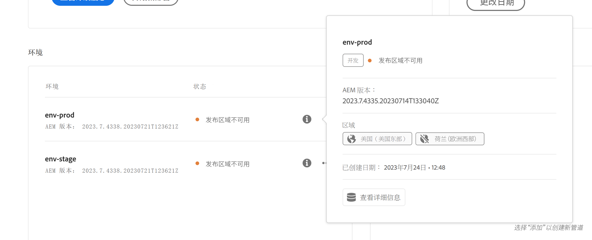

# 管理环境 {#managing-environments}

了解您可以创建的环境类型以及如何为 Cloud Manager 项目创建环境。

## 环境类型 {#environment-types}

具有必要权限的用户可以创建以下环境类型（在特定租户可用的范围内）。

* **生产+暂存** — 生产和暂存环境成对可用，分别用于生产和测试目的。 在暂存环境中执行性能测试和安全性测试。 它的规模与生产环境相同。

* **开发** — 可以为开发和测试目的创建开发环境，并且只能与非生产管道相关联。  开发环境的规模与暂存和生产环境不同，不应用于进行性能和安全测试。

* **快速开发环境** - 快速开发环境 (RDE) 允许开发人员快速部署和审查更改，最大程度地减少测试已证明适用于本地开发环境的功能所需的时间。请参阅[快速开发环境文档](/help/implementing/developing/introduction/rapid-development-environments.md)，了解有关如何使用 RDE 的详细信息。

单个环境的功能取决于环境的[程序](/help/implementing/cloud-manager/getting-access-to-aem-in-cloud/program-types.md)中启用的解决方案。

* [Sites](/help/overview/introduction.md)
* [Assets](/help/assets/overview.md)
* [表单](/help/forms/home.md)
* [屏幕](/help/screens-cloud/introduction/introduction.md)

>[!NOTE]
>
>生产和暂存环境只能成对创建。 您不能仅创建暂存环境或生产环境。

## 添加环境 {#adding-environments}

要添加或编辑环境，用户必须是&#x200B;**业务负责人**&#x200B;角色的成员。

1. 在 [my.cloudmanager.adobe.com](https://my.cloudmanager.adobe.com/) 登录 Cloud Manager 并选择适当的组织。

1. 在&#x200B;**[我的程序](/help/implementing/cloud-manager/navigation.md#my-programs)**&#x200B;控制台上，单击要为其添加环境的程序。

1. 在&#x200B;**[我的程序](/help/implementing/cloud-manager/navigation.md#my-programs)**&#x200B;控制台上，单击&#x200B;**环境**&#x200B;信息卡上的&#x200B;**添加环境**&#x200B;以添加环境。

   

   * **添加环境**&#x200B;选项也可在 **环境**&#x200B;选项卡上使用。

     

   * **添加环境**&#x200B;选项可能由于缺少权限或根据许可的资源而被禁用。

1. 在&#x200B;**添加环境**&#x200B;对话框中：

   * 选择&#x200B;[**环境类型**](#environment-types)。
      * 可用/使用的环境数显示在环境类型名称后面的括号中。
   * 提供环境&#x200B;**名称**。
      * 创建环境后，无法更改环境名称。
   * 提供环境&#x200B;**描述**。
   * 如果您要添加&#x200B;**生产和暂存**&#x200B;环境，则需要为生产环境和暂存环境提供环境名称和描述。
   * 从下拉列表中选择&#x200B;**主要区域。**
      * 主区域创建后无法更改。
      * 根据您的可用权限，您可以配置[多个区域。](#multiple-regions)

   

1. 单击&#x200B;**保存**&#x200B;来添加指定环境。

**概述**&#x200B;屏幕现在在&#x200B;**环境**&#x200B;信息卡中显示您的新环境。 现在可以为新环境设置管道。

## 多个发布区域 {#multiple-regions}

具有&#x200B;**业务所有者**&#x200B;角色的用户可以配置生产和暂存环境，以包括除了主要区域之外的最多三个额外的发布区域。增加发布区域可以提高可用性。有关更多详细信息，请参阅[其他发布区域文档](/help/operations/additional-publish-regions.md)。

>[!TIP]
>
>您可以使用 [Cloud Manager API](https://developer.adobe.com/experience-cloud/cloud-manager/guides/api-usage/creating-programs-and-environments/#creating-aem-cloud-service-environments) 查询可用区域的当前列表。

### 将多个发布区域添加到新环境 {#add-regions}

添加新环境时，除主要区域之外，您可以选择配置附加区域。

1. 选择&#x200B;**主要区域。**
   * 创建环境后无法更改主区域。
1. 选择选项&#x200B;**添加附加发布区域**，之后会出现新的&#x200B;**附加发布区域**&#x200B;选项下拉列表。
1. 在&#x200B;**附加发布区域**&#x200B;下拉列表中，选择一个额外的区域。
1. 所选区域将会添加到下拉列表下方，以指示其选择。
   * 选择所选区域旁边的`X`，以便取消选择该区域。
1. 从&#x200B;**附加发布区域**&#x200B;下拉列表中选择另一个区域以添加另一个地区。
1. 准备好创建环境时，选择&#x200B;**保存**。

所选区域适用于生产环境和暂存环境。

如果不指定任何其他区域，[您可以在环境创建后稍后指定](#edit-regions)。

如果您希望为程序提供[高级网络](/help/security/configuring-advanced-networking.md)，建议在使用 Cloud Manager API 将附加发布区域添加到环境之前完成此配置。否则，附加发布区域的流量会通过主要区域的代理。

### 编辑多个发布区域 {#edit-regions}

如果您最初没有指定任何附加区域，并且您拥有必要的权限，则可以在创建环境后执行此操作。

您还可以删除附加发布区域。但是，您只能在一次交易中添加或删除区域。如果您需要添加一个区域并删除一个区域，请先添加、保存您的更改，然后再删除（反之亦然）。

1. 从程序的“程序概述”控制台中，单击生产环境的省略号按钮并从菜单中选择&#x200B;**编辑。**

   

1. 在&#x200B;**编辑生产环境**&#x200B;对话框中，对附加发布区域进行必要的更改。
   * 使用&#x200B;**附加发布区域**&#x200B;下拉列表选择附加区域。
   * 单击选定的附加发布区域旁边的 X 以取消选择它们。

   

1. 选择&#x200B;**保存**&#x200B;以保存更改。

对生产环境所做的更改会同时应用于生产和暂存环境。只能在生产环境中编辑对多个发布区域的更改。

如果您希望为程序提供[高级网络](/help/security/configuring-advanced-networking.md)，建议在将附加发布区域添加到环境之前完成该设置。否则，附加发布区域的流量会通过主要区域的代理。

## 环境详细信息 {#viewing-environment}

从&#x200B;**概述**&#x200B;页面，您可以通过两种方式访问环境的详细信息。

1. 从&#x200B;**概述**&#x200B;页面，单击侧面导航面板中的&#x200B;**环境**&#x200B;选项卡。

   

   * 或者，单击&#x200B;**环境**&#x200B;信息卡上的&#x200B;**全部显示**&#x200B;按钮，直接跳转到&#x200B;**环境**&#x200B;选项卡。

     

1. **环境**&#x200B;将打开并列出程序的所有环境。

   

1. 点按或单击列表中的环境，以便显示其详细信息。

   

或者，单击所需环境的省略号按钮，然后选择&#x200B;**查看详细信息**。

>[!NOTE]
>
>**环境**&#x200B;信息卡仅列出三个新环境。 如前所述，单击&#x200B;**全部显示**&#x200B;按钮，查看程序的所有环境。

### 访问预览服务 {#access-preview-service}

Cloud Manager 将预览服务（作为额外的发布服务提供）提供给每个 AEM as a Cloud Service 环境。

使用该服务，您可以在网站到达实际发布环境并公开使用之前预览网站的最终体验。

创建后，预览服务会应用标记为 `Preview Default [<envId>]` 的默认 IP 允许列表，它会阻止预览服务的所有流量。 取消应用预览服务中的默认 IP 允许列表，以便启用访问。

具有必要权限的用户必须在共享预览服务 URL 之前完成以下步骤，才能访问它。

1. 创建适当的 IP 允许列表，将其应用于预览服务，然后立即取消应用 `Preview Default [<envId>]` 允许列表。

   * 请参阅[应用和取消应用 IP 允许列表](/help/implementing/cloud-manager/ip-allow-lists/apply-allow-list.md)，了解更多详细信息。

1. 使用更新 **IP 允许列表**&#x200B;工作流，移除默认 IP 并根据需要添加 IP。 请参阅[管理 IP 允许列表](/help/implementing/cloud-manager/ip-allow-lists/managing-ip-allow-lists.md)了解详细信息。

在解锁对预览服务的访问后，预览服务名称前面的锁定图标不会再显示。

激活后，您可以使用 AEM 中的管理发布 UI 将内容发布到预览服务。 有关更多详细信息，请参阅[预览内容。](/help/sites-cloud/authoring/sites-console/previewing-content.md)

>[!NOTE]
>
>您的环境必须是 AEM 版本 `2021.05.5368.20210529T101701Z` 或更新版本才能使用预览服务。确保更新管道已在您的环境中成功运行，以便您可以使用预览服务。

### 其他发布区域的状态 {#additional-region-status}

如果您激活了其他发布区域，则可以从&#x200B;**环境**&#x200B;信息卡检查这些区域的状态。

1. 在&#x200B;**概述**&#x200B;页面上，找到&#x200B;**环境**&#x200B;信息卡。

1. 在&#x200B;**环境**&#x200B;信息卡上，**状态**&#x200B;列将反映配置的其他发布区域是否存在问题。单击&#x200B;**信息**&#x200B;图标以了解各个区域的详细信息。

   

或者，您可以从&#x200B;**环境**&#x200B;标签页访问相同的信息。

1. 在&#x200B;**概述**&#x200B;页面上，选择&#x200B;**环境**&#x200B;标签页。

1. 在&#x200B;**环境**&#x200B;选项卡上，在左侧导航面板中选择要查询的环境。

1. 选择环境后：

   * **环境信息**&#x200B;表将显示为所选环境配置的区域。
   * **环境区段**&#x200B;表的&#x200B;**状态**&#x200B;列将反映配置的其他发布区域是否存在问题。将鼠标悬停在状态上可查看任何问题的详细信息。

   

如果报告与其他发布区域相关的任何问题：

1. 耐心点。 Cloud Manager会不断尝试恢复该地区，并可能随时提供该地区。
1. 如果问题在几小时后仍然存在，您可以删除其他发布区域并重新添加它（同一区域或其他区域），以触发完整的部署。

在执行其他操作之前等待系统自行恢复的时长取决于该区域的故障对系统的影响。

在任何情况下，[流量始终路由到在线](/help/operations/additional-publish-regions.md)的其他最近区域。 如果您仍然遇到问题，请联系Adobe客户关怀部门。

## 更新环境 {#updating-dev-environment}

作为云原生服务，Adobe会自动管理生产程序中开发、暂存和生产环境的更新。

但是，对沙盒程序中环境的更新是在程序中管理的。 当此类环境未运行最新的公开可用 AEM 版本时，程序&#x200B;**概述**&#x200B;屏幕上的&#x200B;**环境**&#x200B;信息状态会显示&#x200B;**可用更新。**

### 更新和管道 {#updates-pipelines}

管道是[将代码](deploy-code.md)部署到AEM as a Cloud Service环境的唯一方法。 因此，每个管道都与特定的AEM版本相关联。

如果 Cloud Manager 检测到有比上次随管道部署的 AEM 更新的版本可用，则会显示环境的&#x200B;**可用更新**&#x200B;状态。

因此，更新过程分为两步：

1. 使用最新 AEM 版本更新管道
1. 运行管道将新版 AEM 部署到环境中

### 更新环境 {#updating-your-environments}

>[!NOTE]
> 截至2024年，开发实例和一些沙盒程序已自动更新，因此无需手动管理它们的更新。 由于此转换，手动为开发实例更新环境的选项可能对&#x200B;_某些_&#x200B;程序不可用。

通过单击环境的省略号按钮，**更新**&#x200B;选项可从&#x200B;**环境**&#x200B;卡中用于沙盒程序中的某些开发环境和环境。

单击程序的&#x200B;**环境**&#x200B;选项卡，然后选择环境的省略号按钮，也可以使用此选项。

具有&#x200B;**部署管理器**&#x200B;或&#x200B;**业务负责人**&#x200B;角色的用户可以使用此选项将与此环境关联的管道更新为最新的AEM版本。

管道版本更新为最新的公开可用 AEM 版本后，系统会提示用户运行关联的管道，将最新版本部署到环境中。

**更新**&#x200B;选项的行为因程序的配置和当前状态而异。

* 如果管道已经更新，则&#x200B;**更新**&#x200B;选项会提示用户执行管道。
* 如果管道已在更新中，则&#x200B;**更新**&#x200B;选项会通知用户更新已在运行。
* 如果不存在合适的管道，则&#x200B;**更新**&#x200B;选项会提示用户创建管道。

## 删除开发环境 {#deleting-environment}

具有&#x200B;**部署管理器**&#x200B;或&#x200B;**业务负责人**&#x200B;角色的用户能够删除开发环境。

在&#x200B;**环境**&#x200B;信息卡的程序&#x200B;**概述**&#x200B;屏幕上，单击要删除的开发环境的省略号按钮。

在程序&#x200B;**概述**&#x200B;窗口的&#x200B;**环境**&#x200B;选项卡上，也可以使用该删除选项。单击环境的省略号按钮，然后选择&#x200B;**删除。**

>[!NOTE]
>
>* 无法删除在生产程序中创建的生产和暂存环境。
>* 可以删除沙盒程序中的生产和暂存环境。

## 管理访问权限 {#managing-access}

从&#x200B;**环境**&#x200B;信息卡上环境的省略号菜单中选择&#x200B;**管理访问权限**。 您可以直接导航到作者实例并管理对环境的访问权限。

>[!TIP]
>
>如果您想了解 AEM as a Cloud Service 团队和产品配置文件如何授予和限制对您获得许可的 Adobe 解决方案的访问权限，请参阅 [AEM as a Cloud Service 团队和产品配置文件。](/help/onboarding/aem-cs-team-product-profiles.md)

## 访问开发人员控制台 {#accessing-developer-console}

从&#x200B;**环境**&#x200B;信息卡上环境的省略号菜单中选择&#x200B;**Developer Console**。 浏览器中会打开一个新的选项卡，其中包含&#x200B;**Developer Console**&#x200B;的登录页面。

只有具有&#x200B;**开发人员**&#x200B;角色的用户才能访问&#x200B;**Developer Console。** 但是，对于沙盒程序来说，任何有权访问沙盒程序的用户都可以访问&#x200B;**Developer Console。**

有关更多详细信息，请参阅[使沙盒环境休眠和解除沙盒环境休眠。](https://experienceleague.adobe.com/docs/experience-manager-cloud-service/content/implementing/using-cloud-manager/programs/introduction-sandbox-programs.html#hibernation)

单击单个环境的省略号菜单时，也可以从&#x200B;**概述**&#x200B;窗口的&#x200B;**环境**&#x200B;选项卡中找到此选项。

## 本地登录 {#login-locally}

从&#x200B;**Environments**&#x200B;信息卡中环境的省略号菜单中选择&#x200B;**本地登录**&#x200B;以本地登录到Adobe Experience Manager。

此外，您可以从&#x200B;**概述**&#x200B;页面的&#x200B;**环境**&#x200B;选项卡中本地登录。

## 管理自定义域名 {#manage-cdn}

在Cloud Manager for Sites程序中，发布和预览服务程序都支持自定义域名。

>[!TIP]
>
>有关详细信息，请参阅[自定义域名简介](/help/implementing/cloud-manager/custom-domain-names/introduction.md)。

## 管理 IP 允许列表 {#manage-ip-allow-lists}

Cloud Manager 支持针对 Sites 程序的作者、发布和预览服务的 IP 允许列表。

要管理 IP 允许列表，请导航到程序的&#x200B;**概述**&#x200B;页面的&#x200B;**环境**&#x200B;选项卡。 单击单个环境管理其详细信息。

### 应用IP允许列表 {#apply-ip-allow-list}

应用IP允许列表会将允许列表定义中包含的所有IP范围与环境中的作者或发布服务相关联。

>[!TIP]
>
>有关详细信息，请参阅[IP允许列表简介](/help/implementing/cloud-manager/ip-allow-lists/introduction.md)。
