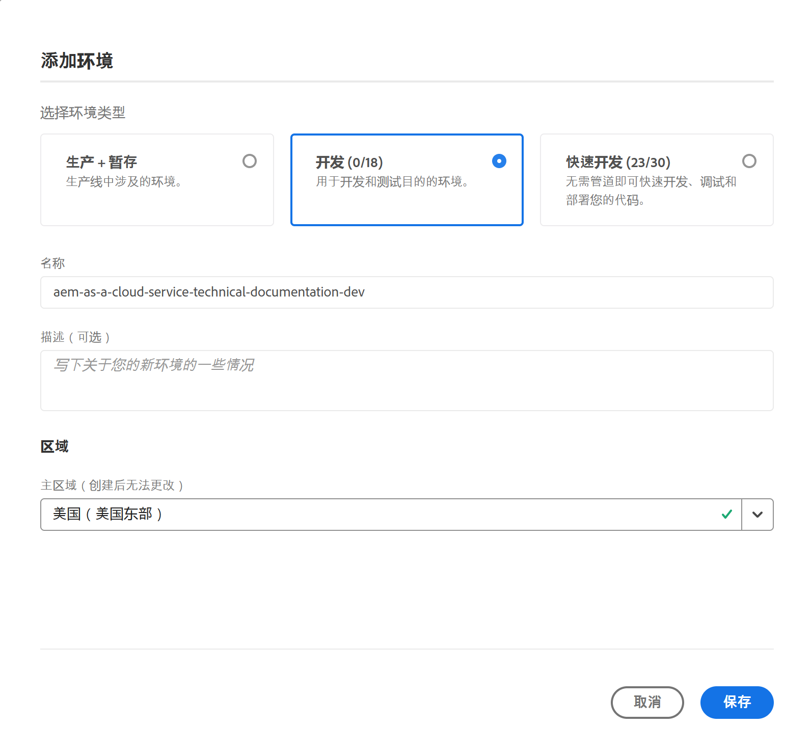

# 管理环境 {#manage-environments}

以下部分介绍用户可以创建的环境类型以及用户可以如何创建环境。

## 环境类型 {#environment-types}

具有必需权限的用户可以创建以下环境类型（在特定租户可用的范围内）。

* **生产和阶段环境**:
生产和阶段可作为两个对象提供，用于测试和生产目的。

* **开发**: 开发环境可以创建用于开发和测试目的，并且仅与非生产管道相关。

   >[!NOTE]
   >在沙箱项目中自动创建的开发环境将配置为包括站点和资产解决方案。

   下表汇总了环境类型及其属性：

   | 名称 | 作者层 | 发布层 | 用户可以创建 | 用户可以删除 | 可与环境关联的管道 |
   |--- |--- |--- |--- |---|---|
   | 生产 | 是 | 是 如果包含站点 | 是 | 否 | 生产管道 |
   | 暂存 | 是 | 是 如果包含站点 | 是 | 否 | 生产管道 |
   | 开发 | 是 | 是 如果包含站点 | 是 | 是 | 非生产管道 |

   >[!NOTE]
   >生产和阶段可作为两个对象提供，用于测试和生产目的。  用户将不能仅创建舞台或仅创建生产环境。

## 添加环境 {#adding-environments}

1. 单击“ **添加环境** ”以添加环境。 此按钮可从环境屏 **幕访** 问。
   

   当 **环境** 中有零个项目时， **环境卡** 上也提供“添加环境”选项。

   

   >[!NOTE]
   >将 **基于缺少权** 限或合同中可能包含的内容禁用“添加环境”选项。

1. 出现 **“添加环境** ”对话框。用户需要提交详细信息，如“环境类型 **”和“环境名称********** ”和“环境描述”（具体取决于用户在特定租户可用的范围内创建环境时的目标）。

   

   >[!NOTE]
   >创建环境时，在Adobe I/ *O中* 创建一个或多个集成。 对于有权访问Adobe I/O控制台的客户用户，这些控制台是可见的，不得删除。 Adobe I/O控制台的说明中不提供此说明。

   

1. 单击 **保存** ，以添加具有已填充条件的环境。  现在， *“概述* ”屏幕会显示可从中设置管道的卡。

   >[!NOTE]
   >如果尚未设置非生产管道，“概述”屏 *幕将显示* 卡，您可以从中创建非生产管道的位置。

## 更新环境 {#updating-dev-environment}

舞台和生产环境的更新由Adobe自动管理。

开发环境的更新由项目的用户管理。 当环境未运行最新的公开可用AEM版本时，主屏幕上的环境卡状态将显示“可 **用更新”**。

更 **新选** 项可从环境卡的下拉菜 **单中获** 得。
如果单击环境卡中的“ **详细信息** ”，也可以从“管理”按 **钮** 访问此选项 **** 。

从下拉菜单中选择此选项将允许部署管理器将与此环境关联的管道更新到最新版本，然后执行该管道。

如果管道已更新，则提示用户执行管道。

## 删除环境 {#deleting-environment}

具有必要权限的用户将能够删除开发环境。

“ **删除** ”选项可从环境卡的下拉菜 **单中** 使用。
如果单击环境卡中的“ **详细信息** ”，也可以从“管理”按 **钮** 访问此选项 **** 。

>[!NOTE]
此功能不适用于为生产目的而设置的常规环境中的生产／阶段项目集。 但是，该功能可用于沙箱环境中的生产／阶段项目。

## 访问开发人员控制台 {#accessing-developer-console}

从 **环境** 卡的下拉菜单中选择开 **发人员** 控制台。 这将在您的浏览器中打开一个新选项卡，其中包含开发人员控制 **台的登录页**。

只有具有“开发人员”角色的用户才有权访问“开 **发人员控制台**”。 沙箱项目例外，在沙箱项目中，有权访问云管理器沙箱的任何用户都有权访问开发 **人员控制台**。

有关更 [多详细信息，请参阅“冬眠”和“脱冬](https://docs.adobe.com/content/help/en/experience-manager-cloud-service/onboarding/getting-access/cloud-service-programs/sandbox-programs.html#hibernating-introduction) ”沙箱环境。

如果单击环境卡中的“详细 **信息** ”，还可以从“管理”按钮中选 **择** 此选项 **** 。

