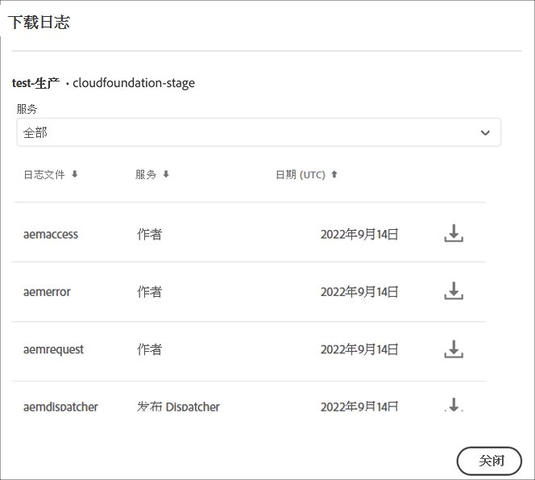

# 访问和管理日志 {#manage-logs}

用户可以使用环境卡访问选定环境的可用日志文件列表。  用户可以访问选定环境的可用日志文件列表。

这些文件可通过UI从&#x200B;**Overview**&#x200B;页面下载：


或者，在&#x200B;**Environments**&#x200B;页面中：


>[!NOTE]
>无论该日志文件在何处打开，都会显示相同的对话框，允许下载单个日志文件。



## 正在下载预览服务的日志{#download-preview-service}

用户可以下载预览服务的日志

1. 从Cloud Manager的&#x200B;**概述**&#x200B;页面中，导航到&#x200B;**Environments**&#x200B;卡。

1. 从……菜单中选择下载日志。

1. 从服务下拉选项中，选择&#x200B;**预览**&#x200B;或&#x200B;**预览Dispatcher**，然后单击下载图标。

   >[!NOTE]
   >此操作也可以从环境详细信息页面完成。

   


## 通过API {#logs-through-api}记录

除了通过UI下载日志外，日志还可通过API和命令行界面使用。

例如，要下载特定环境的日志文件，该命令将是

```java
$ aio cloudmanager:download-logs --programId 5 1884 author aemerror
```

以下命令允许跟踪日志：

```java
$ aio cloudmanager:tail-log --programId 5 1884 author aemerror
```

为了获取环境ID（在本例中为1884）以及您可以使用的可用服务或日志名称选项：

```java
$ aio cloudmanager:list-environments
Environment Id Name                     Type  Description                          
1884           FoundationInternal_dev   dev   Foundation Internal Dev environment  
1884           FoundationInternal_stage stage Foundation Internal STAGE environment
1884           FoundationInternal_prod  prod  Foundation Internal Prod environment
 
 
$ aio cloudmanager:list-available-log-options 1884
Environment Id Service    Name         
1884           author     aemerror     
1884           author     aemrequest   
1884           author     aemaccess    
1884           publish    aemerror     
1884           publish    aemrequest   
1884           publish    aemaccess    
1884           dispatcher httpderror   
1884           dispatcher aemdispatcher
1884           dispatcher httpdaccess
```

>[!NOTE]
>虽然 **日志下载** (Log Downloads **)可通过UI和API使用，但** Log Tailing（日志跟踪）是仅限API/CLI的。

### 其他资源 {#resources}

请参阅以下其他资源，了解有关Cloud Manager API和Adobe I/OCLI的更多信息：

* [Cloud Manager API文档](https://www.adobe.io/apis/experiencecloud/cloud-manager/docs.html)
* [Adobe I/OCLI](https://github.com/adobe/aio-cli-plugin-cloudmanager)
