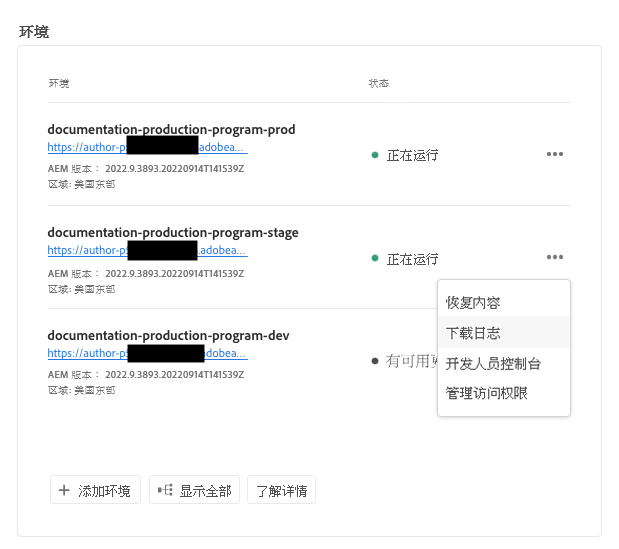
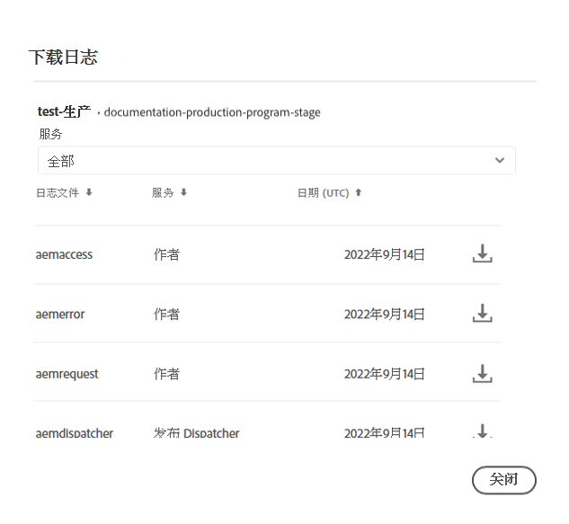
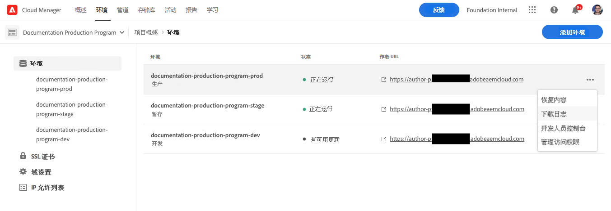

# 访问和管理日志 {#manage-logs}

了解如何在AEM as a Cloud Service中访问和管理日志，以帮助您的开发流程。

您可以使用 **环境** 卡 **概述** 页面或环境详细信息页面。

## 下载日志 {#download-logs}

按照以下步骤下载日志。

1. 登录Cloud Manager(位于 [my.cloudmanager.adobe.com](https://my.cloudmanager.adobe.com/) 并选择相应的组织和程序。

1. 导航到 **环境** 卡 **概述** 页面。

1. 选择 **下载日志** 省略号菜单中。

   

1. 在 **下载日志** 对话框，选择相应的 **服务** 从下拉菜单

   

1. 选择服务后，单击要检索的日志旁边的下载图标。

您还可以从 **环境** 页面。



## 通过API记录 {#logs-through-api}

除了通过UI下载日志之外，还可通过API和命令行界面使用日志。

要下载特定环境的日志文件，该命令类似于以下内容。

```shell
$ aio cloudmanager:download-logs --programId 5 1884 author aemerror
```

您还可以通过命令行界面跟踪日志。

```shell
$ aio cloudmanager:tail-log --programId 5 1884 author aemerror
```

为了获取环境ID（本例中为1884）以及可用的服务或日志名称选项，您可以使用以下命令。

```shell
$ aio cloudmanager:list-environments
Environment Id Name                     Type  Description                          
1884           FoundationInternal_dev   dev   Foundation Internal Dev environment  
1884           FoundationInternal_stage stage Foundation Internal STAGE environment
1884           FoundationInternal_prod  prod  Foundation Internal Prod environment
 
 
$ aio cloudmanager:list-available-log-options 1884
Environment Id Service    Name         
1884           author     aemerror     
1884           author     aemrequest   
1884           author     aemaccess    
1884           publish    aemerror     
1884           publish    aemrequest   
1884           publish    aemaccess    
1884           dispatcher httpderror   
1884           dispatcher aemdispatcher
1884           dispatcher httpdaccess
```

### 其他资源 {#resources}

请参阅以下其他资源，了解有关Cloud Manager API和Adobe I/OCLI的更多信息：

* [Cloud Manager API文档](https://www.adobe.io/apis/experiencecloud/cloud-manager/docs.html)
* [Adobe I/OCLI](https://github.com/adobe/aio-cli-plugin-cloudmanager)
