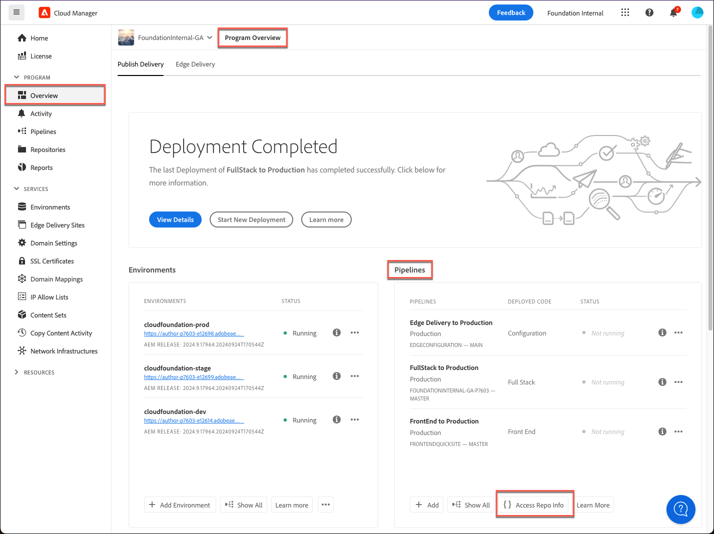

# 存储库访问信息 {#accessing-repos}

了解如何使用Cloud Manager的自助Git帐户管理访问和管理Adobe管理的Git存储库。

## 从“概述”页面访问存储库信息 {#overview-page}

Cloud Manager通过使用，可以轻松检索Adobe管理的存储库的存储库访问信息 **访问存储库信息** 按钮在管道信息卡上突出显示。

1. 在 [my.cloudmanager.adobe.com](https://my.cloudmanager.adobe.com/) 上登录到 Cloud Manager 并选择适当的组织和项目。

1. 导航到 **管道** 您的中的信息卡 **项目概述** 页面。

   

1. 点按或单击 **访问存储库信息** 按钮以打开 **存储库信息** 对话框和视图：

   * Git 用户名。
   * Git密码。
   * Cloud Manager Git 存储库的 URL。
   * 预建的Git命令用于快速将远程添加到Git存储库和推送代码。

   

1. 要访问密码，必须生成新密码。 为此，请点按或单击 **生成密码** 按钮。

1. 确认在中生成密码 **你确定……** 通过点按或单击对话框 **生成密码**.

   

1. 此时将生成密码，并可在中复制该密码 **密码** 字段。

   * 生成密码将使以前的密码无效。
   * Cloud Manager不会保存密码。 您有责任安全地保存此密码。
   * 由于Cloud Manager不会保存密码，因此如果丢失密码，则必须重新生成一个新密码。

   

使用这些凭据，您可以克隆存储库的本地副本，在该本地存储库中进行更改，并在准备好后将任何代码更改提交回Cloud Manager中的远程代码存储库。

>[!NOTE]
>
>* **访问存储库信息**&#x200B;选项对具有&#x200B;**开发人员**&#x200B;或&#x200B;**部署管理员**&#x200B;角色的用户可见。
>* 此 **访问存储库信息** 按钮仅显示Adobe管理的资料档案库的资料档案库访问信息。 访问信息 [专用存储库](private-repositories.md) 在Cloud Manager中不可用。

## 从“存储库”窗口访问存储库信息 {#repositories-window}

An **访问存储库信息** 按钮在的工具栏中也可使用 [**存储库** 窗口。](managing-repositories.md) 它显示有关访问Adobe管理的存储库的相同信息。

## 撤销访问密码 {#revoke-password}

您可以随时撤消访问口令。 要这样做，请 [为此请求创建支持工单。](https://experienceleague.adobe.com/?support-solution=Experience+Manager&amp;support-tab=home#support)

该票证将优先处理，并且应在一天内撤销。
