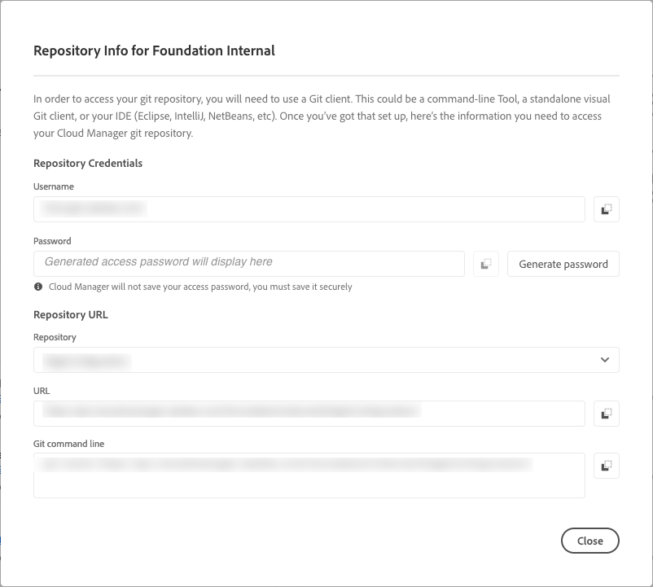

# 存储库访问信息 {#accessing-repos}

了解如何使用 Cloud Manager 的自助 Git 帐户管理访问和管理 Adobe 管理的 Git 存储库。

## 从概述页面访问存储库信息 {#overview-page}

通过使用管道信息卡上突出显示的&#x200B;**访问存储库信息**&#x200B;按钮，Cloud Manager 可以轻松检索 Adobe 管理的存储库的存储库访问信息。

1. 在 [my.cloudmanager.adobe.com](https://my.cloudmanager.adobe.com/) 上登录到 Cloud Manager 并选择适当的组织和项目。

1. 从&#x200B;**程序概述**&#x200B;页面导航到 **管道**&#x200B;信息卡。

   

1. 点击或单击&#x200B;**访问存储库信息**&#x200B;按钮，打开&#x200B;**存储库信息**&#x200B;对话框并查看：

   * Git 用户名。
   * Git 密码。
   * Cloud Manager Git 存储库的 URL。
   * 预构建的 Git 命令可快速将远程添加到您的 Git 存储库并推送代码。

   

1. 要访问密码，必须生成一个新密码。为此，请点击或单击&#x200B;**生成密码**&#x200B;按钮。

1. 在&#x200B;**您确定…**&#x200B;对话框中，通过点击或单击&#x200B;**生成密码**&#x200B;来确认密码生成。

   

1. 密码已生成，可在&#x200B;**密码**&#x200B;字段中复制。

   * 生成密码将使之前的密码失效。
   * Cloud Manager 不会保存密码。您有责任安全地保存此密码。
   * 由于 Cloud Manager 不保存密码，因此，如果您丢失密码，则必须重新生成一个新密码。

   

使用这些凭据，您可以克隆存储库的本地副本，在该本地存储库中进行更改，并在准备就绪后将任何代码更改提交回 Cloud Manager 中的远程代码存储库。

>[!NOTE]
>
>* **访问存储库信息**&#x200B;选项对具有&#x200B;**开发人员**&#x200B;或&#x200B;**部署管理员**&#x200B;角色的用户可见。
>* **访问存储库信息**&#x200B;按钮仅显示 Adobe 管理的存储库的存储库访问信息。Cloud Manager 中没有关于[专用存储库](private-repositories.md)的访问信息。

## 从存储库窗口访问存储库信息 {#repositories-window}

**访问存储库信息**&#x200B;按钮也可在&#x200B;[**存储库**&#x200B;窗口的工具栏中找到。](managing-repositories.md) 该工具栏显示有关访问 Adobe 管理的存储库的相同信息。

## 撤销访问密码 {#revoke-password}

您可以随时撤销访问密码。为此，请[为此请求创建支持工单](https://experienceleague.adobe.com/?support-solution=Experience+Manager&amp;support-tab=home#support)。

该工单将被优先处理，并应在一天内撤销。
