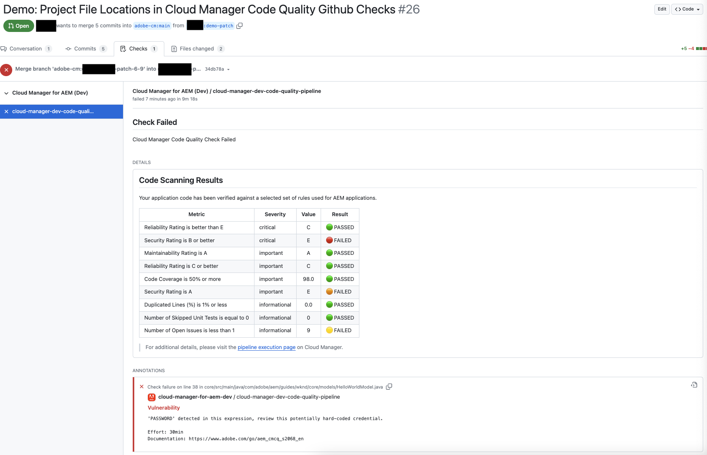

# GitHub 检查批注 {#github-annotations}

了解 GitHub 如何检查您专用存储库的批注 PR 以便为您提供有用的反馈。

## 概述 {#overview}

如果您正在 Cloud Manager 项目中使用[专用存储库](private-repositories.md)，GitHub 中的检查会自动针对每个拉取请求运行。这些批注都含有有用的信息，可帮助您尽快了解代码中的任何问题。

[代码质量](/help/implementing/cloud-manager/code-quality-testing.md)检测到的问题 [SonarQube](/help/implementing/cloud-manager/custom-code-quality-rules.md) 都清晰列出。

提供了存在问题的确切代码行，您可以单击该行显示相关代码。这些批注适用于所有代码问题，而不仅仅是拉取请求中更改的问题。

所有带批注的行都汇总在&#x200B;**已更改文件** GitHub 拉取请求上的选项卡。拉取请求中未更改文件的批注出现在其自己的部分中。

## 代码质量管道 {#code-quality-pipelines}

[代码质量](/help/implementing/cloud-manager/code-quality-testing.md)结果也可以在管道中看到，该管道由 Cloud Manager 在底部自动触发&#x200B;**检查**&#x200B;选项卡。也可以从&#x200B;**详细信息**&#x200B;对拉取请求进行检查。

您还可以以 CSV 的形式将问题可视化。可以通过[查看 Cloud Manager 中管道执行的详细信息来检索此信息](/help/implementing/cloud-manager/configuring-pipelines/managing-pipelines.md#view-details)。
