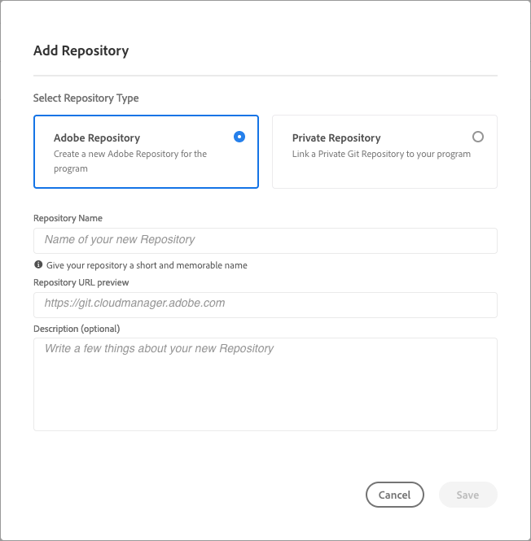

# 在Cloud Manager中管理存储库 {#managing-repos}

了解如何在Cloud Manager中查看、添加和删除您的Git存储库。

## 关于Cloud Manager中的存储库 {#overview}

Cloud Manager中的存储库用于使用Git存储和管理项目的代码。 对于您添加的每个&#x200B;*程序*，将自动创建Adobe管理的存储库。

此外，您还可以选择创建更多Adobe管理的存储库或添加您自己的专用存储库。 可以在&#x200B;**存储库**&#x200B;页面上查看链接到您的项目的所有存储库。

在添加或编辑管道时，也可以选择在Cloud Manager中创建的存储库。 有关配置管道的详细信息，请参阅[CI-CD管道](/help/implementing/cloud-manager/configuring-pipelines/introduction-ci-cd-pipelines.md)。

每个管道都链接到主存储库或分支。 但是，如果支持[Git子模块](git-submodules.md)，则可以在生成过程中包含多个二级分支。

## 查看“存储库”页面 {#repositories-window}

在&#x200B;**存储库**&#x200B;页面上，可以查看有关所选存储库的详细信息。 此信息包括正在使用的存储库类型。 如果存储库标记为&#x200B;**Adobe**，则表示它是Adobe管理的存储库。 如果标记为&#x200B;**GitHub**，则它是指您管理的专用GitHub存储库。 此外，页面还提供详细信息，例如存储库的创建时间以及与其关联的管道。

要对选定的存储库执行操作，您可以单击该存储库并使用打开下拉菜单。 对于Adobe管理的存储库，您可以&#x200B;**[检查分支/创建项目](#check-branches)**。

*存储库页面上的下拉菜单。*

下拉菜单上的其他可用操作包括&#x200B;**[复制存储库URL](#copy-url)**、**[查看和更新](#view-update)**&#x200B;和&#x200B;**[删除](#delete)**&#x200B;存储库。

**要查看存储库页面：**

1. 在 [my.cloudmanager.adobe.com](https://my.cloudmanager.adobe.com/) 上登录到 Cloud Manager 并选择适当的组织和项目。

1. 在&#x200B;**项目概述**&#x200B;页面的侧菜单上，单击 **存储库**。

1. **存储库**&#x200B;页面显示与您所选项目关联的所有存储库。

   
   *Cloud Manager中的“存储库”页面。*

## 添加存储库 {#adding-repositories}

在&#x200B;**存储库**&#x200B;页面的右上角附近，单击&#x200B;**添加存储库**

*添加存储库对话框。*

Cloud Manager支持两种类型的存储库：Adobe管理的存储库(**Adobe存储库**)和自我管理的存储库（**专用存储库**）。 根据您选择添加的存储库类型，设置的必填字段会有所不同。 有关更多信息，请参阅以下内容：

* [在 Cloud Manager 中添加 Adobe 存储库](adobe-repositories.md)
* [在 Cloud Manager 中添加专用存储库](private-repositories.md)

>[!NOTE]
>
>* 用户必须具有&#x200B;**部署管理员**&#x200B;或&#x200B;**业务负责人**&#x200B;角色才能添加存储库。
>* 在任何给定公司或 IMS 组织的所有项目中，存储库的数量限制为 300 个。

## 检查分支/创建项目 {#check-branches}

在&#x200B;**AEM Cloud Manager**&#x200B;中，**检查分支/创建项目**&#x200B;操作有两个用途，具体取决于存储库的当前状态。

* 如果存储库是新创建的，此操作将使用[AEM项目原型](https://experienceleague.adobe.com/zh-hans/docs/experience-manager-core-components/using/developing/archetype/overview)生成示例项目。
* 如果示例项目已在存储库中创建，则该操作会检查存储库及其分支的状态，并提供有关示例项目是否已存在的反馈。

  

## 复制存储库 URL {#copy-url}

**复制存储库URL**&#x200B;操作会将&#x200B;**存储库**&#x200B;页面中所选存储库的URL复制到剪贴板以用于其他位置。

## 查看和更新存储库 {#view-update}

**查看和更新**&#x200B;操作打开&#x200B;**更新存储库**&#x200B;对话框，您可以在其中查看存储库的&#x200B;**名称**&#x200B;和&#x200B;**存储库URL预览**。 此外，它还允许您更新存储库的&#x200B;**描述**。

## 删除存储库 {#delete}

**删除**&#x200B;操作会从您的项目中删除存储库。如果存储库与管道关联，则无法删除它。

删除存储库会使其名称不可用于将来创建的任何新存储库。 如果尝试使用相同的名称，则会出现以下错误消息：

`Repository name should be unique within organization.`

此外，已删除的存储库在Cloud Manager中不再可用，并且无法链接到任何管道。

